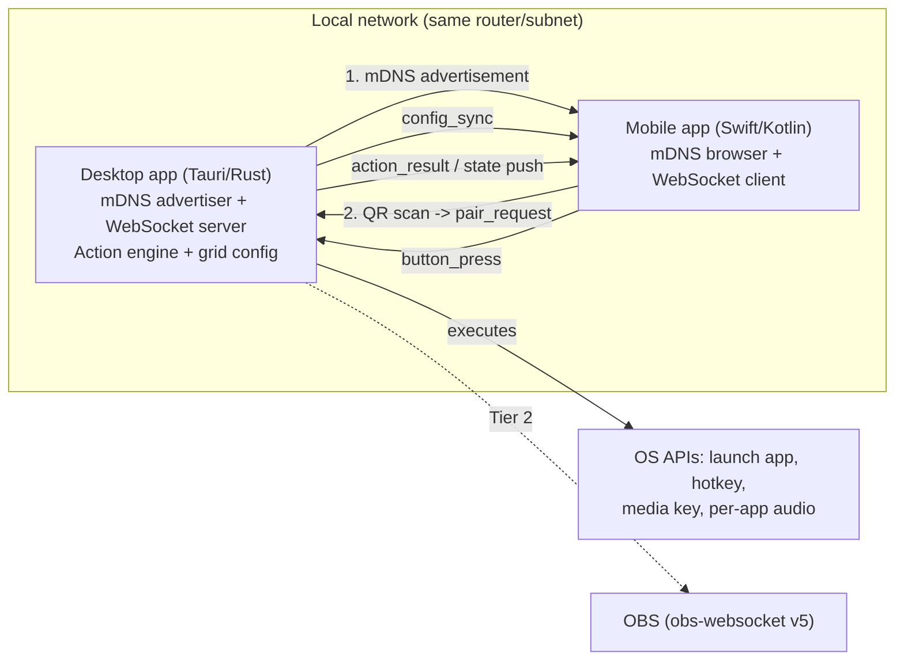
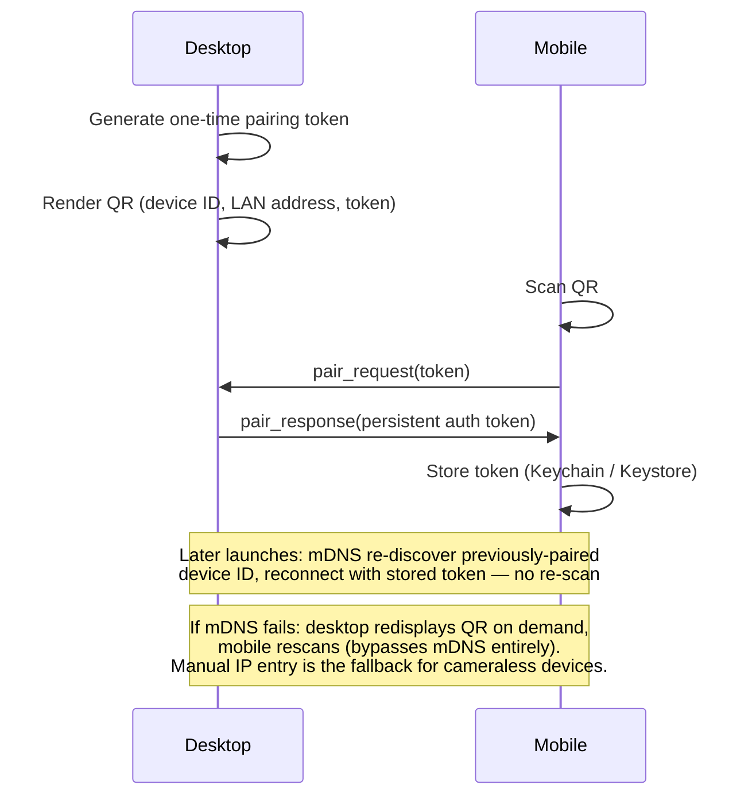

# Architecture Overview — Open-Source Stream Deck Alternative

| | |
|---|---|
| **Doc Type** | EDD |
| **Author** | Gregory McQuillan |
| **Date** | 2026-09-06 |
| **Status** | Draft |
| **Reviewers** | — (solo project) |

**TL;DR:** An open-source Tauri (Rust) desktop app pairs with native iOS/iPadOS/
Android apps over mDNS discovery + QR-code pairing, turning a phone or tablet into
a fully customizable, stateful button-grid remote for the desktop — no manual IP
entry, no hardware purchase. Product rationale and full requirements live in
`00. Product Requirements.prd.md`; this doc covers how it's built.

---

## 1. Purpose & Objective

**Context:** This document is the technical design for the system described in the
PRD: a Tauri-based desktop app and native mobile apps that together turn a phone or
tablet into a programmable button-grid remote for a nearby computer.

**Problem Statement:** The central technical problem is letting the mobile app
discover and pair with the desktop app on the local network without the user
typing an IP address, while keeping the desktop app cheap enough to run
continuously in the background. Full product motivation and use-case research live
in the PRD — this doc focuses on how those requirements get built.

## 2. Goals & Non-Goals

### Goals *(technical, derived from the PRD)*
1. Zero-configuration discovery and pairing over LAN.
2. Desktop app lightweight enough to run indefinitely in the background.
3. A button/grid data model that supports the full PRD Button Model — customizable
   and stateful buttons, folders, swipeable pages, adaptive phone/tablet layout —
   from the first slice, not bolted on later.
4. A pluggable action engine so Tier 2+ integrations (OBS, audio mixer) are
   additive, not rewrites.
5. Ship as open source (GPLv3 desktop / MIT mobile) with no functionality gated
   behind payment.

### Non-Goals (v1)
1. Off-LAN/remote connectivity — needs a relay/signaling server, deferred.
2. USB tethering as a discovery-failure fallback — deferred (iOS restricts
   arbitrary USB-IP tethering without MFi certification); QR-rescan is the primary
   fallback instead (see §5.1).
3. A third-party plugin marketplace — the action engine should allow this later,
   not user-facing in v1.
4. Multiple mobile devices paired to one desktop instance simultaneously.

## 3. Background & Motivation

This doc was originally drafted before a PRD existed. This project's standing
process is PRD-first, EDD-derived (see `00. Product Requirements.prd.md`); this
revision reconciles the two. Where this doc and the PRD conflict going forward, the
PRD wins on product scope and this doc should be updated to match.

## 4. High-Level Overview

The desktop app runs as a background/tray process, advertises itself on the LAN,
and owns the authoritative button-grid configuration. Mobile apps discover it,
pair once via QR code, and thereafter act as a thin, read/press-only remote:
render the synced grid, send button presses, reflect pushed state changes.

| Component | Choice | License |
|---|---|---|
| Desktop | Tauri (Rust backend + HTML/CSS/JS frontend) | GPLv3 |
| iOS / iPadOS | Native Swift/SwiftUI | MIT |
| Android | Native Kotlin/Jetpack Compose | MIT |
| Protocol | Shared JSON schema (docs only, no linked code) | MIT |



**Why Tauri over Electron:** Tauri uses the OS-native webview (WKWebView/WebView2/
WebKitGTK) instead of bundling Chromium — much smaller idle memory footprint,
which matters for an app that runs continuously in the background.

**Why Tauri over Qt/C++:** Qt/QWidgets has no webview overhead and can be
marginally leaner at idle, but has no strong first-party mDNS support —
integration would mean shelling out to `dns-sd`/Avahi/the Bonjour SDK per
platform. Rust's `mdns-sd` crate (pure-Rust, no OS Bonjour/Avahi dependency) plus
the `tokio` async ecosystem substantially de-risks discovery and concurrent-
connection handling. The dynamic, reorderable grid editor (with folders and pages)
is also considerably cheaper to build in CSS Grid + JS than in QWidgets/QML.

## 5. Detailed Design

### 5.1 Discovery & Pairing



1. **Discovery:** mDNS/DNS-SD via the `mdns-sd` crate. Desktop advertises a service
   (e.g. `_buttons._tcp.local`) with an instance name and stable device ID on
   launch. Mobile browses using native APIs (`NWBrowser`/`NetServiceBrowser` on
   iOS, `NsdManager` on Android).
2. **Pairing:** mDNS proves reachability, not trust — first-time pairing is a
   QR-code handshake as shown above.
3. **Recovery:** per the PRD, QR-rescan (not manual IP entry) is the primary
   recovery path if mDNS discovery ever fails, since the QR encodes the address
   directly. The desktop must be able to redisplay its QR on demand, not just
   during initial setup. Manual IP entry is a secondary fallback for mobile devices
   without a usable camera.

### 5.2 APIs & Data Models

Persistent WebSocket transport: `tokio-tungstenite` on the desktop server,
`URLSessionWebSocketTask` on iOS, `OkHttp`/`ktor-client` on Android.

**Schema/model generation: Protocol Buffers**, resolving the earlier open question
of whether `/protocol` should be a schema or markdown prose. `.proto` files in
`/protocol` are the single source of truth, generating typed models via `prost`
(Rust), `swift-protobuf` (iOS), and `wire` or `protobuf-kotlin` (Android) — no
hand-maintained struct definitions per platform to drift out of sync. This is a
codegen/type-safety decision, not a latency one: on LAN, JSON parsing of these
small messages isn't expected to be a meaningful fraction of the 50ms budget (see
§5.4) — protobuf is worth it for keeping three language implementations
consistent, independent of wire format.

**Swift's generated types keep their `Buttons_` package prefix (e.g.
`Buttons_Config`) — deliberate, not an unaddressed wart.** Confirmed at
slice 6 (`docs/slices/06. Protobuf Codegen Prototype.spec.md`): a Swift
module boundary doesn't shorten a declared type name the way a Rust module
or JVM package does (`buttons::Config` / `buttons.Config` are real, but
`ButtonsProto.Config` isn't — the generated identifier is literally
`Buttons_Config`), so putting the generated code in its own SPM target
doesn't remove the prefix. This matches `swift-protobuf`'s own documented
guidance, not just this project's preference:

> Rather than using prefixes to shorten or improve type names, consider
> using a Swift `typealias` within your source to remap the names locally
> where they are used, but keeping the richer name for the full build to
> thus avoid conflicts. This approach is recommended because generation
> options can lead to problems if two pieces of code depend on the same
> `.proto` files and rely on different option settings, which can prevent
> protobuf-using libraries from being used in the same program.
>
> — [`apple/swift-protobuf` FAQ](https://github.com/apple/swift-protobuf/blob/main/Documentation/FAQ.md)

So: don't set `swift_prefix` empty repo-wide (the `.proto`'s own
`swift_prefix` option, or `protoc`'s `--swift_opt`) — if a specific
consuming file wants a shorter local name once these types land in real
iOS app code (step 7), add a local `typealias Config = Buttons_Config` in
that file, not a generation-wide setting. Community appetite for a nicer
default exists ([swift-protobuf#750](https://github.com/apple/swift-protobuf/issues/750),
proposing package-nested types) but isn't shipped, isn't the default, and
isn't something to design around here.

**Sequencing: UI before schema, on both platforms.** Protobuf exists to keep the
*cross-device* wire model consistent across Rust/Swift/Kotlin — it has no role in
the UI-only slices, which run against dummy/mock data with no networking at all.
Per this project's UI-first execution preference, real models are swapped in only
after user-facing UI exists on **both** desktop (Rust, plain structs +
`serde_json` for local config, §5.3) **and** mobile (iOS first) — the `.proto`
schema is written once both UIs have exercised and settled the real button/grid/
folder/Profile shape, not guessed at up front. See the Testing & Rollout Plan
below for where this falls in sequence.

**Wire format is a separate, deferred choice.** Protobuf supports both binary and
a canonical proto3 JSON encoding from the same schema. Start with JSON-over-
WebSocket (debuggable with plain browser devtools / a WebSocket inspector) during
early slices; switch to binary encoding later only if profiling an actual build
shows serialization is a real contributor to round-trip latency, not before.

Messages versioned from day one (`protocol_version` field) since desktop and
mobile releases will inevitably drift out of sync.

| Message | Direction | Purpose |
|---|---|---|
| `pair_request` / `pair_response` | M→D / D→M | Token exchange |
| `config_sync` | D→M | The **whole `Config`** — every Profile, not just the active one (see decision below) — plus `activeProfileId` |
| `button_press` | M→D | Button ID tapped |
| `action_result` | D→M | Success/failure for a press |
| `state_push` | D→M | Unsolicited state/appearance update (stateful buttons) |
| `profile_switch` | M→D / D→M | Mobile requests switching Profile, or desktop announces an auto-switch (by app focus) — just an `activeProfileId` update, no `config_sync` needed unless the data itself also changed (see decision below) |

**Decision: `config_sync` carries the whole `Config` (every Profile), not just
the active one — chosen over the smaller-payload alternative for error-mode
reasons, not payload size** (a personal grid is small either way, per §5.3's
own sizing argument). The alternative — syncing only the active Profile and
requiring a switch to trigger a fresh full sync — creates a standing
correctness invariant: `profile_switch` and `config_sync` must always fire
together, in order, for the life of the codebase. Break that coupling once
(a race, a debounce edge case, a future code path that assumes "already
synced") and mobile is told to display a Profile it has no data for — blank
screen or crash, not a graceful degradation. Syncing everything removes the
invariant instead of trying to keep it intact forever: after any sync, mobile
already has every Profile, so `profile_switch` is a free `activeProfileId`
update with no data dependency, and the only possible failure mode left is
staleness (briefly-outdated data until the next sync) rather than missing
data. This also makes page/folder navigation **within** an already-synced
Profile client-local on mobile, same as the desktop editor's own store
(Slice 4) — no wire round-trip per swipe or folder entry, since mobile
already holds that Profile's full page/folder tree. Through slice 6 the wire
tracks *which Profile is active* and nothing finer.

**Revised (2026-09-10): the wire will also carry a live navigation cursor —
current `pageId` + folder path — from step 7 on.** The original decision here
was "never a live navigation cursor"; that's now scoped to "not until the
WebSocket server exists." Product intent: with a single paired device, the
phone mirrors *exactly what's on the desktop screen* (page and folder depth),
not just the Profile — so a user who has drilled into a folder on one device
can edit that same screen on the other without re-navigating the hierarchy.
Design deferred to step 7 (see Open Questions → "Live navigation-cursor
mirroring"): the desktop owns the cursor as authoritative state, mobile sends
`nav_request` intents and renders the `nav_cursor` it's told — so echo is
structurally absent and concurrent navigation resolves by arrival order at the
desktop, with no counter or origin field needed. Remaining open: the `.proto`
message shapes and reconciling with §5.5's independent mobile swipe/folder
navigation. Desktop-side last-viewed-page *persistence* (slice 04b) is
separate: device-local `localStorage`, restored on launch, and does **not**
put navigation state into `Config` or the wire.

**Decision: syncing the active Profile to the connected device is the
default behavior, not something mobile can opt out of in v1.** Matches how a
real Stream Deck actually behaves — the physical device always shows
whichever Profile the software activated, it doesn't independently browse
away to a different one. With a single paired device (v1 — see §2 Non-Goals),
this is trivially satisfied: whatever Profile is active on desktop is what
the one connected device shows, via `profile_switch` above. This becomes a
genuine per-device choice only once multi-device support lands (deferred,
§2 Non-Goals) — at that point a device could either keep mirroring the
desktop's active selection (today's default behavior, kept as the default
then too) or navigate independently. Not designed now; flagged so the
single-device default doesn't get hardcoded as the *only* mode when it's
revisited.

**Corollary: don't push a sync unless something actually changed.** Two
distinct triggers, needing two distinct guards, addressed separately since
one debounce fix doesn't cover the other:
1. **Profile-switch churn** (rapid OS-focus alt-tabbing) — the debounce on the
   focus watcher (§5.5) already covers this; it now only needs to coalesce
   `profile_switch` events, which are cheap regardless.
2. **Edit churn** — Slice 4's `ButtonEditor` autosaves on a 500ms debounce per
   keystroke pause; if every persisted edit pushed a full `config_sync`, a
   user idly tweaking a label would push a full-Config payload roughly every
   500ms while connected, and mobile would re-render each time. Needs its own
   guard on the desktop side — a dirty-check (only push if the serialized
   Config actually differs from what was last sent) or a coalescing push
   interval — decided once the WebSocket server exists (roadmap step 7+),
   not before; noted here so it isn't designed as an afterthought once real
   connections exist to observe the actual spam pattern against.

A button's action field is an ordered array (0+ entries, per the PRD's
multi-action requirement), not a single value — modeled this way in the `.proto`
schema from the first message, since retrofitting an array later would be a
breaking schema change. Per the PRD's Future Vision, the schema should also avoid
hard-wiring "button" as the only element type — a `oneof`/tagged-union shape for
control elements costs little now and leaves room for a future dial/encoder
element without a breaking change.

**Exported/shared Profile files stay plain, human-readable JSON** regardless of
what the live sync wire format ends up being (§ above) — openness for community
sharing is a product requirement independent of the live-protocol performance
question.

**Decision, refining the above: that JSON is protobuf's own canonical proto3
JSON encoding of the `Profile` message, not a second hand-rolled shape.**
Protobuf was justified above purely on cross-language type consistency, not
latency — but a bespoke hand-written export format would reintroduce exactly
the drift risk that justification argues against, just moved from the wire to
the export boundary, and with a longer compatibility lifetime (shared config
files outlive any single wire-protocol version). Generating exports from the
same `.proto` schema via its standard JSON mapping keeps the "plain, human-
readable, community-shareable" requirement fully intact — proto3 JSON is
ordinary JSON, not a binary or opaque format — while leaving exactly one
hand-maintained model (the `.proto` file itself) instead of two.

This is independent of the wire-format question above: shareable profile exports
stay proto3 JSON permanently, by requirement, regardless of what the live
WebSocket protocol does. The wire format's own JSON-now/binary-later question is
unaffected and still deferred to real measurement (§ above) — once real `.proto`
shapes exist and real JSON is flowing over the wire, that's the moment to
actually profile binary against it, not before. This keeps the user-shared
documents human-readable and doesn't sacrifice app performance because profile
transfers between users happen infrequently compared to constant in-app transmissions.

Repo layout:

```
/desktop        Tauri app (Rust + web frontend)   — LICENSE: GPLv3
/ios            Native SwiftUI app                — LICENSE: MIT
/android        Native Kotlin/Compose app         — LICENSE: MIT
/protocol       Shared .proto schema + docs        — LICENSE: MIT
/docs           Design docs (this doc and others)
```

### 5.3 Infrastructure & Storage

1. **Button config (desktop):** flat JSON file on local disk. Decision, not left
   open — config size is small (a personal grid, not a multi-tenant dataset), a
   human-readable/diffable file is easier to debug and back up than embedded
   SQLite, and there's no query workload that would justify a database.
2. **Auth tokens (mobile):** Keychain (iOS), EncryptedSharedPreferences/Keystore
   (Android) — OS-provided secure storage, not the JSON config file.
3. **Ephemeral view/nav state** (last-viewed Page today; scroll position, window
   bounds, collapsed sections if they land later) lives in the desktop webview's
   `localStorage` — device-local and deliberately **outside `Config`**, so a
   paired phone and desktop don't drag each other's view around, and it's never
   on the wire (restore is a launch-only convenience; live cursor mirroring is a
   separate step-7 channel — §5.2, Open Questions). Genuine device-local
   *settings* (a per-device theme override, a this-machine hotkey toggle, a
   device nickname) — if any ever land — get a JSON file beside `buttons.json`
   instead, per this section's "human-readable/diffable, easy to debug and back
   up" reasoning; `localStorage` is for throwaway view state only. Same precedent
   as slice 04a correcting §7.
4. **No cloud storage** of user data in v1 — everything lives on the two paired
   devices.

### 5.4 Performance & Scale

1. Button-press round-trip latency target: well under 50ms end-to-end on LAN (PRD
   Success Metrics) — feasible since LAN network latency is sub-millisecond in the
   common case; the budget is mostly UI/serialization overhead, not the network.
2. Single desktop, single paired mobile device in v1 (PRD Decisions) — no
   concurrent-connection scaling concerns yet. The WebSocket server should still be
   built on `tokio` so this isn't a rewrite when multi-device support lands.
3. Desktop idle background resource usage: no hard number yet — qualitative target
   ("low enough a user has no reason to quit it"), to be measured once the Tauri
   skeleton exists.

### 5.5 Components

#### Desktop (`/desktop`, Rust + Tauri)
1. mDNS advertiser + on-demand QR redisplay
2. WebSocket server (pairing/auth, config sync, button press handling, state push,
   Profile switch)
3. OS-focus watcher for Smart-Profile-style auto Profile switching — always live,
   since (unlike Elgato) this desktop app has no foreground-editor-window state to
   conflict with it. **Debounced before it fires a `profile_switch`/`config_sync`**
   (a short settle delay after focus changes, not on every raw focus event) — undebounced,
   a user alt-tabbing rapidly would trigger a full-profile resync per switch, and
   mobile would pay a deserialize + full grid re-render for each one. That fights
   both the round-trip latency budget (§5.4) and mobile battery life with the same
   avoidable cause. Debounce is the chosen fix over a profile-revision/etag field
   (letting mobile skip a redundant sync it already has) — simpler, and sufficient
   unless a second reason to skip redundant syncs shows up later.
4. Action engine: button ID → ordered pluggable action list, registry-based so new
   action types (Tier 2+: OBS, audio mixer) are additive
5. Profile export/import to a plain JSON file
6. Frontend: **Svelte** (decision, not left open — compiles away its runtime
   rather than shipping a framework bundle like React/Vue, which fits the
   lightweight-background-app goal, while still giving real component/reactivity
   ergonomics for a genuinely stateful editor: grid, folders, pages, Profiles, live
   icon/label editing). CSS Grid for layout, drag-and-drop reordering, static or
   animated icons — talking to the Rust backend over Tauri's IPC, separate from the
   mobile WebSocket channel

#### Mobile (`/ios`, `/android`, native)
1. mDNS discovery + QR pairing (scan and rescan) + persistent reconnect
2. Grid UI mirroring synced config, adaptive to phone/tablet screen size, with
   folder navigation, swipe-between-pages, and manual Profile switching (SwiftUI
   `LazyVGrid`, Compose `LazyVerticalGrid` — see the variable-sizing open question
   below on the limits of these APIs)
3. Button tap → `button_press` + haptic feedback → reflect `action_result`
4. Reflects `state_push` updates live, no manual refresh

**`ios/project.yml` is the source of truth for the Xcode project, not
`ios/Buttons.xcodeproj/project.pbxproj`.** `xcodegen generate` produces the
`.pbxproj` from it — new targets, sources, and dependencies (SPM packages
included) get added in `project.yml`, then regenerated, never hand-edited
in `.pbxproj` directly. Both files are committed (other tooling/CI may not
always run `xcodegen`), which makes it easy to edit the generated file by
habit — check `project.yml` first. Found this get skipped once during
slice 07 (a package dependency added straight to `.pbxproj`, silently
overwritable by the next `xcodegen generate`) — see
`docs/slices/07. Discovery, Pairing & Config Sync.spec.md`, Implementation
Notes #13.

**SwiftUI view naming: name the thing, `View` only when the bare noun is
uninformative or already taken.** `ButtonGrid`, `DeckButton`, `PageGrid`
drop the suffix — "grid"/"button" already say it's UI, `View` would be pure
noise. `PairingView` keeps it: bare `Pairing` is unavailable —
`PairingPayload`, `PairingStore`, and `PairingSession` already occupy that
name in the same module, so a type called just `Pairing` would read as the
domain model, not the screen. `DeckView` (renamed from `ContentView` once
`PairingView` existed as a second root screen — bare `Content` stopped
meaning anything once it had to be distinguished from something) pairs
with the existing `DeckButton` and the Stream Deck lineage already in the
product's own comments/PRD. Not an exception to a "drop `View`" rule —
there was never a blanket rule, just this one, applied consistently.

**proto3 `optional` scalar fields don't map to Swift `Optional` —
generated code exposes `hasX`/`x`/`clearX` instead, always, across every
protobuf target language (C++, Java, Go, Swift alike) — see
`ios/Buttons/Views/DeckButton.swift`'s `Buttons_Button` extension for the
full reasoning.** Reading `.label`/`.icon`/`.name` directly on a generated
type is a silent footgun, not a compile error: an absent field reads back
as `""`, so a forgotten `hasX` check doesn't crash, it just renders wrong.
**Rule: never read `.label`/`.icon` on `Buttons_Button` (or `.name` on
`Buttons_Page`) directly — use the `iconOrNil`/`labelOrNil` extension
(`DeckButton.swift`), or check `hasX` explicitly.** Add the equivalent
`xOrNil` extension wherever a second real read of an `optional` field
shows up, same "generalize on the second real case" precedent as
04b/05/permission-handling above — don't wait for a third.

**"Coordinator" means the iOS navigation-flow pattern (Khanlou) — don't
reuse the word for a plain glue/business-logic object.** Hit this in slice
07: `PairingCoordinator` did no navigation (it parsed a QR payload, called
`connect`, wrote Keychain on success) while `PairingView.swift` separately
needed a real `UIViewControllerRepresentable` coordinator
(`QRScannerRepresentable.Coordinator`) for its actual, pattern-correct
purpose — two unrelated meanings of "Coordinator" in adjacent files.
Renamed to `PairingSession` (it's instance state for one pairing attempt
across an async round trip, not a flow description). Name a `Coordinator`
only when it's actually one.

## 6. Alternatives Considered

1. **Electron (desktop):** rejected — bundles Chromium, too heavy for an always-on
   background app.
2. **Qt/C++ (desktop):** rejected for v1 — leanest possible memory use and zero web
   tech, but weaker mDNS story and more implementation work for the dynamic grid
   editor. Worth revisiting if Tauri's webview dependency causes platform-specific
   pain later.
3. **React Native / Flutter (mobile):** rejected in favor of fully native Swift/
   Kotlin, per product preference for platform-native integration and performance.
4. **Cloud relay for connectivity:** deferred rather than rejected — needed only if
   off-LAN support becomes a requirement; adds a relay/signaling server and NAT
   traversal complexity not justified for v1.
5. **SQLite for desktop config:** considered, rejected for v1 — see §5.3.
6. **USB tethering as a discovery fallback:** considered, deferred — see Non-Goals.
7. **FlatBuffers / Cap'n Proto for the protocol schema:** considered — both offer
   zero-copy binary parsing, but FlatBuffers adds complexity with no measured need
   yet, and Cap'n Proto's Swift/Kotlin ecosystem support is weak. Protobuf's
   tooling maturity across Rust/Swift/Kotlin wins for now (§5.2).
8. **Hand-maintained JSON structs per platform:** considered, rejected — lowest
   tooling investment, but leaves three model implementations to drift out of sync
   by hand with no compiler-enforced check; protobuf codegen removes that risk.

## 7. Cross-Cutting Concerns

**Security & Privacy:** GPLv3 (desktop) and MIT (mobile) are license-compatible
because the two only ever communicate over a network protocol — no linked/shared
code — so GPL's copyleft doesn't propagate across that boundary. Pairing tokens
are one-time-use for the handshake, exchanged for a persistent per-device token
stored in OS-provided secure storage (§5.3), not the plaintext config file. No
telemetry or cloud data collection in v1.

**Observability:** minimum bar is local logging on every platform (desktop, iOS,
Android) — connection attempts, pairing failures, action execution errors written
to a local log a user (or the developer, from a bug report) can retrieve, since
there's no cloud telemetry to fall back on (see Security & Privacy). Everything
beyond that — a visible connection-status indicator, in-app error surfacing, log
retention/rotation — is TBD, to be decided once the desktop skeleton exists.

**Desktop WebView platform constraint:** none of `window.prompt()`,
`window.confirm()`, or `window.alert()` can be relied on in Tauri's WKWebView
on macOS — the host has to implement native panel delegates, which Tauri
doesn't wire up by default. `prompt()` silently renders nothing and returns
`null`; `confirm()` is worse — it renders nothing and silently returns
**`true`**, so a guarded destructive action fires with no dialog at all.
Both fail without erroring, making it easy to ship a dead or dangerous
button unnoticed.

Discovered empirically across Slice 4: `prompt()` in the
`ProfileSwitcher`/page-rename UI (replaced with inline text inputs), then
`confirm()` on profile delete during the DoD walkthrough (stopgapped with an
inline confirm row). Slice 04a replaces the stopgap with a real in-app
`ConfirmDialog` component — a native `<dialog>` + `showModal()`, app-themed,
promise API `await confirm({ … })` — mounted once in `+layout.svelte` and
used for every yes/no guard in the app. `prompt()`-style text entry stays as
inline inputs; a text-entry dialog is a possible later extension of
`ConfirmDialog`, not built yet.

Applies to any future desktop UI work: reach for the `ConfirmDialog` store,
never `window.confirm()`/`alert()`, and never `window.prompt()`.

**Testing & Rollout Plan:** structured as vertical slices — each slice is
independently runnable/testable end-to-end, per this project's standing
execution preference, rather than horizontal layers (all-backend-then-all-UI).
Where a full slice isn't possible in one step, build the UI first to validate the
data model before the backend behind it.

0. **Network POC (spike — throwaway, not a shippable slice)** — de-risks the
   core technical problem (§1) before investing in the UI-first sequence below,
   proves the WebSocket channel works in *both* directions, and proves the
   protobuf toolchain (§5.2) works across Rust/Swift using a trivial throwaway
   `Ping { text: string }` message — not the real schema, which still waits for
   step 6: a standalone Rust CLI (no Tauri) that mDNS-advertises, runs a
   WebSocket server, renders a terminal QR code, and — once connected — sends a
   `Ping` to the client; a minimal SwiftUI app (a `Text` showing the received
   `Ping`'s message, and a `Button` disabled until it arrives) that discovers
   the desktop via `NWBrowser` and, on tap, replies with a `Ping` reading
   `"Reply To: <original message>"` that the desktop logs to its terminal.
   Lives entirely in `/spikes/network-poc/`, kept in the repo afterward as an
   unmaintained
   reference rather than deleted — see
   `docs/slices/00. Network POC Spike.spec.md`.
1. **Repo scaffold** — this doc, per-directory LICENSE files, empty Tauri/iOS/
   Android project shells, `/protocol` stub.
2. **Desktop grid UI, static** — hardcoded buttons (icon/label), no backend, no
   networking, no protobuf. Validates the button/grid data model visually first —
   the whole point of sequencing it before any schema work (§5.2).
3. **Desktop grid UI, dynamic** — add/remove/reorder, assign a Tier 1 action array
   (launch app/hotkey/media key, one or more per button), persist via a plain Rust
   struct + `serde_json` to local config (§5.3). Desktop-only, proves the action
   engine + editing UX end-to-end.
4. **Folders, pages & Profiles (desktop-only)** — nested grids, swipeable pages,
   and multiple manually-switchable Profiles, still before any networking or
   protobuf work, extending the already-validated data model.
5. **Mobile grid UI, static (iOS, dummy data)** — the iOS app rendering the same
   button/grid/folder/Profile shapes against mock data, no discovery, no
   pairing, no networking. This is the second (and last) UI-only slice before any
   schema work — by the end of it, both platforms' real UI needs are known.
6. **Protobuf codegen prototype** — *now* write the `.proto` schema, translating
   the shape slices 2-5 already validated in both UIs — not a guess. Generate and
   compile successfully in all three languages (`prost`/`swift-protobuf`/`wire` or
   `protobuf-kotlin`) before depending on it in a cross-device slice.
7. **Cross-device slice 1: discovery → pairing → config sync** — mDNS
   advertisement + WebSocket server; the iOS UI from slice 5 swaps its dummy data
   for a real `config_sync` after completing discovery and QR pairing.
8. **Cross-device slice 2: button press round trip** — mobile tap → `button_press`
   → desktop executes a Tier 1 action → `action_result` → mobile shows result +
   haptic feedback. This is the PRD's MVP fully realized end-to-end.
9. **Switch buttons** — a two-state button type (Elgato calls this a
   "Multi Action Switch"): each state has its own icon/label/action array,
   a press runs the current state's actions and flips to the other one,
   desktop-authoritative, mobile flips its display optimistically and
   rolls back on failure. No wire envelope change — the new state rides
   the existing `config_sync`/`Button` message. Design settled, Open
   Questions → "Stateful buttons — Switch button type + `state_push`
   design."
   1. (9a) **`state_push`** — the correction channel for a Switch flipping
   *without* the pressing device's own optimistic guess to rely on (the
   desktop editor's "Test" button, later a Tier 2 integration correcting
   real-world drift). Broadcasts a batch of button/state changes to every
   connected device. Same Open Question as step 9.
10. **Profile switching, cross-device** — manual switch from mobile
    (`profile_switch` → fresh `config_sync`), then the OS-focus watcher for
    auto-switching.
11. **QR reconnect fallback** — on-demand QR redisplay + rescan-to-reconnect.
    Closed 2026-09-20: both already satisfied as a side effect of slices
    07/07a (`docs/slices/11. QR Reconnect Fallback.spec.md`); no new work.
    A cameraless-device fallback was designed (mDNS discovery + a typed
    PIN, not raw manual IP entry — see that spec) but deliberately not
    built: camera is the primary path and needs no fallback until real
    demand shows otherwise. Revisit that spec's Deferred section if it
    ever does.
    1. (11a) **Pairing flow robustness.** Repurposed 2026-09-20 from the
       closed manual-entry work above — still pairing/UX territory, not
       bundled with it. Split `PairingStore` into a `KeychainStore`
       abstraction (protocol-backed, swappable implementation) with
       pairing-specific logic layered on top; extend Keychain storage
       from a single credential to a known-devices history; add a
       device picker to `PairingView` merging mDNS-discovered desktops
       with known/paired ones (connect / offline / pair-new states),
       replacing today's silent single-device auto-reconnect. Also
       fixes real dev-workflow friction disambiguating a live desktop
       app from a `websocat` test harness on the same LAN. **PRD Decision
       1 updated 2026-09-20: multi-desktop enters v1** — connection-flow
       robustness before launch outweighs deferring it. Hub-and-spoke
       (many phones, one desktop) stays deferred, untouched — a separate
       axis. Full scope lands in
       `docs/slices/11a. Pairing Flow Robustness.spec.md` once drafted.
12. **iOS UI polish & App Store review prep.** Promoted from 11a
    2026-09-20 to free that letter for the pairing-robustness slice above
    — unrelated content, unchanged scope. Gates step 13, not bundled with
    it: real theming via design tokens (replacing the placeholder `Color`
    values `StatusColors.swift` has flagged since slice 09), a UX cleanup
    pass across existing screens, and the camera/QR scanner polish
    already scoped in `docs/slices/07a. Pairing Scanner Polish.spec.md`
    (recorded, not yet scheduled). Batched as one pass here rather than
    fixed ad hoc per slice — Apple App Store review approval is the actual
    gate this step exists to clear before Android work starts.
    1. Add a proper top bar
    2. Add an auto-reconnect message on root screen:
       We *know* when we have a previously paired desktop id.
       We should use that and surface that as "trying to reconnect to [Desktop name]"
13. **Second mobile platform (Android)** — port the now-validated flow.
14. **Tier 2 integrations** — OBS control (obs-websocket v5) first, per-app audio
    mixer as a parallel/second slice. Live-state reporting for Switch buttons
    (Open Questions → "Stateful buttons," Note 7) lands with whichever of
    these needs it first.
15. **Profile export/import** — plain-JSON file, for community sharing.
16. **Packaging & distribution** — Tauri bundler (dmg/msi/deb/AppImage); App
    Store/Play Store submission.

## Open Questions

1. Which Kotlin protobuf codegen to use (`wire` vs. `protobuf-kotlin`/
   `protobuf-java` interop) — decide once the Android slice starts. **Not**
   settled by step 6's `protocol/verify-kotlin` (`docs/slices/06. Protobuf
   Codegen Prototype.spec.md`): that package picks `com.squareup.wire`
   provisionally, only to satisfy the roadmap's schema-lock-time "compiles in
   all three languages" check (proto3 `optional` presence, the recursive
   `Button → ButtonContent → FolderContent → Button` cycle) — not a real
   Android-app library decision, which stays open here.
2. When (if ever) to switch the wire encoding from proto3 JSON to binary — deferred
   until there's a measured latency number to react to (§5.2).
3. **Live navigation-cursor mirroring (page + folder path).** §5.2's revised
   decision commits to the wire carrying the active navigation position, not
   just the active Profile, from step 7 on — so a single paired device shows
   exactly what's on the desktop screen, folder depth included. Open for
   step 7:
   1. **Authority / direction: desktop-authoritative cursor, mobile sends
      intents.** The desktop already runs the WebSocket server and owns
      `Config` — it owns the cursor too. Mobile swipe/drill → `nav_request`
      (M→D), rendered optimistically; desktop applies it to its store (single
      source of truth) and announces `nav_cursor` (D→M); mobile renders
      whatever it's told, a correction just overwrites the optimistic guess.
      **Mobile never broadcasts cursor *state*, so there is no echo to
      suppress** — it's structurally absent, not filtered. Near-simultaneous
      navigation on both ends resolves by arrival order at the desktop; both
      devices converge on the desktop's answer. No monotonic counter, no
      nonce, no `source` field needed for correctness. This is the same
      request-in / announce-out split §5.2's `profile_switch` row already
      uses ("Mobile requests… or desktop announces…"), applied to the cursor.
      (Standard pattern — "server-authoritative state + client-side
      prediction" in game netcode; the same shape in any two-way sync layer.)
   2. **Two message types, not one bidirectional type.** `nav_request` (M→D)
      and `nav_cursor` (D→M) are distinct messages. A single type used both
      directions is exactly what makes an echo ambiguous (can't tell an
      announcement from a request without an origin tag). `profile_switch`
      currently has that latent shape; the cursor fires far more often, so
      don't inherit it there. New `.proto` message(s); still free pre-lock
      (schema locks step 6 — this may need to land just after).
   3. **`deviceId` in both messages from day one.** At N=1 (v1) it's
      redundant — the desktop has one cursor and one connected device — but it
      is the map key the multi-device case turns on (below), and adding a
      field to `nav_cursor` after the step-6 schema lock is a breaking change.
      Cheap to include now, expensive to retrofit. It also earns its keep at
      N=1 for logging ("who drove this navigation"). Device identity is
      already stable from QR pairing.
   4. **`nav_cursor` is unicast, not broadcast.** The desktop sends it only to
      the device it addresses — there is no client-side "is this for me?"
      check, because the transport already answered that. This is deliberately
      *unlike* game server-authoritative broadcast: an entity position there is
      shared world state every client renders, but a nav cursor is private view
      state — device B's rendering never depends on device A's cursor, so the
      broadcast rationale doesn't transfer. It also puts the failure mode on
      the safe side: a delivery bug means a device *misses* an update and shows
      a stale page that self-corrects on its next navigation, rather than a
      filtering bug that makes a device apply someone else's cursor and yank to
      a page the user didn't pick. If ambient cross-device awareness ("device B
      is on page 3") is ever wanted on a mobile client, it's a separate
      explicit message — a device roster — never a side effect of cursor
      delivery.
   5. **Multi-device generalization (deferred, §2 Non-Goals) — the contract
      scales without change.** Desktop holds `Map<deviceId, cursor>` rather
      than one global cursor. `nav_request` moves the requesting device's *own*
      entry; the desktop unicasts each device its own `nav_cursor`. Desktop
      stays authoritative, echo stays structurally absent, and concurrent
      navigation across devices stops being a conflict at all — distinct keys,
      no contention. So N=1 is genuinely the special case, not a separate
      shape. `deviceId` stays in `nav_cursor` for self-describing logs and
      schema-lock safety, but the client never branches on it. What *doesn't*
      fall out for free is a **desktop-side UX** question: with per-device
      cursors, "edit what the phone is looking at" is no longer automatic — it
      needs an explicit affordance (a device picker, a "follow device B"
      toggle, or jump-to-a-device's-position on demand). The desktop already
      has the full cursor map locally, so this is pure UI, no new wire
      message. That's PRD-level and not answered here.
   6. **Mobile reentrancy discipline (local, not wire).** Keep "apply remote
      `nav_cursor`" and "handle user gesture" as separate code paths — free
      guard if render-from-state and the gesture handler are already different
      functions. Where a shared path is unavoidable, a local `isApplyingRemote`
      flag cleared in a `finally` is the conventional fix. Local flag, never a
      wire field.
   7. **Initial cursor rides the handshake, not a push.** The cursor a device
      sees on connect belongs in the pairing / `config_sync` handshake
      payload. So the app-launch "restore Profile then restore page
      back-to-back" sequence emits *nothing* on the wire — the double-push
      problem dissolves rather than needing the debounce/dirty-check machinery
      §5.2's "don't push a sync unless something changed" corollary defers to
      step 7. (That machinery still covers rapid live navigation, if it turns
      out to need coalescing at all.)
   8. **Interaction with independent mobile navigation** (§5.5 lists
      swipe-between-pages / folder navigation as mobile capabilities). If
      mirroring is always-on and bidirectional, "independent" just means
      "either side can drive" — reconcile the wording there when this is built.
   9. Desktop-local last-viewed-page persistence (slice 04b) is **not** this:
      it's `localStorage`, launch-only, never on the wire. This cursor sync is
      a live runtime channel, added later.
4. **Variable-size (multi-cell-spanning) buttons on native mobile grids.**
   CSS Grid supports column/row spanning natively for the desktop editor; SwiftUI's
   `LazyVGrid`/`LazyVerticalGrid` and Compose's `LazyVerticalGrid` don't support
   arbitrary spans as directly — likely needs a custom `Layout` (SwiftUI) or custom
   layout composable (Compose) instead of the off-the-shelf lazy grid. Needs a
   timeboxed spike before committing to the feature (PRD Button Model), since it
   may be materially harder than the desktop side implies.
5. **Cross-platform hotkey portability in shared Profiles.** A `Hotkey`
   action's `keys` array (slice 3) is always literal/physical — `"ctrl"` means
   physical Control on every platform, no automatic Ctrl↔Cmd substitution.
   This is deliberate: forced semantic remapping with no escape hatch (e.g.
   Qt's `QKeySequence::StandardKey`, which makes it impossible to bind a
   literal physical Control key on macOS) trades away real capability for
   convenience. Becomes a live question once Profile export/import ships
   (roadmap step 15, PRD's "shareable, open configs") — a `Hotkey` exported on
   Windows and imported on Mac will press literal Ctrl+C there too, which may
   not be what the sharer intended. If cross-platform shortcut *portability*
   is wanted later, add it as a distinct, explicit action type (e.g.
   `Action::StandardShortcut(Copy)`, resolved per-platform at execution time)
   — never have it silently reinterpret `Hotkey`.
6. **Desktop grid preview accuracy and grid density, tiered.** The desktop
   editor's grid preview (added ahead of schedule, alongside slice 3) renders
   against a fixed generic phone size (375×812), and Slice 4's preview grid
   currently uses a hardcoded column count (4 Portrait / 8 Landscape) as a
   stand-in — see that slice's spec for the full note. Both are placeholders
   for the same eventual feature: the PRD's "Adaptive grid" density control
   (grid dimensions user-configurable, scaling by screen size) resolved as a
   **tiered override chain** — a device-appropriate default, overridable per
   Profile, overridable again per Page — with **authored config always winning
   over the screen-adaptive default** where both apply (a Page with an explicit
   4×2 renders as 4×2 on a tablet too; only a Page left at "default" adapts to
   the connected device). Best-guess starting defaults, pending real device
   user-testing to actually confirm: Landscape ≈ 3 rows × 4 columns, matching
   a physical Stream Deck's density; Portrait's larger available height likely
   supports more rows at the same column count, but this is closer to an
   accessibility/preference setting than a hard device constraint — similar to
   OS text-size/zoom, it's really "how big does this user need buttons to be
   to see and hit them comfortably," not a fixed number this doc should
   guess at. Once a real device connection exists (roadmap step 7+), the
   paired mobile client reporting actual screen dimensions (logical points/dp,
   safe-area insets) — pairing handshake or a dedicated message — is what lets
   the "device-appropriate default" tier mean something concrete instead of a
   generic guess.

   **Deliberately not modeled in the schema yet.** Per this section's own
   sequencing rule (§5.2: UI settles the real shape before the `.proto` gets
   written, not guessed at up front) and this project's Rollback precedent
   (pre-protobuf schema changes are free — no real user data exists to
   migrate), adding `rows`/`columns` fields to `Profile`/`Page` now would be
   exactly the kind of guess that rule exists to prevent. Add them when grid
   density becomes its own slice, once real usage shows whether the
   Profile-level override tier is actually needed or the Page-level one alone
   covers it. Revisit this note if that slice would land *after* protobuf is
   locked at step 6 — the calculus for modeling early changes at that point.
7. **Action-type picker: dropdown vs. searchable command palette.** The desktop
   editor currently picks an action type from a plain `<select>` (Launch App /
   Hotkey / Media Key) — the right call while there are only 3 types, and
   swapping it later is a contained change since each type's fields already
   live in their own component (`LaunchAppField`/`HotkeyField`/`MediaKeyField`).
   Once the registry-based action engine (§5.5) grows Tier 2+ plugin actions
   (OBS, audio mixer, third-party), a flat dropdown won't scale — needs
   categorization and/or search. Leaning toward a searchable, type-to-filter
   command palette (cmd+K-style) over a Stream-Deck-style persistent sidebar
   drawer, since a palette fits a compact per-button edit form better than a
   sidebar would. Revisit at roughly 8-10 action types, or whenever a plugin
   system lands and actions need grouping by source.
8. **Stateful buttons — Switch button type + `state_push` design.** Settled
   for steps 9/9a. Researched against Elgato's own "Multi Action Switch"
   (see Sources) — it separates two things this project's first draft of
   this Open Question conflated:
   - an authored **two-state button type**, each state with its own
     icon/label/action array, toggled by default on every press with no
     external reporter involved at all;
   - **`setState()`**, the plugin's own hook for correcting the displayed
     state when *external* reality changes independent of a press —
     Elgato's own SDK docs say the plugin, not the platform, is
     responsible for calling it. This project's `state_push` is exactly
     that hook, not a replacement for it.
   No Tier 1 use case (§4 Use Cases) produces real *external* state, so
   the external-correction half (9a) has no real Tier 1 driver — but the
   button-type half (9) needs none: a mute-toggle Switch runs one hotkey
   array in state 0 and another in state 1, entirely Tier 1, no reporter
   required, matching Elgato's own default behavior. Split accordingly:
   1. **Step 9 — Switch button type.** New `ButtonContent::Switch`
      variant (`buttons.proto`), sibling to `Actions`/`Folder`/`Back`:
      two `SwitchState { label, icon, actions }`. A press runs the
      *current* state's actions and flips to the other one.
      **Desktop-authoritative, unconditionally** — the desktop's
      in-memory current-index is the only thing that decides which
      array runs, on a real press or on the editor's `Test` button
      (Note 5) alike; nothing mobile displays ever feeds back into it.
   2. **Capped at two states, matching Elgato exactly** — their own SDK
      docs call more than two "not fully supported." Keeps the index a
      `bool`, keeps `is_active` as one name/type across both `buttons.proto`
      and every platform. If an N-state need is ever real (a 3-way scene
      selector), add a sibling `MultiSwitch { states: repeated
      SwitchState }` variant later — additive, no reshape of `Switch`, no
      migration of an already-persisted `buttons.json`.
   3. **Current-index persistence is split, deliberately, not "never
      persisted."** Authored content (both states' icon/label/actions)
      is ordinary `Config` data — persists in `buttons.json`, travels
      with an exported Profile, no different from a plain `.actions`
      button. The *current index* is different: for a Tier 1 switch with
      no feedback API (the mute-toggle case), resetting to state 0 on
      every desktop restart isn't neutral — it's a guess that's wrong
      roughly half the time and never self-corrects, since Tier 1 has no
      way to query real state back. So the index persists too, just not
      in the same place or the same file: a local-only
      `switch_state.json`, sibling to the existing `device.json` (same
      "machine-local, never shared" precedent that file already
      establishes), loaded at launch, excluded from whatever step 15's
      export format turns out to be. Rule for every future reader: **an
      exported Profile carries what a button does in each state, never
      which state it's currently in.**
   4. **No new wire *message* for step 9** — the current index rides the
      existing `config_sync`/`Button` message, via the same `bool
      is_active = 7` field this Open Question originally drafted for a
      generic flag (kept, tag and name unchanged, now scoped to Switch
      buttons specifically). Built by merging the local
      `switch_state.json` value into the freshly-built proto `Config` at
      every `config_sync` send site — the same "merge live state into a
      freshly-built proto tree" seam a generic flag would have needed
      anyway, just fed by a file instead of the step-9a broadcast map.
      One consequence worth stating plainly: this wire copy is a
      **snapshot at send time**, never itself persisted on mobile — only
      desktop's `switch_state.json` is a durable copy.
   5. **Mobile flips optimistically, on tap, before any round trip** —
      exactly Elgato's own default hardware behavior, and the only design
      that stays responsive under a poor connection (EDD §1's own
      motivation). It already has both states' icon/label from
      `config_sync` (Note 4's authored half), so nothing about the flip
      needs the network. On `ActionResult{ok:false}`, mobile rolls the
      guess back — the press's actions never ran, so the flip didn't
      happen either. **Precedence, stated once so 9a doesn't inherit a
      race:** any later authoritative message (`state_push`, a fresh
      `config_sync`) overwrites mobile's optimistic guess unconditionally
      — no "is my press still in flight" check, same "remove the
      invariant, don't maintain it" move as the two other precedence
      calls already made in this document.
   6. **Step 9a — `state_push`, the correction channel.** Needed the
      moment a Switch's state changes *without* the observing device's
      own press to explain it — available today via the desktop editor's
      `Test` button (a real, always-on trigger — no need to wait on a
      synthetic demo affordance or on Tier 2), and later via any Tier 2
      integration reporting real drift (step 14). New `Envelope` case:
      ```protobuf
      message StatePush {
        repeated StateChange changes = 1;
      }
      message StateChange {
        string button_id = 1;
        bool is_active = 2;
      }
      ```
      `repeated`, not a single pair, decided deliberately: reshaping a
      single field to `repeated` later is the same non-additive problem
      Note 2 just used to justify capping states at two, and there's a
      real (not hypothetical) case for batching — a future OBS
      scene-switch integration flips two buttons (old scene → inactive,
      new scene → active) as one external event, and must never render a
      frame where both or neither look active. Broadcast (not a
      `ConnSlot`-style unicast registry) — `state_push` carries no
      per-recipient payload, unlike `nav_cursor`'s future per-device
      cursor (Open Question 3.4), so there is nothing broadcast-to-
      everyone-connected gets wrong even once N>1 (deferred, §2
      Non-Goals). Fed by the same in-memory `SwitchStates` map
      `config_sync` already reads (Note 4) — 9a's only new work is the
      broadcast plumbing and the callers that write to that map.
   7. **Forward compatibility: reading live state from a real source.**
      Not step 9/9a's problem to solve — noted here so step 14 (or
      whichever slice first adds system/app volume control) doesn't
      discover a redesign is needed. The scenario: a Switch's recorded
      state (`switch_state.json`) drifts from *reality* — e.g. the
      button says muted, the system isn't — with no press able to detect
      it, because a Tier 1 action reporting `Ok` only means the command
      was sent, not that the OS actually changed anything.
      1. **Nothing in 9/9a's design blocks this.** `SwitchState.actions`
         (what a press runs) and `is_active` (the current value) are
         already decoupled — "a press runs actions, then flips on
         success" is one way to change `is_active`, not the only one a
         reporter could use.
      2. **The primitive step 14 needs already gets built in 9a**, if 9a
         specifies it deliberately rather than letting it fall out: a
         standalone setter — persists to `switch_state.json`, broadcasts
         `state_push`, **runs no actions** — for the manual drift-
         correction control (§ this Open Question, editor UX). Once that
         exists as its own function rather than logic welded inside the
         press/`Test` handlers, a future OS-level observer (e.g. a
         CoreAudio mute-change callback) is just a fourth caller of the
         same thing, not a refactor.
      3. **Genuinely undecided, left for step 14:** whether a real
         integration is a new discrete `Action` variant (e.g.
         `SetSystemMute(bool)` — which also buys the idempotent,
         self-healing property a toggle-only hotkey can't: see this Open
         Question's editor-UX discussion on discrete-set vs. toggle
         actions) or a reporter living entirely outside the `Action`
         model, observation-only. Decide against a real platform API's
         actual behavior, not in the abstract.
      4. **Media-key mute ≠ system volume mute ≠ per-app mute** — on
         macOS specifically, the media-key mute affects system output,
         not a given app's own volume. Which "mute" a future Switch
         targets is an `Action`-variant/integration-scoping detail for
         step 14, decoupled from everything in 9/9a; no cross-platform
         verification needed before either of those slices is done.

9. **Transport encryption — device-identity keypairs, SSH/Noise model, not TLS.**
   Raised 2026-09-20 during slice 11 (QR Reconnect Fallback) design: the
   wire is plain `ws://` today (`server.rs:173`, `Connection.swift:116,453`),
   no TLS anywhere, so all traffic — including the persisted `auth_token`,
   which never rotates (pairing.rs:98-103) — is sniffable in cleartext by
   anything on the LAN segment. Not new; slice 07's threat model already
   accepted this for the QR's *ephemeral* one-time token. It's materially
   worse for a value that's resent unchanged on every reconnect forever.
   1. **TLS is the wrong fix here.** A self-signed cert on an
      mDNS-discovered, ephemeral LAN peer has no trust story — no CA, cert
      pinning/distribution/rotation UX, cert warnings — disproportionate
      to a home-LAN casual-use app and out of step with this project's
      stated threat model (§2 Non-Goals territory, not attempted).
   2. **Better fit: the SSH/Noise Protocol model** (what WireGuard uses) —
      encrypted + mutually authenticated, no CA required.
      - Desktop generates a long-term identity keypair on first run,
        stored alongside `device.json`.
      - First pairing pins the desktop's public-key fingerprint (the QR/PIN
        trust moment already *is* the TOFU moment — no separate step
        needed).
      - Mobile generates its own long-term keypair at pairing time; desktop
        stores mobile's *public* key in `PairedSlot`, replacing today's
        shared `auth_token` string entirely.
      - Reconnect becomes challenge-response (sign a server nonce) instead
        of "resend the same static secret" — this is what actually fixes
        the cleartext-replay problem above, not just hiding it behind
        encryption.
      - Session transport encryption is a separate ephemeral X25519 KEX per
        connection, deriving a fresh symmetric key — covers *all* traffic
        (button presses, config, PINs), not just pairing.
   3. **Cross-platform feasibility, not yet a blocker:** iOS `CryptoKit`
      has native `Curve25519` support; Rust has `snow` (a Noise
      implementation) or `ed25519-dalek`/`x25519-dalek`; Android (step 13)
      has libsodium/BC bindings. Workable, not exotic — but a real
      protocol-layer integration, not a UI-level slice.
   4. **Independent of slice 11's outcome either way.** Slice 11 closed
      2026-09-20 without building anything (camera-only QR pairing is
      sufficient for now); the mDNS-discovery-plus-PIN fallback it
      designed but deferred would, if ever built, inherit the
      *already-accepted* QR threat model (ephemeral, single-use, short
      window) regardless of what this Open Question resolves to. This
      item is the placeholder for whenever hardening past the
      household-LAN threat model becomes an actual goal — no roadmap
      step assigned yet.
   5. **Not an App Store gate — and not a live bug either, corrected
      2026-09-20.** ATS (App Transport Security) does in principle apply
      to `URLSessionWebSocketTask` (same URL Loading System as HTTP), and
      `NSAllowsLocalNetworking` is the standard, narrowly-scoped Info.plist
      exception for exactly this "app controls a local-network device"
      category, needed without this keypair/Noise work first. But an
      earlier version of this note claimed real on-device `ws://`
      connections "likely already fail" absent that key — **this
      contradicts this project's own evidence**: slice 07d shipped with
      DoD items 1/2/3/6 confirmed on a real device, including a live
      foreground-triggered `ws://` reconnect, with no ATS exception
      declared anywhere in `ios/project.yml`/`Generated-Info.plist` then
      or now. Trust the observed behavior over the general claim — ATS
      evidently isn't blocking this app's connections in practice (exact
      mechanism unconfirmed; a bare-LAN-IP-literal WebSocket target may
      simply fall outside what ATS enforces, unlike a named HTTPS
      hostname). Downgraded from "known gap, needs a fix" to "unconfirmed
      theoretical concern, no reproduced failure" — don't spend effort on
      `NSAllowsLocalNetworking` unless a real failure shows up.

## Sources

See `00. Product Requirements.prd.md` for product research and sourcing.
