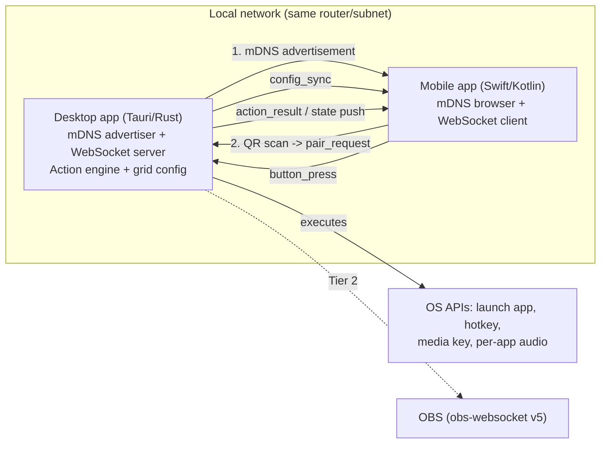
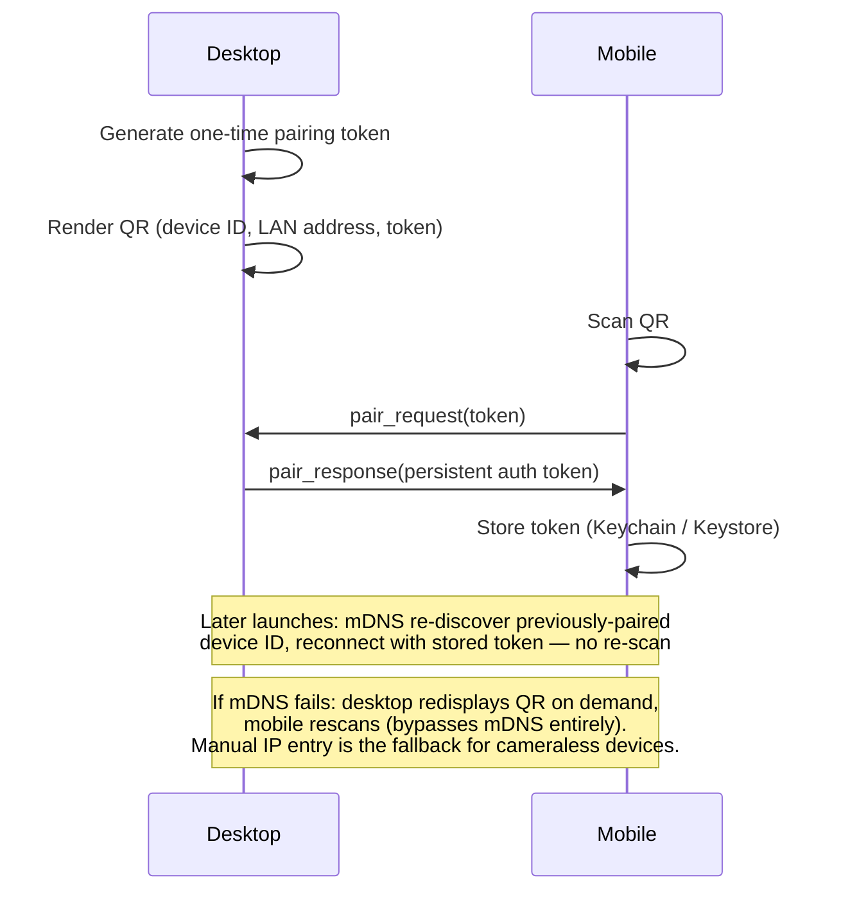

# Architecture Overview — Open-Source Stream Deck Alternative

| Doc Type | Author | Date | Status | Reviewers |
|---|---|---|---|---|
| EDD | Gregory McQuillan | 2026-09-06 | Draft | — (solo project) |

**TL;DR:** An open-source Tauri (Rust) desktop app pairs with native iOS/iPadOS/
Android apps over mDNS discovery + QR-code pairing, turning a phone or tablet into
a fully customizable, stateful button-grid remote for the desktop — no manual IP
entry, no hardware purchase. Product rationale and full requirements live in
`00. Product Requirements.prd.md`; this doc covers how it's built.

---

## 1. Purpose & Objective

**Context:** This document is the technical design for the system described in the
PRD: a Tauri-based desktop app and native mobile apps that together turn a phone or
tablet into a programmable button-grid remote for a nearby computer.

**Problem Statement:** The central technical problem is letting the mobile app
discover and pair with the desktop app on the local network without the user
typing an IP address, while keeping the desktop app cheap enough to run
continuously in the background. Full product motivation and use-case research live
in the PRD — this doc focuses on how those requirements get built.

## 2. Goals & Non-Goals

**Goals** (technical, derived from the PRD)
- Zero-configuration discovery and pairing over LAN.
- Desktop app lightweight enough to run indefinitely in the background.
- A button/grid data model that supports the full PRD Button Model — customizable
  and stateful buttons, folders, swipeable pages, adaptive phone/tablet layout —
  from the first slice, not bolted on later.
- A pluggable action engine so Tier 2+ integrations (OBS, audio mixer) are
  additive, not rewrites.
- Ship as open source (GPLv3 desktop / MIT mobile) with no functionality gated
  behind payment.

**Non-Goals (v1)**
- Off-LAN/remote connectivity — needs a relay/signaling server, deferred.
- USB tethering as a discovery-failure fallback — deferred (iOS restricts
  arbitrary USB-IP tethering without MFi certification); QR-rescan is the primary
  fallback instead (see §5.1).
- A third-party plugin marketplace — the action engine should allow this later,
  not user-facing in v1.
- Multiple mobile devices paired to one desktop instance simultaneously.

## 3. Background & Motivation

This doc was originally drafted before a PRD existed. This project's standing
process is PRD-first, EDD-derived (see `00. Product Requirements.prd.md`); this
revision reconciles the two. Where this doc and the PRD conflict going forward, the
PRD wins on product scope and this doc should be updated to match.

## 4. High-Level Overview

The desktop app runs as a background/tray process, advertises itself on the LAN,
and owns the authoritative button-grid configuration. Mobile apps discover it,
pair once via QR code, and thereafter act as a thin, read/press-only remote:
render the synced grid, send button presses, reflect pushed state changes.

| Component | Choice | License |
|---|---|---|
| Desktop | Tauri (Rust backend + HTML/CSS/JS frontend) | GPLv3 |
| iOS / iPadOS | Native Swift/SwiftUI | MIT |
| Android | Native Kotlin/Jetpack Compose | MIT |
| Protocol | Shared JSON schema (docs only, no linked code) | MIT |



**Why Tauri over Electron:** Tauri uses the OS-native webview (WKWebView/WebView2/
WebKitGTK) instead of bundling Chromium — much smaller idle memory footprint,
which matters for an app that runs continuously in the background.

**Why Tauri over Qt/C++:** Qt/QWidgets has no webview overhead and can be
marginally leaner at idle, but has no strong first-party mDNS support —
integration would mean shelling out to `dns-sd`/Avahi/the Bonjour SDK per
platform. Rust's `mdns-sd` crate (pure-Rust, no OS Bonjour/Avahi dependency) plus
the `tokio` async ecosystem substantially de-risks discovery and concurrent-
connection handling. The dynamic, reorderable grid editor (with folders and pages)
is also considerably cheaper to build in CSS Grid + JS than in QWidgets/QML.

## 5. Detailed Design

### 5.1 Discovery & Pairing



- **Discovery:** mDNS/DNS-SD via the `mdns-sd` crate. Desktop advertises a service
  (e.g. `_streamdeck._tcp.local`) with an instance name and stable device ID on
  launch. Mobile browses using native APIs (`NWBrowser`/`NetServiceBrowser` on
  iOS, `NsdManager` on Android).
- **Pairing:** mDNS proves reachability, not trust — first-time pairing is a
  QR-code handshake as shown above.
- **Recovery:** per the PRD, QR-rescan (not manual IP entry) is the primary
  recovery path if mDNS discovery ever fails, since the QR encodes the address
  directly. The desktop must be able to redisplay its QR on demand, not just
  during initial setup. Manual IP entry is a secondary fallback for mobile devices
  without a usable camera.

### 5.2 APIs & Data Models

Persistent WebSocket transport: `tokio-tungstenite` on the desktop server,
`URLSessionWebSocketTask` on iOS, `OkHttp`/`ktor-client` on Android.

**Schema/model generation: Protocol Buffers**, resolving the earlier open question
of whether `/protocol` should be a schema or markdown prose. `.proto` files in
`/protocol` are the single source of truth, generating typed models via `prost`
(Rust), `swift-protobuf` (iOS), and `wire` or `protobuf-kotlin` (Android) — no
hand-maintained struct definitions per platform to drift out of sync. This is a
codegen/type-safety decision, not a latency one: on LAN, JSON parsing of these
small messages isn't expected to be a meaningful fraction of the 50ms budget (see
§5.4) — protobuf is worth it for keeping three language implementations
consistent, independent of wire format.

**Wire format is a separate, deferred choice.** Protobuf supports both binary and
a canonical proto3 JSON encoding from the same schema. Start with JSON-over-
WebSocket (debuggable with plain browser devtools / a WebSocket inspector) during
early slices; switch to binary encoding later only if profiling an actual build
shows serialization is a real contributor to round-trip latency, not before.

Messages versioned from day one (`protocol_version` field) since desktop and
mobile releases will inevitably drift out of sync.

| Message | Direction | Purpose |
|---|---|---|
| `pair_request` / `pair_response` | M→D / D→M | Token exchange |
| `config_sync` | D→M | Active Profile's full state: buttons (each an action array), folders, pages, appearance |
| `button_press` | M→D | Button ID tapped |
| `action_result` | D→M | Success/failure for a press |
| `state_push` | D→M | Unsolicited state/appearance update (stateful buttons) |
| `profile_switch` | M→D / D→M | Mobile requests switching Profile, or desktop announces an auto-switch (by app focus) — either way followed by a fresh `config_sync` |

A button's action field is an ordered array (0+ entries, per the PRD's
multi-action requirement), not a single value — modeled this way in the `.proto`
schema from the first message, since retrofitting an array later would be a
breaking schema change. Per the PRD's Future Vision, the schema should also avoid
hard-wiring "button" as the only element type — a `oneof`/tagged-union shape for
control elements costs little now and leaves room for a future dial/encoder
element without a breaking change.

**Exported/shared Profile files stay plain, human-readable JSON** regardless of
what the live sync wire format ends up being (§ above) — openness for community
sharing is a product requirement independent of the live-protocol performance
question.

Repo layout:

```
/desktop        Tauri app (Rust + web frontend)   — LICENSE: GPLv3
/ios            Native SwiftUI app                — LICENSE: MIT
/android        Native Kotlin/Compose app         — LICENSE: MIT
/protocol       Shared .proto schema + docs        — LICENSE: MIT
/docs           Design docs (this doc and others)
```

### 5.3 Infrastructure & Storage

- **Button config (desktop):** flat JSON file on local disk. Decision, not left
  open — config size is small (a personal grid, not a multi-tenant dataset), a
  human-readable/diffable file is easier to debug and back up than embedded
  SQLite, and there's no query workload that would justify a database.
- **Auth tokens (mobile):** Keychain (iOS), EncryptedSharedPreferences/Keystore
  (Android) — OS-provided secure storage, not the JSON config file.
- **No cloud storage** of user data in v1 — everything lives on the two paired
  devices.

### 5.4 Performance & Scale

- Button-press round-trip latency target: well under 50ms end-to-end on LAN (PRD
  Success Metrics) — feasible since LAN network latency is sub-millisecond in the
  common case; the budget is mostly UI/serialization overhead, not the network.
- Single desktop, single paired mobile device in v1 (PRD Decisions) — no
  concurrent-connection scaling concerns yet. The WebSocket server should still be
  built on `tokio` so this isn't a rewrite when multi-device support lands.
- Desktop idle background resource usage: no hard number yet — qualitative target
  ("low enough a user has no reason to quit it"), to be measured once the Tauri
  skeleton exists.

### 5.5 Components

**Desktop (`/desktop`, Rust + Tauri)**
- mDNS advertiser + on-demand QR redisplay
- WebSocket server (pairing/auth, config sync, button press handling, state push,
  Profile switch)
- OS-focus watcher for Smart-Profile-style auto Profile switching — always live,
  since (unlike Elgato) this desktop app has no foreground-editor-window state to
  conflict with it
- Action engine: button ID → ordered pluggable action list, registry-based so new
  action types (Tier 2+: OBS, audio mixer) are additive
- Profile export/import to a plain JSON file
- Frontend: CSS Grid button editor — drag-and-drop reordering, folders, swipeable
  pages, Profile management, variable button sizing, live icon/label editing
  (static or animated) — talking to the Rust backend over Tauri's IPC, separate
  from the mobile WebSocket channel

**Mobile (`/ios`, `/android`, native)**
- mDNS discovery + QR pairing (scan and rescan) + persistent reconnect
- Grid UI mirroring synced config, adaptive to phone/tablet screen size, with
  folder navigation, swipe-between-pages, and manual Profile switching (SwiftUI
  `LazyVGrid`, Compose `LazyVerticalGrid` — see the variable-sizing open question
  below on the limits of these APIs)
- Button tap → `button_press` + haptic feedback → reflect `action_result`
- Reflects `state_push` updates live, no manual refresh

## 6. Alternatives Considered

- **Electron (desktop):** rejected — bundles Chromium, too heavy for an always-on
  background app.
- **Qt/C++ (desktop):** rejected for v1 — leanest possible memory use and zero web
  tech, but weaker mDNS story and more implementation work for the dynamic grid
  editor. Worth revisiting if Tauri's webview dependency causes platform-specific
  pain later.
- **React Native / Flutter (mobile):** rejected in favor of fully native Swift/
  Kotlin, per product preference for platform-native integration and performance.
- **Cloud relay for connectivity:** deferred rather than rejected — needed only if
  off-LAN support becomes a requirement; adds a relay/signaling server and NAT
  traversal complexity not justified for v1.
- **SQLite for desktop config:** considered, rejected for v1 — see §5.3.
- **USB tethering as a discovery fallback:** considered, deferred — see Non-Goals.
- **FlatBuffers / Cap'n Proto for the protocol schema:** considered — both offer
  zero-copy binary parsing, but FlatBuffers adds complexity with no measured need
  yet, and Cap'n Proto's Swift/Kotlin ecosystem support is weak. Protobuf's
  tooling maturity across Rust/Swift/Kotlin wins for now (§5.2).
- **Hand-maintained JSON structs per platform:** considered, rejected — lowest
  tooling investment, but leaves three model implementations to drift out of sync
  by hand with no compiler-enforced check; protobuf codegen removes that risk.

## 7. Cross-Cutting Concerns

**Security & Privacy:** GPLv3 (desktop) and MIT (mobile) are license-compatible
because the two only ever communicate over a network protocol — no linked/shared
code — so GPL's copyleft doesn't propagate across that boundary. Pairing tokens
are one-time-use for the handshake, exchanged for a persistent per-device token
stored in OS-provided secure storage (§5.3), not the plaintext config file. No
telemetry or cloud data collection in v1.

**Observability:** minimum bar is local logging on every platform (desktop, iOS,
Android) — connection attempts, pairing failures, action execution errors written
to a local log a user (or the developer, from a bug report) can retrieve, since
there's no cloud telemetry to fall back on (see Security & Privacy). Everything
beyond that — a visible connection-status indicator, in-app error surfacing, log
retention/rotation — is TBD, to be decided once the desktop skeleton exists.

**Testing & Rollout Plan:** structured as vertical slices — each slice is
independently runnable/testable end-to-end, per this project's standing
execution preference, rather than horizontal layers (all-backend-then-all-UI).
Where a full slice isn't possible in one step, build the UI first to validate the
data model before the backend behind it.

1. **Repo scaffold** — this doc, per-directory LICENSE files, empty Tauri/iOS/
   Android project shells, `/protocol` stub.
2. **Protobuf codegen prototype** — a minimal `.proto` message, generated and
   compiled successfully in all three languages (`prost`/`swift-protobuf`/`wire`
   or `protobuf-kotlin`), before any real messages are designed. Validates the
   toolchain works end-to-end before depending on it.
3. **Desktop grid UI, static** — hardcoded buttons (icon/label), no backend, no
   networking. Validates the button/grid data model visually first.
4. **Desktop grid UI, dynamic** — add/remove/reorder, assign a Tier 1 action array
   (launch app/hotkey/media key, one or more per button), persist to the JSON
   config (§5.3). Desktop-only, proves the action engine + editing UX end-to-end.
5. **Folders, pages & Profiles (desktop-only)** — nested grids, swipeable pages,
   and multiple manually-switchable Profiles, still before any networking work,
   extending the already-validated data model.
6. **Cross-device slice 1: discovery → pairing → config sync** — mDNS
   advertisement + WebSocket server; a minimal mobile shell (iOS first) that
   discovers, completes QR pairing, and renders the synced grid read-only.
7. **Cross-device slice 2: button press round trip** — mobile tap → `button_press`
   → desktop executes a Tier 1 action → `action_result` → mobile shows result +
   haptic feedback. This is the PRD's MVP fully realized end-to-end.
8. **Stateful buttons** — desktop `state_push` for toggle-style actions; mobile
   reflects live without a manual refresh.
9. **Profile switching, cross-device** — manual switch from mobile
   (`profile_switch` → fresh `config_sync`), then the OS-focus watcher for
   auto-switching.
10. **QR reconnect fallback** — on-demand QR redisplay + rescan-to-reconnect, plus
    manual IP entry for cameraless devices.
11. **Second mobile platform (Android)** — port the now-validated flow.
12. **Tier 2 integrations** — OBS control (obs-websocket v5) first, per-app audio
    mixer as a parallel/second slice.
13. **Profile export/import** — plain-JSON file, for community sharing.
14. **Packaging & distribution** — Tauri bundler (dmg/msi/deb/AppImage); App
    Store/Play Store submission.

## Open Questions

- Desktop frontend framework for the grid editor (e.g. Svelte vs. vanilla JS) —
  not yet decided, doesn't block early slices.
- Which Kotlin protobuf codegen to use (`wire` vs. `protobuf-kotlin`/
  `protobuf-java` interop) — decide once the Android slice starts.
- When (if ever) to switch the wire encoding from proto3 JSON to binary — deferred
  until there's a measured latency number to react to (§5.2).
- **Variable-size (multi-cell-spanning) buttons on native mobile grids.**
  CSS Grid supports column/row spanning natively for the desktop editor; SwiftUI's
  `LazyVGrid`/`LazyVerticalGrid` and Compose's `LazyVerticalGrid` don't support
  arbitrary spans as directly — likely needs a custom `Layout` (SwiftUI) or custom
  layout composable (Compose) instead of the off-the-shelf lazy grid. Needs a
  timeboxed spike before committing to the feature (PRD Button Model), since it
  may be materially harder than the desktop side implies.

## Sources

See `00. Product Requirements.prd.md` for product research and sourcing.
