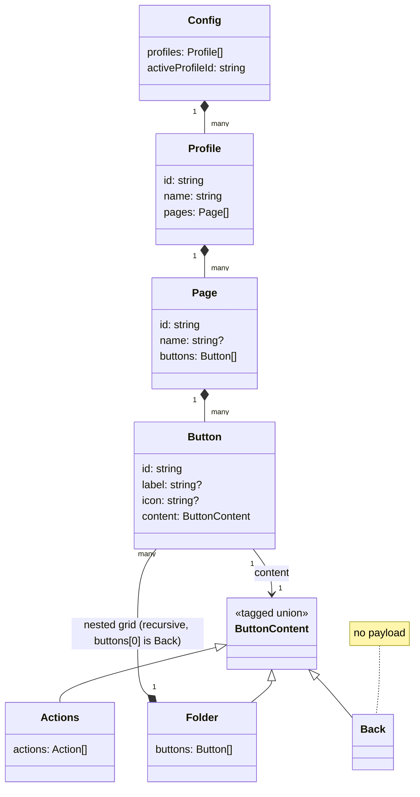
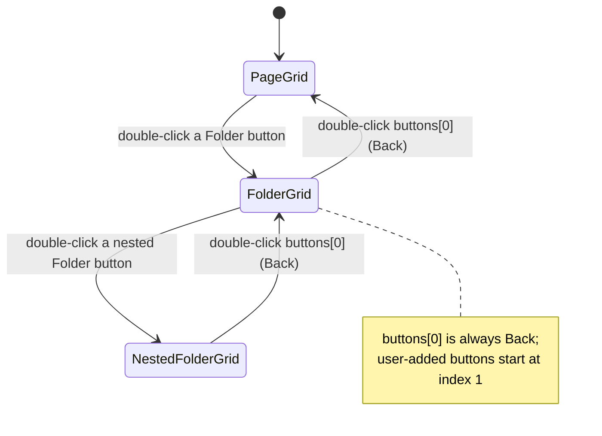

<!-- docs/slices/04. Folders Pages Profiles.spec.md -->

# Slice Spec: Folders, Pages & Profiles

| | |
|---|---|
| **Doc Type** | Slice Spec |
| **Author** | Gregory McQuillan |
| **Date** | 2026-09-08 |
| **Status** | Draft |
| **Reviewers** | — (solo project) |

**Implements:** `01. Architecture Overview.edd.md`, Testing & Rollout Plan step 4.
**TL;DR:** Extend slice 3's flat, single-grid config into the full desktop-only
Button Model — nested folders, swipeable Pages within a Profile, and multiple
manually-switchable Profiles — still entirely local, still no networking or
protobuf, proving out the last of the data model shape before it's translated
into a `.proto` schema (roadmap step 6).

---

## Scope

**In:**
- **Pages:** a Profile holds an ordered list of one or more Pages, each a flat
  grid of buttons (slice 3's shape). Desktop UI navigates between Pages via
  tabs/arrows; add, remove, and rename a Page.
- **Folders:** a button may act as a folder instead of holding actions —
  double-clicking it in the preview grid navigates into a nested grid of its
  own buttons. That nested grid's own `buttons` array always carries a real
  **Back button as its first element** (not UI-only chrome) so the way back
  to the parent is ordinary button data — see Interface section. Folders may
  nest arbitrarily deep.
- **Profiles:** multiple independently-switchable named configurations, each
  with its own Pages/folders/buttons. Create, rename, delete, and manually
  switch the active Profile from the desktop UI.
- Persistence: the whole `Config` (all Profiles, Pages, folders, buttons, and
  which Profile is active) round-trips through `serde_json` to the same local
  config file mechanism as slice 3 (EDD §5.3), on the same load-on-start /
  save-on-edit cadence.
- Existing Tier 1 action execution (launch app / hotkey / media key) and the
  editor's Test affordance keep working for buttons at any depth — inside a
  folder, on a non-default Page, in a non-default Profile.

**Out:**
- Networking, protobuf, mobile changes of any kind — roadmap steps 5+.
- **OS-focus auto-switching of Profiles** ("Smart Profiles") — explicitly a
  cross-device concern per the roadmap (step 10); this slice only does manual
  switching from the desktop UI itself.
- **Folder auto-return-to-parent after an idle timeout** — PRD lists this as
  optional and off-by-default. Adds a timer mechanism that isn't needed to
  prove the nesting data model works; deferred rather than built now. Flagged
  here so it isn't lost, same treatment slice 3 gave the Accessibility-
  permission timing question. Likely lands as an `auto_fire_after_seconds`
  property on `Back` itself rather than a separate folder setting — see the
  Interface section's note on the `Back` variant — also not in scope here,
  along with letting the user set a custom label on `Back`.
- Dragging a button *between* Pages, or into/out of a folder. Slice 3's
  same-grid drag-reorder still works within one Page or one folder's grid;
  cross-context moves are a natural follow-up, not required to validate the
  Page/Folder/Profile shapes themselves.
- Stateful/live-updating buttons (`state_push`) — roadmap step 9.
- Tier 2+ actions (OBS, audio mixer) — roadmap step 13.
- Profile export/import — roadmap step 14.
- Variable-size (cell-spanning) buttons — still an open EDD question,
  unrelated to this slice.
- **Per-page configurable grid dimensions (rows/columns as a "density"
  setting)** — this is the PRD's "Adaptive grid" density control (§ Adaptive
  grid), the sibling of the cell-spanning question above: same section, two
  independent controls. Not built this slice; the desktop preview's grid
  currently uses a hardcoded column count instead (4 in Portrait, 8 in
  Landscape — chosen so square buttons keep a comparable row count visible
  in either shape) as a stand-in for what should eventually be a per-Page
  `rows`/`columns` property the user sets, with the grid auto-scaling to fit.
  Whatever scaling logic desktop lands on should apply identically on mobile
  clients once those exist, rather than mobile inventing its own density
  rules — flagged here so the future config schema accounts for it as a
  Page-level property (alongside `id`/`name`/`buttons`) rather than being
  retrofitted later.
- Animated icons, live/dynamic text — later polish, unrelated to this slice.
- Light/dark theme switching — still deferred (slice 2's note stands).
- "Swipe" as a literal touch gesture — this is a desktop, mouse/trackpad-
  driven slice. Page navigation validates the *data model* (a Profile has
  multiple ordered Pages); the swipe *gesture* itself is a mobile-slice
  concern (roadmap step 5).

> **Rule for agent:** stay inside this scope. If something out of scope blocks
> you, stop and flag it — don't silently expand scope to route around it.

## Files to Touch

- `/desktop/src-tauri/src/config.rs` — modify — replace the flat
  `Vec<Button>` shape with `Config { profiles, active_profile_id }` /
  `Profile { id, name, pages }` / `Page { id, name, buttons }`; replace
  `Button`'s `actions: Vec<Action>` field with a tagged `content:
  ButtonContent` enum (`Actions { actions }` | `Folder { buttons }` |
  `Back`) so a button can't hold more than one kind of content at once — see
  Interface section. Add a helper that builds a new `Folder`'s initial
  `buttons` vec as `vec![Button { content: ButtonContent::Back, .. }]` — the
  single source of truth for "every folder starts with a Back button at
  index 0," used both by the default-bootstrap config and whenever the
  editor toggles a button to `Folder`. Replace `load_buttons`/`save_buttons`
  with `load_config`/`save_config` operating on the whole `Config`. Bootstrap
  a default `Config` (one Profile, one Page, no buttons) when no config file
  exists yet, same as slice 3's empty-state handling.
- `/desktop/src-tauri/src/actions.rs` — no change expected. Already
  Tauri-agnostic and operates on a plain `&[Action]`; reused as-is.
- `/desktop/src-tauri/src/lib.rs` — modify — replace `list_buttons`/
  `save_button`/`delete_button`/`reorder_buttons`/`press_button` with three
  commands: `get_config`, `save_config`, `run_actions` (see Interface section
  for why the surface shrinks rather than grows).
- `/desktop/src/lib/types/button.ts` — modify — add `Config`/`Profile`/`Page`
  interfaces mirroring the new Rust shapes; replace `Button.actions` with a
  `content: ButtonContent` discriminated union mirroring the new Rust enum.
- `/desktop/src/lib/stores/buttons.svelte.ts` — rewrite, rename to
  `/desktop/src/lib/stores/config.svelte.ts` — the old name no longer fits
  once it holds the whole `Config` tree, not a flat button list. Holds the
  loaded `Config` plus UI-local navigation state (current Page id, and the
  stack of folder-button ids drilled into so far); exposes the currently
  visible button array derived from that navigation state; every mutation
  (button CRUD, Page CRUD, Profile CRUD/switch, folder enter/exit) updates the
  in-memory `Config` and calls `save_config` to persist the whole tree.
- `/desktop/src/lib/components/PreviewPane.svelte` — modify — render the
  current navigation context's buttons (including the real `Back` button
  whenever inside a folder) instead of a flat list; wire double-click on a
  cell to "fire" that button, dispatched on `ButtonContent` (run its
  actions / navigate in if it's a folder / navigate up if it's `Back` — see
  Implementation Notes); a `Back`-content cell is excluded from drag-reorder
  and has no delete affordance, since it isn't a button the user authored;
  fold in `ProfileSwitcher` and `PageTabs`. No separate breadcrumb chrome
  needed — the `Back` button in the grid is the back affordance.
- `/desktop/src/lib/components/ButtonEditor.svelte` — modify — add an
  "Is folder" toggle; when on, hide/disable the action-array editor and the
  Test button (a folder button navigates, it doesn't execute), and show a
  "Content" panel in their place with a "Show Content" button that navigates
  into the folder (same navigation as double-clicking it in the preview
  grid). Selecting the `Back` button itself opens a minimal, non-editable
  view — no label/icon/actions fields, since it's not user-authored content —
  with a "Navigation" panel and a "Go Back" button mirroring the Folder
  panel's "Show Content" pattern.
- `/desktop/src/lib/components/ProfileSwitcher.svelte` — create — dropdown of
  Profiles with create/rename/delete, and switching the active one.
- `/desktop/src/lib/components/PageTabs.svelte` — create — tab row for the
  active Profile's Pages, with add/remove/rename.
- `/desktop/src/routes/+page.svelte` — modify — wire the new store shape
  through to `PreviewPane`/`ButtonEditor`.

> **Rule for agent:** don't touch files outside this list without flagging it
> first. If reality doesn't match this list once you're in the code, correct
> the list rather than guessing around it.

## Interface / Data Contract

Still provisional/frontend-and-desktop-only — informs but does not commit the
future `.proto` schema (EDD §5.2). This is the shape the EDD's `config_sync`
message already anticipates ("Active Profile's full state: buttons, folders,
pages, appearance" — EDD §5.2 table), which is why this slice loads/saves a
whole `Profile`/`Config` rather than individual buttons.

### Type Overview



Exactly one path in this diagram is recursive — `Folder` contains `Button`,
the same type it hangs off of — which is what lets folders nest arbitrarily
deep without any new types. Everything else is a strict tree with no other
cycles.

```rust
#[derive(Serialize, Deserialize, Clone)]
#[serde(rename_all = "camelCase")]
struct Config {
    profiles: Vec<Profile>,
    active_profile_id: String,
}

#[derive(Serialize, Deserialize, Clone)]
#[serde(rename_all = "camelCase")]
struct Profile {
    id: String,
    name: String,
    pages: Vec<Page>,
}

#[derive(Serialize, Deserialize, Clone)]
#[serde(rename_all = "camelCase")]
struct Page {
    id: String,
    name: Option<String>,
    buttons: Vec<Button>,
}

#[derive(Serialize, Deserialize, Clone)]
#[serde(rename_all = "camelCase")]
struct Button {
    id: String,
    label: Option<String>,
    icon: Option<String>,
    content: ButtonContent,
}

#[derive(Serialize, Deserialize, Clone)]
#[serde(tag = "type", rename_all = "camelCase")]
enum ButtonContent {
    Actions { actions: Vec<Action> },
    Folder { buttons: Vec<Button> }, // this button's own nested grid; its
                                      // buttons may themselves be `Folder`
                                      // to nest further. `buttons[0]` is
                                      // always a `Back` button — see below.
    Back, // no payload — pops one level off the current navigation stack,
          // wherever it's rendered. Doesn't need to know its parent's id.
}
// Action / MediaKeyKind unchanged from slice 3.
```

**Exclusivity is enforced by the type itself, not by convention.** A `Button`
holds exactly one `ButtonContent` — `Actions`, `Folder`, or `Back`, never a
mix — so there's no invalid state to define precedence rules for the way an
`Option<Vec<Action>>` + `Option<Vec<Button>>` pairing would need. Same
tagged-enum pattern already used for `Action` (`#[serde(tag = "type")]`), so
this is consistent with the existing convention rather than a new one.
Toggling a button between "regular" and "folder" in the editor UI means
swapping which `ButtonContent` variant it holds — any actions entered before
switching to `Folder` are discarded, and vice versa, since a variant swap
can't carry data across to the other shape. That's expected behavior here,
not a bug to fix.

**Back is real button data, not UI chrome — this is the point.** When a
button's content is set to `Folder`, its `buttons` vec is initialized with
exactly one entry — a `Back`-content button — at index 0, before any
user-added buttons. This is what makes the preview grid an honest 1:1 stand-in
for what a future mobile client will render (per this project's standing
preview-is-1:1 principle): mobile doesn't need any bespoke "draw a back
chevron when inside a folder" logic of its own, because the back button
already comes down the wire as an ordinary array element like any other
button. `Back` needing no payload (no parent-folder id) is what keeps this
simple — "go back" always means "pop whatever navigation stack got you to
wherever this button is currently being rendered," so the same `Back` button
value is valid at any nesting depth without needing to know where it is.

**Future, not in scope here:** letting the user set a custom label/icon on a
`Back` button (it's presented as locked/non-editable in this slice), and an
"auto-back" option — a configurable delay in seconds after which a `Back`
fires on its own. The latter is very likely the concrete mechanism for the
"folder auto-return-to-parent after an idle timeout" item already deferred
in Scope — worth implementing as a property of the `Back` button itself
(e.g. `Back { auto_fire_after_seconds: Option<u32> }`) rather than a
separate folder-level setting, once it's picked up. Noted so both mentions
of this idea point at the same eventual feature instead of drifting into two
different designs.

Tauri commands — the surface shrinks from slice 3's five commands to three,
because ownership of "where am I in the tree" moves to the frontend (which
already has to hold the full active-Profile tree to render Pages/folders
anyway), so a server-side per-id lookup is no longer needed for pressing a
button:

| Command | Signature | Purpose |
|---|---|---|
| `get_config` | `() -> Config` | Load the whole config on app start |
| `save_config` | `(config: Config) -> ()` | Persist the whole config after any edit |
| `run_actions` | `(actions: Vec<Action>) -> Result<(), String>` | Execute one button's action array — the frontend passes the actions directly since it already has them, no id lookup needed |

### Navigation Flow

Purely frontend/store state — none of this is persisted, and none of it
needs a Tauri round-trip beyond the `save_config` that follows any edit made
while navigated somewhere other than the top level.



`PageTabs` switching, and `ProfileSwitcher` switching, both reset this stack
back to `PageGrid` at whatever Page/Profile was selected — they're lateral
moves, not another level of the same in/out stack a `Folder`/`Back` pair
walks.

## Implementation Notes

- **Config file format change is breaking.** Slice 3's `buttons.json` held a
  bare `Vec<Button>`; this slice's file holds a `Config`. No real user data
  exists yet (same situation slice 3's own rollback note flagged), so no
  migration code — just delete the old config file (path noted in slice 3's
  Implementation Notes) before first run against this slice's code.
- **Default bootstrap:** first run with no config file creates
  `Config { profiles: [Profile { id, name: "Default", pages: [Page { id, name: None, buttons: [] }] }], active_profile_id: <that profile's id> }`.
  Mirrors slice 3's empty-grid-is-fine starting state.
- **Single click vs. double click, a UX decision worth stating plainly:** a
  single click on a preview cell keeps meaning "select it for editing"
  (unchanged from slice 3 — lets you rename/re-icon a folder button, or flip
  its folder toggle off, without triggering anything). A **double click
  "fires" the button** — the same underlying action as the editor's existing
  Test button, extended to also cover `Folder` and `Back` content: for
  `Actions` content it runs the action array via `run_actions`; for `Folder`
  content it navigates into that nested grid; for `Back` content it pops the
  navigation stack up one level — none of the latter two call into
  `actions.rs` at all. One dispatch-on-`ButtonContent`-variant behavior,
  reachable from two places: double-clicking the cell in the preview grid,
  and — new for this slice — a panel inside `ButtonEditor` itself ("Content"
  for `Folder`, "Navigation" for `Back`) with a button that fires the same
  dispatch. It exists because the editor is where you're already looking
  after selecting the cell, and making you leave the editor, find the cell,
  and double-click it just to trigger the same thing would be a needless
  detour. Single-click-to-select is what makes double-click safe to add on
  the grid: it can't be confused with the editing click since they're
  different gesture counts, not different targets.
- **Back-button invariants, enforced by the store, not left to the UI to get
  right by convention:** always present at index 0 of a `Folder`'s `buttons`
  (created automatically — see `config.rs`'s helper — never by the user
  manually adding one); excluded from delete (no delete affordance is shown
  for it); excluded from drag-reorder (can't be dragged away from index 0,
  and no other button can be dropped ahead of it). These rules live in the
  store/`PreviewPane`, since `ButtonContent::Back` itself is just a plain
  enum variant with nothing stopping a hand-edited config from putting one
  anywhere — same "the type doesn't fully police this, the app does" caveat
  slice 3 already accepted for other invariants.
- **Page navigation is click-driven (tabs/arrows), not a touch swipe** — see
  Scope. Validates the data model; the mobile slice (roadmap step 5) is where
  a literal swipe gesture belongs.
- Keep the Rust core Tauri-agnostic — same architecture principle slice 3
  established. `config.rs` continues to take `&Path`, never `AppHandle`;
  `actions.rs` needs no changes at all, which is a good sign the boundary
  drawn in slice 3 was in the right place.
- Deleting a Profile: block deleting the last remaining Profile (there must
  always be at least one) and require switching away from the active Profile
  before/at the moment of deleting it — pick whichever is simpler once in the
  editor UI, but don't leave `active_profile_id` pointing at a Profile that
  no longer exists.

## Definition of Done

- [ ] Add a second Page to the active Profile; switch between Pages via the
      UI; each Page holds its own independent set of buttons.
- [ ] Turn a button into a folder, double-click it in the preview grid to
      navigate into it, and confirm a real `Back` button appears as the
      first cell in the resulting grid (not a separate breadcrumb element).
      Add buttons inside it, then double-click the `Back` cell to navigate
      out.
- [ ] Confirm the `Back` cell can't be deleted and can't be dragged away
      from index 0 (and nothing can be dropped ahead of it).
- [ ] With a folder button selected in the editor, click its "Content"
      panel's "Show Content" button and confirm it navigates into the same
      folder double-click does; select the `Back` button itself and confirm
      its "Navigation" panel's "Go Back" button navigates up a level.
- [ ] Nest a folder inside a folder (two levels deep); navigate all the way
      in (double-clicking each nested folder button) and all the way back
      out (double-clicking each level's own `Back` button).
- [ ] Double-click a regular (non-folder) button in the preview grid and
      confirm it fires its action array with a real observable effect — same
      outcome as the editor's Test button, triggered from the grid directly.
- [ ] Create a second Profile with its own distinct Pages/buttons, switch to
      it, confirm it's fully independent of the first, then switch back.
- [ ] Delete a non-active, non-last Profile and confirm its data is gone.
- [ ] A regular button's action array still executes correctly (Test button
      in the editor, real observable effect) from inside a nested folder and
      from a non-default Page in a non-default Profile — proves the action
      engine still works unchanged at any depth/location.
- [ ] Quit and relaunch the app — all Profiles, Pages, folder nesting, and
      which Profile was active all persist exactly as left.

**Verification:**
```
cd desktop && npm run tauri dev
```
Manually walk every checklist item above; no automated test at this stage,
same rationale as slices 2 and 3 — this is UI/UX and a data-model shape that
need eyes on it, not unit coverage.

> **Rule for agent:** run the verification command above and manually confirm
> every Definition of Done item before declaring this slice done — don't
> assume it passed.

## Rollback

Low-medium risk — a breaking local config-file format change (see
Implementation Notes) plus a real rewrite of the frontend store's shape and
navigation model. No real user data exists yet, so if the new tree shape goes
sideways mid-implementation, deleting the local config file and relaunching
is safe and matches slice 3's own rollback posture. If the store rewrite
itself gets tangled, slice 3's flat single-grid version is still in git
history to fall back to and re-extend differently.
