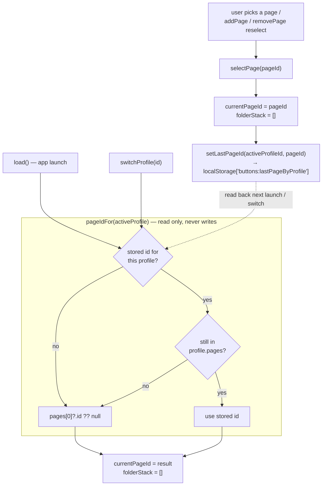

<!-- docs/slices/04b. Last Viewed Page.spec.md -->

# Slice Spec: Last Viewed Page

| | |
|---|---|
| **Doc Type** | Slice Spec |
| **Author** | Gregory McQuillan |
| **Date** | 2026-09-10 |
| **Status** | Draft |
| **Reviewers** | — (solo project) |

**Implements:** no EDD roadmap step directly — a slice-4 follow-up (see
`04. Folders Pages Profiles.spec.md` → Post-Implementation Notes, and
`03. Desktop Grid UI Dynamic.spec.md`). Its own thin vertical slice per this
project's execution preference.
**TL;DR:** Remember which Page each Profile was last parked on and restore it
on launch and on Profile switch — stored device-local in webview
`localStorage`, never in `Config`, so a paired phone and desktop don't yank
each other's view around. Folder drill-in depth is still deliberately not
persisted.

---

## Scope

**In:**
1. **`navState.ts`** — a tiny device-local read/write helper over
   `localStorage`, one key holding `Record<profileId, pageId>`. Sync API,
   fully guarded (a thrown or absent `localStorage` degrades to "no stored
   page"). This is the whole persistence mechanism — no Rust, no new file
   beside `buttons.json`, no dependency.
2. **Restore on launch** — `configStore.load()` sets `currentPageId` to the
   active Profile's stored last page instead of always `pages[0]`.
3. **Restore on Profile switch** — `configStore.switchProfile()` restores the
   target Profile's stored last page instead of always `pages[0]`. (The
   memory note said "on launch"; switch is the same mechanism keyed the same
   way and is the more visible half — decided in, not left to discover.)
4. **Record on navigation** — `configStore.selectPage()` writes the new page
   id for the active Profile. This one write point already covers manual
   pager clicks (`PagePager.svelte`), `addPage()`, and the post-delete
   reselect in `removePage()`, all of which route through `selectPage()`.
5. **Fallback chain** (stale entries are harmless, so no pruning needed):
   stored id → still present in `activeProfile.pages`? → else
   `pages[0]?.id ?? null`.
6. **EDD §5.2 + Open Questions** — *already revised alongside this spec
   (2026-09-10), not an implementation task:* §5.2's "never a live navigation
   cursor" decision is now scoped to "not until step 7," and a new Open
   Question "Live navigation-cursor mirroring" captures the deferred
   phone-mirrors-desktop-screen feature. This also resolved a dangling
   "see the nav-state-sync note below" reference in §5.2.
7. **EDD §5.3 note** *(implementation task)* — add a bullet to
   `01. Architecture Overview.edd.md` §5.3 that **draws the storage
   boundary**, not just records this choice:
   ephemeral view/nav state (last-viewed page, and future scroll pos / window
   bounds / collapsed sections) lives in webview `localStorage`, device-local
   and deliberately outside `Config`; genuine device-local *settings* (a
   per-device theme override, a this-machine hotkey toggle, a device
   nickname) — if any land later — get a JSON file beside `buttons.json`
   instead, per §5.3's existing "human-readable/diffable, easy to debug and
   back up" reasoning. Stating the line now, before there's a second case,
   keeps the next thing from landing in `localStorage` reflexively. Same
   precedent as 04a correcting §7.

**Out:**
1. **Persisting folder depth.** `folderStack` still resets to `[]` on launch
   and on every `selectPage`/`switchProfile`. Relaunching several folders
   deep is disorienting and contradicts slice 4's own deferred
   "auto-return-to-parent after idle" direction — folder drill-in is meant to
   be transient. Do not add it.
2. **Pruning stale `localStorage` entries** on `deleteProfile` / `removePage`
   / page delete. The fallback chain above makes a dangling id a no-op; a
   deleted profile's entry is a few dead bytes. If entry bloat ever matters,
   prune then — not now.
3. **Putting navigation state on the wire.** This slice's persistence is
   desktop-local `localStorage`, launch-only — not a `config_sync` field, not
   a `profile_switch` payload. Live navigation-cursor mirroring (the phone
   showing the desktop's current page + folder depth) is real product intent
   but a **step-7+** feature — it needs the WebSocket server, which doesn't
   exist yet — and is designed there, not here. See EDD §5.2 (revised
   2026-09-10) and Open Questions → "Live navigation-cursor mirroring". The
   two are deliberately separate: `localStorage` restore is a desktop-only
   launch convenience; cursor mirroring is a live runtime channel.
4. **Anything about the native iOS / Android apps.** They don't persist a
   last-viewed page from this slice; whether they ever do is folded into the
   step-7 cursor-mirroring question above.
5. **A general device-local settings store / framework.** This is one helper
   for one `Record`. If a second device-local setting shows up later
   (window bounds, per-device theme override), generalize then.
6. **Migrating existing `Config` persistence** or touching the Rust
   `get_config` / `save_config` path at all.
7. Light-mode styling — still deferred project-wide.

> **Rule for agent:** stay inside this scope. If something out of scope
> blocks you, stop and flag it — don't silently expand scope to route around
> it.

## Files to Touch

1. `/desktop/src/lib/stores/navState.ts` — **create** — plain `.ts` (no
   reactivity). Exports `getLastPageId(profileId: string): string | null` and
   `setLastPageId(profileId: string, pageId: string): void`. Internally: one
   key `buttons:lastPageByProfile`, value is `JSON.stringify(Record<string,
   string>)`. Every `localStorage` access wrapped in `try/catch`; a failed
   read returns `null`, a failed write is swallowed. Corrupt JSON → treat as
   empty.
2. `/desktop/src/lib/stores/config.svelte.ts` — **modify** —
   1. add a private `pageIdFor(profile: Profile | null): string | null`
      implementing the fallback chain (reads `getLastPageId`).
   2. `load()`: `this.currentPageId = this.pageIdFor(this.activeProfile);`
      (still `this.folderStack = [];`).
   3. `switchProfile()`: `this.currentPageId = this.pageIdFor(this.activeProfile);`
      in place of the current `?.pages[0]?.id ?? null`.
   4. `selectPage(pageId)`: after setting `currentPageId`, call
      `setLastPageId(this.config.activeProfileId, pageId)` when
      `this.config` is present. Stays sync.
3. `/docs/01. Architecture Overview.edd.md` — **modify** — §5.3 boundary
   bullet (see Scope). (§5.2 + Open Questions already revised alongside this
   spec.)

> **Rule for agent:** don't touch files outside this list without flagging it
> first.

## Interface / Data Contract

```ts
// $lib/stores/navState.ts

/** Active-Profile last-viewed Page ids, device-local. Key:
 *  localStorage["buttons:lastPageByProfile"] = JSON<{ [profileId]: pageId }> */

/** Stored page id for this profile, or null if none / storage unavailable. */
export function getLastPageId(profileId: string): string | null;

/** Record the current page for this profile. No-op on storage failure. */
export function setLastPageId(profileId: string, pageId: string): void;
```

```ts
// config.svelte.ts — new private helper

private pageIdFor(profile: Profile | null): string | null {
  if (!profile) return null;
  const stored = getLastPageId(profile.id);
  if (stored && profile.pages.some((p) => p.id === stored)) return stored;
  return profile.pages[0]?.id ?? null;
}
```

## Flow



## Implementation Notes

1. **Why `localStorage` and not a Rust-backed file:** verified 2026-09-10
   that webview `localStorage` survives a full Cmd-Q / relaunch in this app's
   WKWebView. It keeps `selectPage()` synchronous — a Rust `invoke` would
   force `selectPage` async and ripple through its three sync call sites
   (`PagePager.svelte`, `addPage`, `removePage`). Nav state is a best-effort
   UI convenience; losing it on a hard crash is acceptable, so the durability
   gap vs. an `fsync`'d file doesn't matter.
2. **One key, not a key per profile** — a single `Record` is one parse, one
   write, and trivially inspectable in devtools.
3. **Dev and prod are different origins.** `tauri dev` serves the frontend
   from `http://localhost:1420`; a built app serves from `tauri://localhost`
   — separate `localStorage` partitions. The 2026-09-10 durability probe ran
   in dev, so a production build starts with an empty store and opens on
   Page 1 the first time. Expected, not a bug — note it during the DoD walk
   so it isn't chased.
4. **Rust can't read `localStorage`.** Fine here — nothing Rust-side needs
   the current page — but it's the constraint that would force a
   Rust-backed file if that ever changes.
5. **The native apps won't reuse this.** `ios/` / `android/` are full native
   apps, not web wrappers — their view state belongs in `UserDefaults` /
   `SharedPreferences` per platform, mirroring how §5.3 already splits
   auth-token storage. Not shared code, by design.
6. **`pageIdFor` is the single source of the fallback chain** — both `load()`
   and `switchProfile()` call it, so "stored → valid? → page 1" lives once.
7. **`selectPage` is the only write point.** Confirm during implementation
   that nothing sets `currentPageId` directly except `load()` /
   `switchProfile()` (which restore, and must not write back) — as of this
   spec, `config.svelte.ts:66,72,80` are the only assignments.
8. **Do not write from `switchProfile` / `load`.** Restoring a page is not a
   user choice; only an explicit `selectPage()` records one. Writing back the
   restored value would be harmless but muddies intent.
9. Keep `navState.ts` dumb: no knowledge of `configStore`, profiles, or
   pages beyond the two string ids it's handed.

## Definition of Done

1. [ ] Park on Page 3 of a Profile, Cmd-Q, relaunch → app opens on Page 3,
       not Page 1. `folderStack` is empty (folders not restored).
2. [ ] Switch to another Profile that was last on Page 2, then back → each
       returns to its own last page.
3. [ ] A Profile never navigated away from Page 1 still opens on Page 1.
4. [ ] Delete the page you were parked on → next launch falls back to Page 1
       (no error, no blank grid).
5. [ ] Manually clear `localStorage` → app launches on Page 1 for every
       Profile, no error.
6. [ ] `npm run check` passes with no new errors.
7. [ ] EDD §5.3 records nav state as device-local, outside `Config`.

**Verification:**
```
cd desktop && npm run check && npm run tauri dev
```
Then manually walk every checklist item above. No automated test at this
stage — same rationale as slices 2–4.

## Rollback

Low risk — one new plain-TS file plus three small edits in
`config.svelte.ts` and a doc bullet. If restore misbehaves, revert
`config.svelte.ts` to set `currentPageId = activeProfile?.pages[0]?.id ??
null` in both `load()` and `switchProfile()` and delete `navState.ts`;
nothing else imports it. Stored `localStorage` keys are inert once the
helper is gone.
