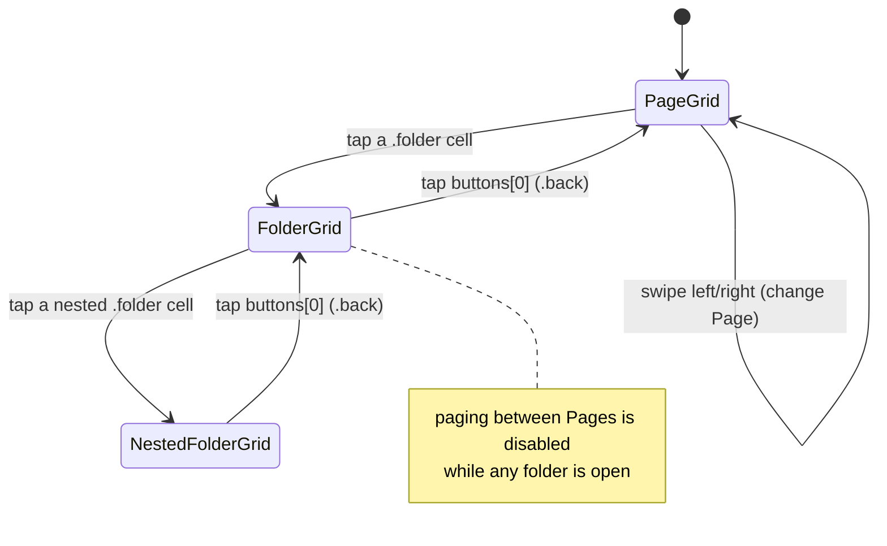

<!-- docs/slices/05. Mobile Grid UI Static.spec.md -->

# Slice Spec: Mobile Grid UI, Static

| | |
|---|---|
| **Doc Type** | Slice Spec |
| **Author** | Gregory McQuillan |
| **Date** | 2026-09-10 |
| **Status** | Draft |
| **Reviewers** | — (solo project) |

**Implements:** `01. Architecture Overview.edd.md`, Testing & Rollout Plan step 5.
**TL;DR:** The iOS app renders the same Button / grid / folder / Page shapes
the desktop already validated (slices 2–4), driven entirely by hand-written
Swift mock data — no discovery, no pairing, no networking, no protobuf, no
`Codable`. This is the last *pre-schema* UI slice: by the end of it the
desktop and iOS UI needs are both known, so step 6 can translate a validated
shape into the `.proto` schema rather than guess at one. It is not the last
UI work overall — the Android port (step 12) is another UI slice, deferred
until the proto shapes and round-trip networking are proven on iOS first.

---

## Scope

**In:**
- **Swift model mirror** of `desktop/src/lib/types/button.ts` — `Config`,
  `Profile`, `Page`, `Button`, and `ButtonContent` as an enum with associated
  values (`.actions([Action])` / `.folder([Button])` / `.back`), plus
  `Action` and `MediaKeyKind`. Plain value types only. No `Codable`
  conformance, no JSON, no wire concerns — that starts at step 6/7.
- **Mock `Config`** as a Swift literal: one Profile, two or three Pages, a
  mix of `.actions` buttons and at least one `.folder` nested two levels
  deep. Every `.folder`'s `buttons` array starts with a `.back` button at
  index 0, exactly as the desktop config does — the back button is ordinary
  button data, not view chrome (EDD §5.5, slice 4 Interface).
- **Grid rendering** — a scrollable grid of button cells for the current
  navigation context. Fixed column count mirroring the desktop preview:
  **4 in portrait, 8 in landscape** (see slice 4's density note — mobile does
  not invent its own density rules). Each cell shows the button's icon glyph
  and label; a `.back` cell with nil icon/label falls back to `⬅` / "Back",
  matching desktop's `DeckButton`.
- **Folder navigation** — tapping a `.folder` cell drills into its nested
  grid; tapping the `.back` cell (index 0) pops one level. Arbitrarily deep.
  A navigation stack held as SwiftUI view state, not persisted.
- **Swipe between Pages** — a horizontally paged container swipes between the
  active Profile's Pages (PRD Mobile §4; slice 4 explicitly deferred the
  literal swipe gesture to "the mobile slice, roadmap step 5"). Swiping is
  only available at the top level of a Page, not inside a folder.
- **Portrait + landscape** — the grid re-lays-out to 8 columns on rotation.
  `TARGETED_DEVICE_FAMILY` stays `"1"` (iPhone).
- **Tapping an `.actions` button does nothing** beyond an optional brief
  pressed-state visual. No action runs — there is no desktop to run it on.

**Out:**
- `Codable` / JSON / protobuf / any serialization or wire format — step 6.
- Networking, mDNS discovery, QR pairing, auto-reconnect, manual IP entry —
  steps 7 and 11.
- `button_press` events, action execution, haptic feedback, success/failure
  result display — step 8.
- Live state / stateful buttons (`state_push`) — step 9.
- **Manual Profile switching from mobile, and any Profile-switcher UI** —
  step 10. The EDD says a paired device shows only the active Profile, from
  step 7 on; this slice renders the mock Profile's Pages and nothing else.
  Mock data may still contain a single Profile only.
- Editing anything — the grid is read/press-only by design (PRD § Grid
  authority); no add/remove/reorder/rename, no `ButtonEditor` equivalent,
  no drag-reorder.
- iPad / tablet-specific layouts and size-class adaptation beyond the
  portrait/landscape column swap.
- Android — step 12.
- Per-Page configurable grid density, cell-spanning buttons, animated icons,
  dynamic text, light/dark theme switching — same deferrals as slices 2–4.
- Restoring last-viewed Page or folder depth on relaunch — navigation state
  is view-local and resets on launch, same posture as desktop before slice
  04b.

> **Rule for agent:** stay inside this scope. If something out of scope
> blocks you, stop and flag it — don't silently expand scope to route around
> it.

## Files to Touch

- `ios/Buttons/Models/ButtonModel.swift` — create — the Swift model mirror
  (see Interface / Data Contract).
- `ios/Buttons/Data/MockConfig.swift` — create — the hand-written mock
  `Config` literal used to drive the whole UI.
- `ios/Buttons/Views/DeckButtonView.swift` — create — one button cell:
  icon glyph + label, `.back` fallback glyph/label, pressed-state visual.
- `ios/Buttons/Views/ButtonGridView.swift` — create — the column grid for a
  given `[Button]` and the current orientation's column count; emits a
  "button tapped" callback the caller dispatches on `ButtonContent`.
- `ios/Buttons/Views/PageView.swift` — create — one Page: hosts the folder
  navigation stack (top-level grid + drilled-in folder grids) over that
  Page's buttons.
- `ios/Buttons/Views/ContentView.swift` — create — the paged Pages
  container; owns the current-Page index, disables paging while a folder is
  open. (Effectively a move of `ios/Buttons/ContentView.swift`: delete the
  old file, create this one. `xcodegen` globs the whole `Buttons` dir so the
  relocation is free, but the git diff is a delete + an add, not a rename.)
- `ios/Buttons/ContentView.swift` — delete — superseded by
  `Views/ContentView.swift` above.
- `ios/Buttons/ButtonsApp.swift` — modify only if the `ContentView` file
  move requires it; otherwise leave.
- `ios/Buttons.xcodeproj/project.pbxproj` — regenerated — `xcodegen`
  re-globs `sources: Buttons` on every new file; the regenerated project
  file is committed (see Implementation Notes).

> **Rule for agent:** don't touch files outside this list without flagging
> it first. If reality doesn't match this list once you're in the code,
> correct the list rather than guessing around it.

## Interface / Data Contract

The Swift model mirrors `desktop/src/lib/types/button.ts` field-for-field.
This is deliberate: step 6 locks the `.proto` from "the shape slices 2–5
already validated in both UIs", so the two UIs must be validating the *same*
shape. iOS must not introduce an `isFolder: Bool` flag or parallel optional
arrays — `ButtonContent` is one enum, exactly as the desktop discriminated
union is.

```swift
struct Config {
    var profiles: [Profile]
    var activeProfileId: String
}

struct Profile {
    let id: String
    var name: String
    var pages: [Page]
}

struct Page {
    let id: String
    var name: String?
    var buttons: [Button]
}

struct Button {
    let id: String
    var label: String?
    var icon: String?        // emoji / text glyph, per slice 2's convention
    var content: ButtonContent
}
// No Identifiable conformance — see Type lifecycle. Views use
// ForEach(_, id: \.id).

enum ButtonContent {
    case actions([Action])
    case folder([Button])    // buttons[0] is always .back
    case back                // no payload; pops one nav level
}

enum Action {
    case launchApp(path: String)
    case hotkey(keys: [String])
    case mediaKey(key: MediaKeyKind)
}

enum MediaKeyKind {
    case playPause, mute, nextTrack, previousTrack
}
```

`Action` is carried in the model for shape fidelity only — nothing in this
slice reads or runs it.

### Type lifecycle — these types are throwaway by design

`ButtonModel.swift` is **superseded**, not kept, at step 6/7:

- **Not view models.** They are a domain-shape mirror, not a view layer.
- **Not a base the proto types will wrap.** EDD §5.2's export decision is
  explicit — shareable Profile exports are proto3 canonical JSON of the
  `Profile` message, with the stated goal of *one* hand-maintained model
  (the `.proto` file). A hand-written Swift model that outlives step 6 is
  the second hand-maintained model that decision exists to prevent. A
  wrapper/adapter layer is worse, not better: `.folder([Button])` is
  recursive, so wrapping means a recursive adapter over the generated tree —
  real code, no user benefit, and it re-introduces the drift risk.
- **What survives step 5 is the validated *shape*, not the file.** Step 6
  translates that shape into `.proto`; `swift-protobuf`'s generated types
  then replace `ButtonModel.swift` outright, and the view code is repointed
  at them. Treat `ButtonModel.swift` as scaffolding, not load-bearing.

**Deliberate step-6 evidence this slice produces** (not caveats — findings):

- `label` / `icon` are `String?` here. The nil-vs-empty-string distinction
  is load-bearing: the `.back` cell's `⬅` / "Back" fallback fires on nil.
  `swift-protobuf` gives non-optional `String` (empty-string default) unless
  the `.proto` field is marked `optional` — so this slice's `String?` usage
  is direct evidence *for* marking those two fields `optional` at step 6.
- Generated proto structs are not `Identifiable`. To keep the step-6 delta
  to a one-line extension, view code here addresses cells explicitly —
  `ForEach(buttons, id: \.id)` — rather than leaning on `Identifiable`
  conformance.

### Navigation

Purely SwiftUI view state, nothing persisted.



## Implementation Notes

- **`xcodegen` after every new Swift file.** `project.yml` globs
  `sources: - Buttons`, so each new file only enters the build after
  `xcodegen generate`. `project.pbxproj` is committed and will churn on each
  regen — that is expected; commit it with the files it references.
- **No `Codable`, and no serialization at all.** Mock data is Swift
  literals. This isn't only a scope cut — see *Type lifecycle*: the model is
  scaffolding that step 6 replaces with generated types, so hand-writing
  `Codable` now would be throwaway work on a throwaway model. (Aside for
  step 6: Swift's *synthesized* `Codable` for enums-with-associated-values
  does not emit the desktop's internally-tagged `{"type": "folder", …}`
  shape — `swift-protobuf`'s generated coding handles the wire form, which
  is another reason the generated types win over kept hand types.)
- **Boolean view state follows the repo convention** — `isFolderOpen`,
  `hasNestedFolder`, etc.; name the positive.
- **Column count is hardcoded 4 / 8**, mirroring
  `desktop/src/lib/components/PreviewPane.svelte`. A real per-Page
  `rows`/`columns` density setting is deferred identically to slice 4 — do
  not add one here.
- **`.back` rendering matches desktop** — `DeckButton` falls back to `⬅` and
  "Back" when icon/label are nil; do the same. The `.back` cell is a normal
  grid cell (no special chevron chrome), which is the whole point of it
  being real button data.
- Keep the model layer free of SwiftUI imports — plain value types, same
  Tauri-agnostic-core discipline the desktop's `config.rs` follows.

## Definition of Done

- [ ] `xcodegen generate` succeeds and the build command below builds clean.
- [ ] App launches in the iOS Simulator showing a grid of mock buttons with
      icons and labels.
- [ ] Swiping left/right moves between the mock Profile's Pages; each Page
      shows its own independent buttons.
- [ ] Tapping a folder button drills into its nested grid, which shows a
      real `Back` cell as the first element (⬅ / "Back").
- [ ] Tapping the `Back` cell returns to the parent grid.
- [ ] A folder nested two levels deep can be navigated all the way in and
      all the way back out via its own `Back` cells.
- [ ] Paging between Pages is disabled while a folder is open, and re-enabled
      after backing out to the Page's top level.
- [ ] Rotating to landscape re-lays the grid to 8 columns; rotating back
      returns to 4. No clipped cells, no horizontal scroll bleed.
- [ ] Tapping a regular (`.actions`) button does not crash and does not
      navigate; at most a brief pressed visual.
- [ ] Code check: the Swift model in `ButtonModel.swift` mirrors
      `desktop/src/lib/types/button.ts` — one `ButtonContent` enum, no
      `isFolder` boolean, no parallel optional arrays; `label`/`icon` are
      `String?`; no `Identifiable`, no `Codable`; views iterate with
      `ForEach(_, id: \.id)`.

**Verification:**
```
cd ios && xcodegen generate && xcodebuild -project Buttons.xcodeproj -scheme Buttons -destination 'platform=iOS Simulator,name=iPhone 17' build
```
Then run in the Simulator and walk every checklist item. No automated tests
at this stage — same rationale as slices 2–4: UI/UX and a data-model shape
that need eyes on them, not unit coverage.

> **Rule for agent:** run the verification command above and manually confirm
> every Definition of Done item before declaring this slice done — don't
> assume it passed.

## Rollback

Low risk — all new files under `ios/`, no shared code touched, no data
format anywhere. If the build tangles, `git checkout ios/` restores the
scaffold from slice 01 and the slice can be re-approached with a different
view structure.
