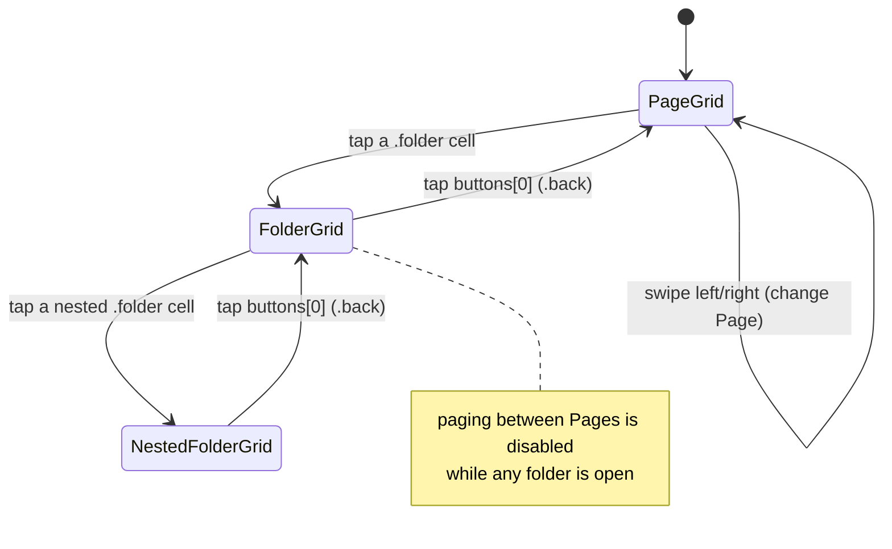

<!-- docs/slices/05. Mobile Grid UI Static.spec.md -->

# Slice Spec: Mobile Grid UI, Static

| | |
|---|---|
| **Doc Type** | Slice Spec |
| **Author** | Gregory McQuillan |
| **Date** | 2026-09-10 |
| **Status** | Draft |
| **Reviewers** | — (solo project) |

**Implements:** `01. Architecture Overview.edd.md`, Testing & Rollout Plan step 5.
**TL;DR:** The iOS app renders the same Button / grid / folder / Page shapes
the desktop already validated (slices 2–4), driven entirely by hand-written
Swift mock data — no discovery, no pairing, no networking, no protobuf, no
`Codable`. This is the last *pre-schema* UI slice: by the end of it the
desktop and iOS UI needs are both known, so step 6 can translate a validated
shape into the `.proto` schema rather than guess at one. It is not the last
UI work overall — the Android port (step 12) is another UI slice, deferred
until the proto shapes and round-trip networking are proven on iOS first.

> **Convention note (trial):** this spec uses numbered list items throughout,
> even where the order doesn't matter — the numbers are diff anchors, making
> a changed item easy to locate in a rendered Markdown diff. Under review as
> a possible repo-wide standard; applied to this file only for now.

---

## Scope

**In:**

1. **Swift model mirror** of `desktop/src/lib/types/button.ts` — `Config`,
   `Profile`, `Page`, `DeckButtonModel` (see naming note below), and
   `ButtonContent` as an enum with associated values
   (`.actions([Action])` / `.folder([DeckButtonModel])` / `.back`), plus
   `Action` and `MediaKeyKind`. Plain value types only. No `Codable`
   conformance, no JSON, no wire concerns — that starts at step 6/7.
2. **Mock `Config`** as a Swift literal: one Profile, two or three Pages, a
   mix of `.actions` buttons and at least one `.folder` nested two levels
   deep. Every `.folder`'s `buttons` array starts with a `.back` button at
   index 0, exactly as the desktop config does — the back button is ordinary
   button data, not view chrome (EDD §5.5, slice 4 Interface).
3. **Grid rendering** — a scrollable grid of button cells for the current
   navigation context. Fixed column count mirroring the desktop preview:
   **4 in portrait, 8 in landscape** (see slice 4's density note — mobile
   does not invent its own density rules). Each cell shows the button's icon
   glyph and label; a `.back` cell with nil icon/label falls back to
   `⬅` / "Back", matching desktop's `DeckButton.svelte`.
4. **Folder navigation** — tapping a `.folder` cell drills into its nested
   grid; tapping the `.back` cell (index 0) pops one level. Arbitrarily
   deep. A navigation stack held as SwiftUI view state, not persisted.
5. **Swipe between Pages** — a horizontally paged container swipes between
   the active Profile's Pages (PRD Mobile §4; slice 4 explicitly deferred
   the literal swipe gesture to "the mobile slice, roadmap step 5"). Swiping
   is only available at the top level of a Page, not inside a folder.
6. **Portrait + landscape** — the grid re-lays-out to 8 columns on rotation.
   `TARGETED_DEVICE_FAMILY` stays `"1"` (iPhone).
7. **Tapping an `.actions` button does nothing** beyond an optional brief
   pressed-state visual. No action runs — there is no desktop to run it on.

**Out:**

1. `Codable` / JSON / protobuf / any serialization or wire format — step 6.
2. Networking, mDNS discovery, QR pairing, auto-reconnect, manual IP entry —
   steps 7 and 11.
3. `button_press` events, action execution, haptic feedback, success/failure
   result display — step 8.
4. Live state / stateful buttons (`state_push`) — step 9.
5. **Manual Profile switching from mobile, and any Profile-switcher UI** —
   step 10. The EDD says a paired device shows only the active Profile, from
   step 7 on; this slice renders the mock Profile's Pages and nothing else.
   Mock data may still contain a single Profile only.
6. Editing anything — the grid is read/press-only by design (PRD § Grid
   authority); no add/remove/reorder/rename, no `ButtonEditor` equivalent,
   no drag-reorder.
7. iPad / tablet-specific layouts and size-class adaptation beyond the
   portrait/landscape column swap.
8. Android — step 12.
9. Per-Page configurable grid density, cell-spanning buttons, animated
   icons, dynamic text, light/dark theme switching — same deferrals as
   slices 2–4.
10. Restoring last-viewed Page or folder depth on relaunch — navigation
    state is view-local and resets on launch, same posture as desktop before
    slice 04b.

> **Rule for agent:** stay inside this scope. If something out of scope
> blocks you, stop and flag it — don't silently expand scope to route around
> it.

## Files to Touch

1. `ios/Buttons/Models/ButtonModel.swift` — create — the Swift model mirror
   (see Interface / Data Contract); holds `Config` / `Profile` / `Page` /
   `DeckButtonModel` / `ButtonContent` / `Action` / `MediaKeyKind`.
2. `ios/Buttons/Data/MockConfig.swift` — create — the hand-written mock
   `Config` literal used to drive the whole UI.
3. `ios/Buttons/Views/DeckButton.swift` — create — one button cell: icon
   glyph + label, `.back` fallback glyph/label, pressed-state visual. No
   `View` suffix — SwiftUI idiom (`Button`, `Text`, …); the colliding model
   is `DeckButtonModel`, not this.
4. `ios/Buttons/Views/ButtonGrid.swift` — create — the column grid for a
   given `[DeckButtonModel]` and the current orientation's column count;
   emits a "button tapped" callback the caller dispatches on `ButtonContent`.
5. `ios/Buttons/Views/PageGrid.swift` — create — one Page: hosts the folder
   navigation stack (top-level grid + drilled-in folder grids) over that
   Page's buttons. Named `PageGrid`, not `PageView`, to avoid shadowing the
   `Page` model.
6. `ios/Buttons/ContentView.swift` — modify — replace the template
   `Text("Hello, world!")` with the paged Pages container; owns the
   current-Page index, disables paging while a folder is open. Stays where
   it is, beside `ButtonsApp.swift`, since it is the app root, not a subview.
7. `ios/Buttons/ButtonsApp.swift` — no change expected — already renders
   `ContentView()`.
8. `ios/Buttons.xcodeproj/project.pbxproj` — regenerated — `xcodegen`
   re-globs `sources: Buttons` on every new file; the regenerated project
   file is committed (see Implementation Notes).

> **Rule for agent:** don't touch files outside this list without flagging
> it first. If reality doesn't match this list once you're in the code,
> correct the list rather than guessing around it.

## Interface / Data Contract

The Swift model mirrors `desktop/src/lib/types/button.ts` field-for-field.
This is deliberate: step 6 locks the `.proto` from "the shape slices 2–5
already validated in both UIs", so the two UIs must be validating the *same*
shape. iOS must not introduce an `isFolder: Bool` flag or parallel optional
arrays — `ButtonContent` is one enum, exactly as the desktop discriminated
union is.

**Naming:** field names mirror `button.ts` exactly; type names may diverge
where a bare mirror would collide with SwiftUI. `button.ts`'s `Button`
becomes **`DeckButtonModel`** — `Button` is a SwiftUI view, and an
unqualified `Button` in a SwiftUI-importing file would resolve to the model
and shadow it. It is the only colliding type, so it is the only one that
carries a suffix (`Config` / `Profile` / `Page` / `ButtonContent` are
unchanged). The SwiftUI view that renders one cell is `DeckButton`, no
suffix. This mirrors desktop's own two-layer split — `button.ts` (types) +
`DeckButton.svelte` (cell) — rather than diverging from it. Both Swift names
are moot at step 6: the generated type is `Buttons_Button`.

```swift
struct Config {
    var profiles: [Profile]
    var activeProfileId: String
}

struct Profile: Identifiable {
    let id: String
    var name: String
    var pages: [Page]
}

struct Page: Identifiable {
    let id: String
    var name: String?
    var buttons: [DeckButtonModel]
}

struct DeckButtonModel: Identifiable {   // button.ts `Button` — see Naming
    let id: String
    var label: String?
    var icon: String?        // emoji / text glyph, per slice 2's convention
    var content: ButtonContent
}

enum ButtonContent {
    case actions([Action])
    case folder([DeckButtonModel])  // buttons[0] is always .back
    case back                        // no payload; pops one nav level
}

enum Action {
    case launchApp(path: String)
    case hotkey(keys: [String])
    case mediaKey(key: MediaKeyKind)
}

enum MediaKeyKind {
    case playPause, mute, nextTrack, previousTrack
}
```

`Action` is carried in the model for shape fidelity only — nothing in this
slice reads or runs it.

### Type lifecycle — these types are throwaway by design

`ButtonModel.swift` is **superseded**, not kept, at step 6/7:

1. **Not view models.** They are a domain-shape mirror, not a view layer.
2. **Not a base the proto types will wrap.** EDD §5.2's export decision is
   explicit — shareable Profile exports are proto3 canonical JSON of the
   `Profile` message, with the stated goal of *one* hand-maintained model
   (the `.proto` file). A hand-written Swift model that outlives step 6 is
   the second hand-maintained model that decision exists to prevent. A
   wrapper/adapter layer is worse, not better: `.folder([DeckButtonModel])`
   is recursive, so wrapping means a recursive adapter over the generated
   tree — real code, no user benefit, and it re-introduces the drift risk.
3. **What survives step 5 is the validated *shape*, not the file.** Step 6
   translates that shape into `.proto`; `swift-protobuf`'s generated types
   then replace `ButtonModel.swift` outright, and the view code is repointed
   at them. Treat `ButtonModel.swift` — and `Data/MockConfig.swift`, whose
   literals are superseded by real `config_sync` data at step 7 — as
   scaffolding, not load-bearing.

**Deliberate step-6 evidence this slice produces** (not caveats — findings):

1. `label` / `icon` are `String?` here. The nil-vs-empty-string distinction
   is load-bearing: the `.back` cell's `⬅` / "Back" fallback fires on nil.
   `swift-protobuf` gives non-optional `String` (empty-string default)
   unless the `.proto` field is marked `optional` — so this slice's
   `String?` usage is direct evidence *for* marking those two fields
   `optional` at step 6.
2. `Profile` / `Page` / `DeckButtonModel` conform to `Identifiable` here
   (they each already have an `id: String`). `swift-protobuf`'s generated messages do
   not conform, but they carry the same `id` field, so step 6 restores it
   with a one-line retroactive conformance per type
   (`extension Buttons_Button: @retroactive Identifiable {}`) in a
   hand-written file — `Models/Proto+Identifiable.swift`, never in generated
   output, which regeneration overwrites. View code uses plain
   `ForEach(collection)` in both eras.

### Navigation

Purely SwiftUI view state, nothing persisted.



## Implementation Notes

1. **`xcodegen` after every new Swift file.** `project.yml` globs
   `sources: - Buttons`, so each new file only enters the build after
   `xcodegen generate`. `project.pbxproj` is committed and will churn on
   each regen — that is expected; commit it with the files it references.
2. **No `Codable`, and no serialization at all.** Mock data is Swift
   literals. This isn't only a scope cut — see *Type lifecycle*: the model
   is scaffolding that step 6 replaces with generated types, so hand-writing
   `Codable` now would be throwaway work on a throwaway model. (Aside for
   step 6: Swift's *synthesized* `Codable` for enums-with-associated-values
   does not emit the desktop's internally-tagged `{"type": "folder", …}`
   shape — `swift-protobuf`'s generated coding handles the wire form, which
   is another reason the generated types win over kept hand types.)
3. **Boolean view state follows the repo convention** — `isFolderOpen`,
   `hasNestedFolder`, etc.; name the positive.
4. **Column count is hardcoded 4 / 8**, mirroring
   `desktop/src/lib/components/PreviewPane.svelte`. A real per-Page
   `rows`/`columns` density setting is deferred identically to slice 4 — do
   not add one here.
5. **`.back` rendering matches desktop** — desktop's `DeckButton.svelte`
   falls back to `⬅` and "Back" when icon/label are nil; do the same. The
   `.back` cell is a normal grid cell (no special chevron chrome), which is
   the whole point of it being real button data.
6. Keep the model layer free of SwiftUI imports — plain value types, same
   Tauri-agnostic-core discipline the desktop's `config.rs` follows. This is
   also why the model type is `DeckButtonModel`, not `Button`: the moment a
   view file imports SwiftUI, an unqualified `Button` resolves to the model
   and shadows `SwiftUI.Button`. Naming the model — the one contested type —
   keeps every view file collision-free with no `SwiftUI.` qualification.
7. **Folder structure is type-based (`Models/` / `Views/` / `Data/`) on
   purpose** — the app is one screen; feature-folder grouping
   (`Grid/` / `Pairing/` / …) has nothing to group yet. Revisit at step 7,
   when discovery + QR pairing add a genuine second feature boundary.
   `xcodegen` globs the whole `Buttons` dir, so a later restructure is a
   `git mv` + regen, not project-file surgery. Deferred deliberately, same
   as slice 4's density note.

## Definition of Done

1. [ ] `xcodegen generate` succeeds and the build command below builds
       clean.
2. [ ] App launches in the iOS Simulator showing a grid of mock buttons with
       icons and labels.
3. [ ] Swiping left/right moves between the mock Profile's Pages; each Page
       shows its own independent buttons.
4. [ ] Tapping a folder button drills into its nested grid, which shows a
       real `Back` cell as the first element (⬅ / "Back").
5. [ ] Tapping the `Back` cell returns to the parent grid.
6. [ ] A folder nested two levels deep can be navigated all the way in and
       all the way back out via its own `Back` cells.
7. [ ] Paging between Pages is disabled while a folder is open, and
       re-enabled after backing out to the Page's top level.
8. [ ] Rotating to landscape re-lays the grid to 8 columns; rotating back
       returns to 4. No clipped cells, no horizontal scroll bleed.
9. [ ] Tapping a regular (`.actions`) button does not crash and does not
       navigate; at most a brief pressed visual.
10. [ ] Code check: the Swift model in `ButtonModel.swift` mirrors
        `desktop/src/lib/types/button.ts` — one `ButtonContent` enum, no
        `isFolder` boolean, no parallel optional arrays; `label`/`icon` are
        `String?`; no `Codable`. `button.ts`'s `Button` is `DeckButtonModel`;
        no view file qualifies `SwiftUI.Button`.

**Verification:**
```
cd ios && xcodegen generate && xcodebuild -project Buttons.xcodeproj -scheme Buttons -destination 'platform=iOS Simulator,name=iPhone 17' build
```
Then run in the Simulator and walk every checklist item. No automated tests
at this stage — same rationale as slices 2–4: UI/UX and a data-model shape
that need eyes on them, not unit coverage.

> **Rule for agent:** run the verification command above and manually
> confirm every Definition of Done item before declaring this slice done —
> don't assume it passed.

## Rollback

Low risk — all new files under `ios/`, no shared code touched, no data
format anywhere. If the build tangles, `git checkout ios/` restores the
scaffold from slice 01 and the slice can be re-approached with a different
view structure.
