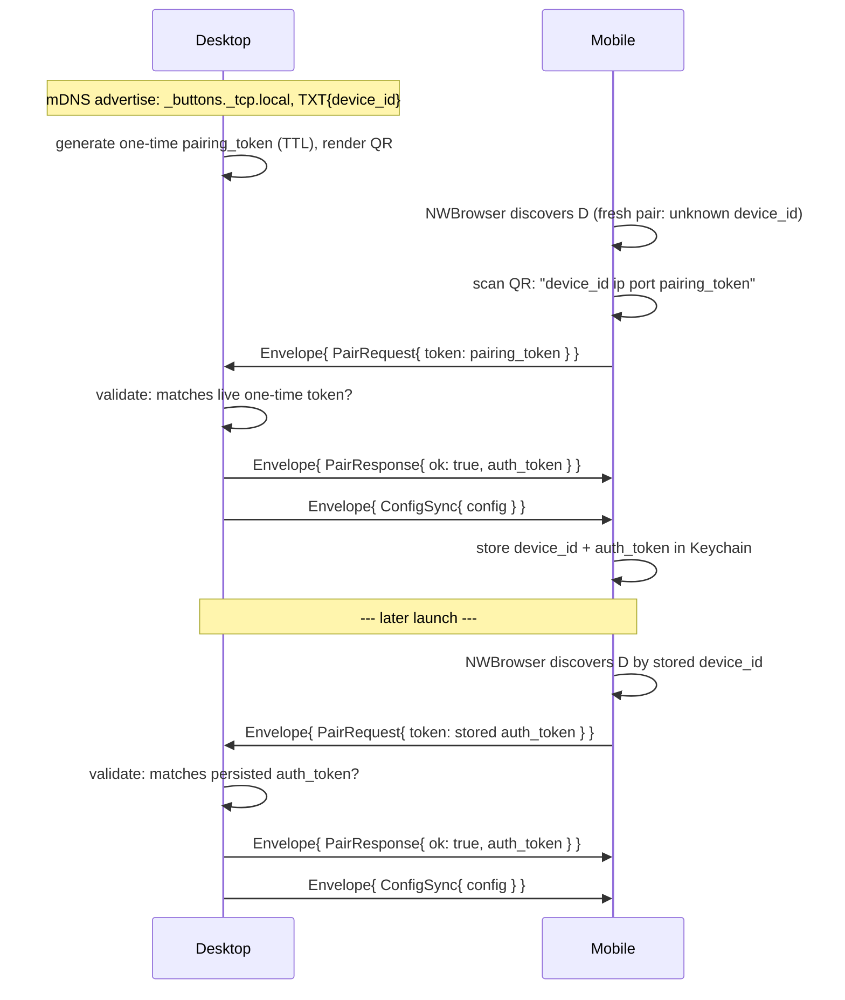

<!-- docs/slices/07. Discovery, Pairing & Config Sync.spec.md -->

# Slice Spec: Discovery, Pairing & Config Sync

| | |
|---|---|
| **Doc Type** | Slice Spec |
| **Author** | Gregory McQuillan |
| **Date** | 2026-09-11 |
| **Status** | Draft |
| **Reviewers** | — (solo project) |

**Implements:** `01. Architecture Overview.edd.md`, Testing & Rollout Plan step 7
("Cross-device slice 1: discovery → pairing → config sync").
**TL;DR:** Desktop advertises itself over mDNS and runs a real WebSocket
server; iOS discovers it, scans a QR code to pair, and the slice-05 grid UI
swaps `MockConfig` for a real `config_sync` — end to end, on a real LAN, for
the first time.

> **Style:** terse over complete — cut words that don't carry a decision,
> fact, or constraint. Write for a human skimming and an agent executing:
> concrete nouns, exact names, exact commands, not vague gestures at intent.
> Use a Mermaid diagram instead of prose for any multi-step exchange.
> Use numbered lists (`1.`, `2.`, ...), not `-` bullets — see CONTRIBUTING.md
> § Documentation style.

---

## Scope

**In:**
1. **Wire envelope schema** (`protocol/wire.proto`, new) — `Envelope` +
   `PairRequest` / `PairResponse` / `ConfigSync`, per Interface section below.
   This is the first content in the buttons.proto docstring's "designed at
   roadmap step 7" note.
2. **Desktop: real prost codegen wired into `desktop/src-tauri`** — a
   `build.rs` invocation (mirrors `protocol/verify-rust/build.rs`) compiling
   `wire.proto` (which imports `buttons.proto`) into `buttons::` /
   `wire::` modules. First real (non-prototype) consumer of `/protocol`.
3. **Desktop: canonical proto3 JSON codegen** (`pbjson` + `pbjson-build`)
   alongside prost, so the generated types get `Serialize`/`Deserialize`
   matching swift-protobuf's `jsonString()` output byte-for-byte on the
   field-name casing (camelCase) — required for the JSON-over-WebSocket
   decision (EDD §5.2) to actually interoperate cross-language.
4. **Desktop: mDNS advertise** (`mdns-sd`) — `_buttons._tcp.local.`, a
   stable `device_id` (generated once, persisted) in the TXT record.
5. **Desktop: WebSocket server** (`tokio` + `tokio-tungstenite`), background
   task spawned from Tauri's `.setup()` hook. One connection at a time (PRD/
   EDD §5.4: single paired mobile device in v1) — a second inbound
   connection while one is active is rejected, not queued.
6. **Desktop: pairing flow** — one-time pairing token (in-memory, TTL'd,
   regenerated each time the QR is (re)requested), a single persisted
   pairing slot (`device.json` beside `buttons.json`: `device_id` +
   optional `{ auth_token, paired_at }`), `PairRequest` validation against
   either the live one-time token or the stored persistent token, unified
   through one code path (see Implementation Notes).
7. **Desktop: pairing UI** — a view in the existing Svelte app rendering the
   QR (SVG, generated server-side by the `qrcode` crate, returned as a
   string from a Tauri command — no client-side QR library). Reachable from
   the existing header.
8. **Desktop: `config_sync` on connect** — after a successful pair (fresh or
   reconnect), the server reads the current `Config` via the existing
   `config::load_config` and sends it as `ConfigSync`, converted to the wire
   `buttons::Config` shape (small `From`/`to_wire()` mapping — see
   Implementation Notes; `config.rs`'s hand-written structs are not
   replaced this slice).
9. **iOS: discovery** (`NWBrowser`, adapted from the spike's
   `DesktopDiscovery.swift`) — browse `_buttons._tcp.local.`, read
   `device_id` from the TXT record.
10. **iOS: QR scan** (`DataScannerViewController`, VisionKit, iOS 16+) —
    parse the space-delimited payload (`device_id ip port pairing_token`),
    connect, send `PairRequest`.
11. **iOS: connection** (`URLSessionWebSocketTask`, adapted from the spike's
    `DesktopConnection.swift`) — send/receive `Envelope` as JSON text
    frames (not the spike's binary frames — wire format decision, EDD
    §5.2).
12. **iOS: pairing storage** — `device_id` + `auth_token` in Keychain.
13. **iOS: reconnect on launch** — Keychain has a stored pair → mDNS browse,
    match by `device_id`, connect, send `PairRequest{token: auth_token}` —
    no QR, no camera permission prompt.
14. **iOS: real data** — on a successful `ConfigSync`, decode into the
    generated `Buttons_Config` and drive the existing `ContentView` /
    `PageGrid` / `ButtonGrid` / `DeckButton` views from it directly, deleting
    `ButtonModel.swift` and `MockConfig.swift` per their own "superseded at
    step 6/7" comments. `#Preview` blocks get trimmed literal
    `Buttons_Config` fixtures in their place — real generated types, not a
    revived mock layer.
15. **`protocol/wire.proto` comments as the canonical wire-protocol
    reference** — `protocol/README.md` already promises this directory is
    home to "the message catalog, field shapes, and pairing sequence";
    satisfied by the `.proto` file's own doc-comments plus one short
    `protocol/PAIRING.md` for the sequence diagram (a concrete version of
    EDD §5.1's, with real field names) — not a second schema doc to drift.
16. **EDD updates** — `buttons.proto`'s header comment and
    `protocol/README.md`'s "aren't in `buttons.proto` yet" line both
    updated to point at `wire.proto` now that it exists.

**Out:**
1. **`nav_request` / `nav_cursor` (live navigation-cursor mirroring).**
   Confirmed out of this slice (2026-09-11) — designed and built once live
   nav mirroring is actually being added, not bundled into the initial
   handshake just because EDD's Open Questions ties its *design* to "step 7
   on." This slice's `ConfigSync` carries no navigation position.
2. **`button_press` / `action_result` / `state_push` / `profile_switch`.**
   Roadmap steps 8-10. The `Envelope` oneof adding a case later for these is
   non-breaking — no need to stub them now.
3. **Multiple simultaneous mobile connections / a device roster.** PRD v1 is
   one desktop, one paired phone. The single-slot `device.json` and
   one-active-connection server behavior both hard-code this; don't
   generalize early.
4. **Token rotation.** Once a persistent `auth_token` is issued it's reused
   indefinitely across reconnects in v1 — no expiry, no refresh. Revisit
   only if a real security need shows up.
5. **Binary wire encoding.** JSON-over-WebSocket per EDD §5.2, unconditionally,
   this slice. The switch is deferred until a measured latency number
   justifies it — not guessed at here.
6. **Android.** Roadmap step 12. `wire.proto` must still compile under
   `protocol/verify-kotlin`'s existing `wire` codegen (it's on the schema
   lock's "all three languages" hook), but no Android app code is touched.
7. **Manual IP entry / QR redisplay-for-reconnect fallback.** Roadmap step
   11. This slice's reconnect path is mDNS-only; if it fails, the only
   recovery is re-scanning a freshly-generated QR (the normal first-pair
   flow), not a dedicated fallback UI.
8. **Rewriting `desktop/src-tauri/src/config.rs`'s hand-written structs to
   the generated `buttons::` types.** They coexist on purpose this slice —
   see item 8 above and Implementation Notes. A full repoint, if it ever
   happens, is its own slice.
9. **Observability beyond local `println!`/`eprintln!`-style logging** on
   both ends. EDD §7's "minimum bar is local logging" is satisfied by
   console output for now; a real log file/rotation is explicitly TBD there.
10. Light-mode styling — still deferred project-wide.

> **Rule for agent:** stay inside this scope. If something out of scope
> blocks you, stop and flag it — don't silently expand scope to route around
> it.

## Files to Touch

1. `protocol/wire.proto` — **create** — `Envelope`, `PairRequest`,
   `PairResponse`, `ConfigSync`; imports `buttons.proto`.
2. `protocol/buttons.proto` — modify — update the header comment: wire
   envelope now lives in `wire.proto`, not "not yet designed."
3. `protocol/README.md` — modify — point the "aren't in `buttons.proto` yet"
   line at `wire.proto`.
4. `protocol/PAIRING.md` — **create** — the pairing sequence diagram with
   real field names, superseding EDD §5.1's diagram as the canonical copy
   (EDD keeps the rationale, links here).
5. `desktop/src-tauri/Cargo.toml` — modify — add `prost`, `pbjson`,
   `pbjson-types`, `mdns-sd`, `tokio` (with needed features), `tokio-tungstenite`,
   `futures-util`, `qrcode`, `uuid` (`v4` feature); add `prost-build`,
   `pbjson-build` under `[build-dependencies]`.
6. `desktop/src-tauri/build.rs` — modify — compile `../../protocol/wire.proto`
   with `prost_build` + `pbjson_build`, wrapped in real `buttons`/`wire`
   modules (mirrors `protocol/verify-rust/build.rs` + its "wrap in a real
   module" fix from slice 06).
7. `desktop/src-tauri/src/proto.rs` — **create** — `pub mod buttons { include!(...) }`,
   `pub mod wire { include!(...) }`; one `impl From<&config::Config> for
   buttons::Config` (and the nested types it needs) — the only bridge
   between the hand-written local-persistence structs and the wire shape.
8. `desktop/src-tauri/src/pairing.rs` — **create** — device id load-or-generate,
   one-time token issuance (in-memory, TTL), persisted-slot read/write
   (`device.json`), the unified `PairRequest` validator.
9. `desktop/src-tauri/src/server.rs` — **create** — mDNS advertise +
   WebSocket accept loop + per-connection handshake (`PairRequest` →
   `PairResponse` → `ConfigSync`) + single-active-connection guard.
10. `desktop/src-tauri/src/lib.rs` — modify — spawn `server::run()` from
    `.setup()`; add a `get_pairing_qr` command returning the QR SVG string
    (+ the raw payload, for a "copy" affordance) sourced from `pairing.rs`.
11. `desktop/src/routes/pairing/+page.svelte` (or equivalent per current
    routing) — **create** — calls `get_pairing_qr`, renders the SVG,
    "waiting for connection…" state.
12. Existing desktop header component — modify — one entry point to the
    pairing view (exact file: whatever slice 4's `ProfileSwitcher` header
    lives in today).
13. `ios/Buttons/Networking/Discovery.swift` — **create** — adapted from
    `spikes/network-poc/ios/NetworkPOC/DesktopDiscovery.swift` for the real
    service type + `device_id` TXT lookup.
14. `ios/Buttons/Networking/Connection.swift` — **create** — adapted from
    `spikes/network-poc/ios/NetworkPOC/DesktopConnection.swift` for JSON
    text frames instead of binary.
15. `ios/Buttons/Networking/Pairing.swift` — **create** — QR scan → payload
    parse → `PairRequest` → Keychain store.
16. `ios/Buttons/Views/PairingView.swift` — **create** — "Scan to Pair" /
    connecting / failed states.
17. `ios/Buttons/ButtonsApp.swift` — modify — launch sequence: Keychain
    check → reconnect attempt → `PairingView` fallback → `ContentView` once
    a `ConfigSync` lands.
18. `ios/Buttons/ContentView.swift`, `Views/PageGrid.swift`,
    `Views/ButtonGrid.swift`, `Views/DeckButton.swift` — modify — bind to
    `Buttons_Config`/`Buttons_Profile`/`Buttons_Page`/`Buttons_Button`
    instead of the hand types; trim `#Preview` fixtures to match.
19. `ios/Buttons/Models/ButtonModel.swift` — **delete** — superseded, per its
    own header comment.
20. `ios/Buttons/Data/MockConfig.swift` — **delete** — superseded, per its
    own header comment.
21. `protocol/verify-kotlin` — modify only if `wire.proto` fails to compile
    under it; otherwise untouched (Android app code is out of scope, but the
    schema-compiles-in-three-languages hook still applies).

> **Rule for agent:** don't touch files outside this list without flagging
> it first.

## Interface / Data Contract



`protocol/wire.proto`:
```proto
syntax = "proto3";
package buttons;
import "buttons.proto";

message Envelope {
  string protocol_version = 1; // "1" for this slice; bumped on breaking change
  oneof message {
    PairRequest pair_request = 2;
    PairResponse pair_response = 3;
    ConfigSync config_sync = 4;
  }
}

message PairRequest {
  string token = 1; // the QR's one-time token, OR a stored persistent auth_token
}

message PairResponse {
  bool ok = 1;
  optional string auth_token = 2; // present iff ok — same value on every
                                   // successful reconnect, no rotation (v1)
  optional string error = 3;      // present iff !ok
}

message ConfigSync {
  Config config = 1; // buttons.Config from buttons.proto — the whole thing,
                      // every Profile, per EDD §5.2's decision
}
```

QR payload (not protobuf — a bootstrap string, parsed before any connection
exists): `"<device_id> <lan_ip> <port> <pairing_token>"`, space-delimited,
extending the spike's 3-field format by one.

## Implementation Notes

1. **One validator, two acceptable tokens.** `pairing.rs` exposes a single
   `validate(token: &str) -> Option<AuthResult>` checked against (a) the
   live in-memory one-time token if not expired, or (b) `device.json`'s
   stored `auth_token` if present. Same code path for first-pair and
   reconnect — the server doesn't need to know which case it's in.
2. **`device.json` shape:** `{ "device_id": "...", "paired": { "auth_token":
   "...", "paired_at": "..." } | null }`. `device_id` is generated once (on
   first launch that finds no file) and never changes — mobile's reconnect
   matching depends on that stability.
3. **`device.json` lives beside `buttons.json`**, same directory, same
   `serde_json` pattern — per EDD §5.3's "genuine device-local settings get
   a JSON file beside `buttons.json`" rule (04b's precedent), not
   `localStorage` (that's the webview's, and this is Rust-side state the
   frontend never needs directly).
4. **QR is SVG, server-rendered, no client QR library.** `qrcode`'s
   `render::<svg::Color>()` returns a `String` of SVG markup; the Tauri
   command hands it straight to the frontend, which inlines it — sidesteps
   picking a client-side QR-rendering package entirely.
5. **`buttons::Config` (wire) vs. `config::Config` (local persistence) stay
   two distinct types this slice.** The conversion lives in one place
   (`proto.rs`), one direction (local → wire, for `ConfigSync`). No reverse
   mapping needed yet — nothing on the wire writes back into local config
   this slice (that's `button_press`/`profile_switch`, steps 8-10).
6. **pbjson, not hand-rolled JSON.** Canonical proto3 JSON field-casing
   (camelCase) has real rules (well-known-type special cases, `oneof`
   representation) that swift-protobuf's `jsonString()` already implements
   correctly; `pbjson-build` generates matching Rust `Serialize`/
   `Deserialize` from the same `.proto` so the two sides agree without
   either one hand-coding the mapping.
7. **Single-connection guard is a `Mutex<bool>` (or an `AtomicBool`) in
   `server.rs`,** not a connection pool — simplest thing that satisfies
   "single paired mobile device in v1." A second inbound TCP connection
   while one is active gets its WebSocket handshake completed, an
   `Envelope{PairResponse{ok:false, error:"already connected"}}`, then
   closed — never silently dropped, so a confused second device gets a
   reason.
8. **iOS QR scanning needs `NSCameraUsageDescription`** in `Info.plist` —
   easy to forget, silently crashes on scan attempt without it.
9. **`DataScannerViewController` requires a real device or a Simulator with
   a virtual camera feed** — plain Simulator QR scanning from a laptop
   webcam doesn't work out of the box; the DoD walk below needs a real
   iPhone against the built desktop app on the same LAN.
10. **Point every generated-type reference at `Buttons_` directly.** Per EDD
    §5.2's swift_prefix decision (slice 06): no repo-wide typealias. A
    single file with several long names can add its own local `typealias
    Config = Buttons_Config` at the top — decide file-by-file during
    implementation, not here.

## Definition of Done

1. [ ] Desktop launches → advertises mDNS → pairing view shows a QR (SVG),
       distinct payload each time it's (re)opened.
2. [ ] Fresh iOS install (no Keychain entry) → "Scan to Pair" screen; scan
       desktop's QR → connects, receives `ConfigSync`, renders the **real**
       `buttons.json` content (not `MockConfig`) in the existing
       page/folder navigation.
3. [ ] Edit a button's label in the desktop editor, force-quit + relaunch
       the iOS app (or trigger a reconnect) → sees the updated label — no
       stale cache.
4. [ ] Force-quit + relaunch iOS app after a successful pair → reconnects
       via mDNS + stored token automatically, **no QR scan, no camera
       permission prompt**.
5. [ ] Stale/reused one-time token (generate a new QR on desktop, then scan
       a screenshot of the *old* one) → iOS shows a pairing-failed state, no
       config received.
6. [ ] A second mobile device attempting to connect while the first is
       active gets rejected with a reason, doesn't disrupt the first
       device's session.
7. [ ] `cargo build` (desktop/src-tauri) succeeds with the new deps.
8. [ ] `npm run check` (desktop) passes with no new errors.
9. [ ] iOS target builds and runs on a real device (Simulator can't
       exercise the mDNS+camera round trip — see Implementation Notes #9).
10. [ ] `protocol/verify-kotlin`'s existing build still compiles
       `wire.proto` alongside `buttons.proto` (schema-lock language check).

**Verification:**
```
cd desktop/src-tauri && cargo build
cd desktop && npm run check
# then manually, on a real LAN with a real iPhone + the built desktop app:
cd desktop && npm run tauri dev
# open Xcode, run ios/Buttons on a physical device on the same Wi-Fi
```
Walk the checklist above manually — no automated test at this stage, same
rationale as prior cross-UI slices.

## Rollback

Higher risk than prior slices — first slice touching two runtimes' network
stacks at once. If pairing or sync misbehaves close to done:
1. Desktop and iOS are independently revertable — the desktop server can
   ship (advertising + accepting + QR) even if iOS-side pairing isn't
   working yet, since nothing else depends on the connection existing.
2. `wire.proto` additions are new files/messages, not edits to
   `buttons.proto`'s existing messages — reverting is deleting `wire.proto`
   and the generated-code wiring, no schema migration.
3. Deleting `ButtonModel.swift`/`MockConfig.swift` is the one destructive
   step with no easy partial-revert — do it last, only once `ConfigSync`
   is confirmed rendering real data through the existing views.
