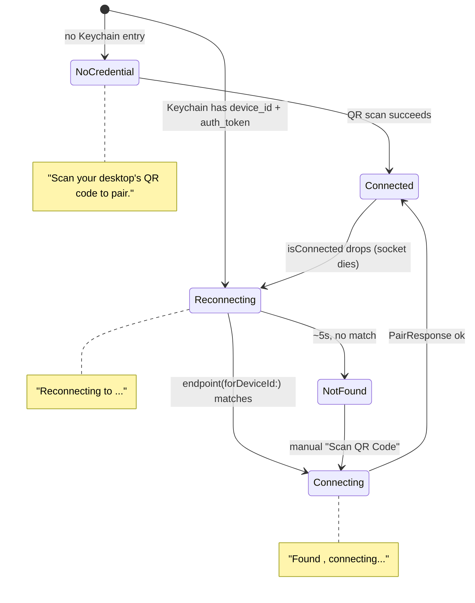

<!-- docs/slices/07c. Desktop Device Name.spec.md -->

# Slice Spec: Desktop Device Name

| | |
|---|---|
| **Doc Type** | Slice Spec |
| **Author** | Gregory McQuillan |
| **Date** | 2026-09-13 |
| **Status** | Draft — recorded as a follow-up, not yet scheduled |
| **Reviewers** | — (solo project) |

**Implements:** follow-up to `07. Discovery, Pairing & Config Sync.spec.md`
— a real `wire.proto` addition (additive, non-breaking), plus a desktop
preference and an iOS copy update.
**TL;DR:** the desktop gets a human-readable name (default hostname,
overridable in desktop settings), handed to mobile at pair time and
persisted, so mobile-side copy can say "Looking for Greg's Mac Mini…"
instead of "your paired desktop."

> **Style:** terse over complete — cut words that don't carry a decision,
> fact, or constraint. Use numbered lists (`1.`, `2.`, ...), not `-`
> bullets — see CONTRIBUTING.md § Documentation style.

---

## Scope

**In:**
1. **`wire.proto`: `PairResponse` gains `optional string device_name = 4`.**
   Additive field on an existing message — non-breaking, same precedent as
   slice 07's own `Envelope` oneof being open to new cases later. Desktop
   populates it on every successful pair, fresh **and** reconnect — every
   reconnect is already a full `PairRequest`/`PairResponse` round trip
   through the same validator, so this is free, not an extra fetch.
2. **Desktop: persisted device name**, `device.json` (beside `device_id`),
   defaulting to the machine hostname on first launch, overridable via a
   new desktop settings field. Renaming later doesn't change `device_id` —
   the two are independent. **Cap the name at 63 bytes UTF-8** — Bonjour's
   own instance-label limit (see Out item 1) — enforced here at the
   settings field, not discovered later as a silent truncation elsewhere.
3. **iOS: persist `device_name` in Keychain** alongside `device_id`/
   `auth_token` (extend `StoredPairing`) — overwritten on **every**
   successful `PairResponse`, not just the first pair. This is what makes
   a desktop rename actually reach the phone (DoD item 2) without any
   separate push mechanism.
4. **`AutoReconnectState` (`Pairing.swift`) gains a `.connecting` case.**
   Today `attemptAutoReconnect` sets `.idle` the instant it finds a
   matching endpoint and calls `reconnect()` — the screen briefly shows
   `.idle`'s copy mid-handshake before `RootView` swaps to
   `ProgressView("Loading…")` once `isConnected` flips. Real flicker, not
   just a copy gap; `.connecting` fixes it and gives state 3 below
   somewhere to live.
5. **`PairingView`'s landing copy — three states from two axes** (credential
   held in Keychain? matched to a live advertisement yet?), not one
   generic fallback — see State Diagram below for the full picture,
   including the auto-reconnect-on-drop loop this connects to. The one
   thing the diagram doesn't carry: this state's "searching, no credential
   yet" variant doesn't exist in the normal flow today (nothing
   auto-browses before a first pair) — its real home, if it's ever needed,
   is a future device picker (`07b`'s debug list, or roadmap step 11's
   manual-entry slice), not this reconnect path.

**Out:**
1. **Desktop's Bonjour *instance name*** (`server.rs`'s `INSTANCE_NAME`
   constant) — the canonical DNS-SD mechanism for a human-readable name in
   a live picker/list (RFC 6763 §4.1.1 — this is why an AirPlay receiver
   shows up as "Greg's Apple TV," not an IP), and worth eventually pointing
   at the same persisted device name. Left out here because it solves a
   different problem (naming something *found live*, e.g. `07b`'s debug
   list) — it can't produce this slice's "Looking for X" copy, which
   needs a name *before* any live match exists. **Before wiring the two
   together in a later slice: confirm `mdns-sd`'s `ServiceInfo::new`
   accepts a name with spaces/punctuation without escaping, and enforces
   or truncates the 63-byte limit** — if it needs escaping, keep the
   Bonjour instance name and the stored device name as two separate
   strings rather than assuming one field feeds both.
2. **Multi-device naming/roster** — PRD v1 is one phone, one desktop; this
   doesn't anticipate a device list.
3. **A picker for multiple advertised instances** — deliberately absent,
   not overlooked, and worth recording precisely because a later slice
   could break it by accident. Two things make this a non-problem today:
   `device_id` (not the Bonjour instance name) is what reconnect matches
   on, so N desktops advertising simultaneously is already a non-event for
   `endpoint(forDeviceId:)` — it filters to the one credential held
   regardless of how many others are on the LAN, or what mDNS's own
   conflict-renaming (RFC 6762 §9 — "Buttons Desktop (2)") did to their
   instance names. And first pair never browses at all: the QR payload
   carries `device_id ip port token` and connects to that literal address,
   so there's no multi-candidate disambiguation to do in v1. **Any future
   slice adding a browse-and-choose flow** (roadmap step 11's manual entry,
   or a device picker) **must re-derive this, not assume it still holds**
   once picking among live advertisements becomes a real UI.

> **Rule for agent:** stay inside this scope. If something out of scope
> blocks you, stop and flag it — don't silently expand scope to route
> around it.

## State Diagram

`PairingView`'s landing copy plus the auto-reconnect-on-drop loop already
shipped in slice 07 — one picture instead of re-deriving the transitions
from prose each time.



`NotFound`'s own copy ("Couldn't find `<device_name>` automatically…") and
the always-available "Scan QR Code" action aren't shown as a separate
node above — they're `Reconnecting`'s timeout outcome, not a new place in
the credential/match state space, and slice 07 already ships that copy.

## Files to Touch

1. `protocol/wire.proto` — modify — `PairResponse.device_name`.
2. `desktop/src-tauri/src/pairing.rs` — modify — persisted device name,
   default-to-hostname on first launch.
3. `desktop/src-tauri/src/server.rs` — modify — populate `device_name` in
   every `PairResponse`.
4. Desktop settings UI — modify — field to view/override the device name.
5. `ios/Buttons/Networking/Pairing.swift` — modify — `StoredPairing` gains
   `deviceName`, `PairingStore` persists it.
6. `ios/Buttons/Networking/Connection.swift` — modify — read
   `response.deviceName` on success, hand it to the pair-completion path.
7. `ios/Buttons/Views/PairingView.swift` — modify — landing copy uses the
   stored name when present.
8. `ios/Buttons/Generated/*.pb.swift`, Kotlin/Rust generated code —
   regenerate after the `.proto` change (same commands as slice 07's Files
   to Touch #24 / `protocol/verify-kotlin`).

## Definition of Done

1. [ ] Fresh pair: desktop's device name (hostname by default) round-trips
       into the phone's persisted `StoredPairing`.
2. [ ] Overriding the name in desktop settings, then forcing a reconnect
       (not just relaunch) updates the phone's stored copy on the next
       successful `PairResponse`.
3. [ ] `PairingView`'s landing screen shows the actual device name once
       one is stored, not the generic phrase.
4. [ ] Fresh install (nothing stored yet) still shows today's generic
       scanning copy — no name to show yet.
5. [ ] `protocol/verify-kotlin` and `protocol/verify-swift` still compile
       `wire.proto` with the new field (schema-lock check).

**Verification:**
```
cd desktop/src-tauri && cargo build
cd desktop && npm run check
xcodebuild -project ios/Buttons.xcodeproj -scheme Buttons -destination 'generic/platform=iOS Simulator' build
# manual: pair fresh, confirm name round-trips; rename in desktop
# settings, force a reconnect, confirm the phone's copy updates.
```
