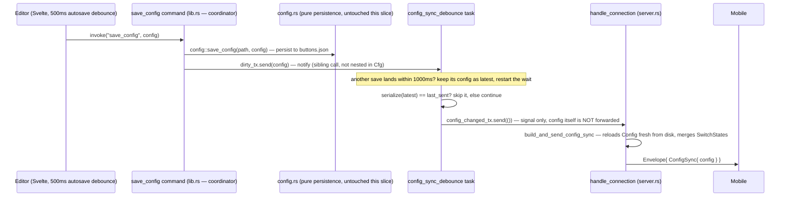

# Slice Spec: Config Sync On Edit

| | |
|---|---|
| **Doc Type** | Slice Spec |
| **Author** | Gregory |
| **Date** | 2026-09-16 |
| **Status** | Draft |
| **Reviewers** | — |

**Implements:** `01. Architecture Overview.edd.md` § 5.2, "Corollary: don't
push a sync unless something actually changed," item 2 ("Edit churn") —
explicitly deferred there to "once the WebSocket server exists (roadmap
step 7+), not before." That's now. Found live during 09/09a work: an edit
made in the desktop editor while mobile is connected is invisible until the
next reconnect.
**TL;DR:** `config_sync` sends exactly once today, at connect time
(`server.rs::handle_connection`). Editing a button, page, folder, or Profile
afterward changes `buttons.json` but nothing tells the open connection —
mobile is stale until it reconnects. This slice adds a server-side debounce
that, once desktop edits go quiet, rebuilds and re-sends `config_sync` to
whatever's connected, reusing the exact connect-time build path so there is
one definition of "send a config_sync," not two. No wire schema change —
`config_sync` already exists (`Envelope` tag 4).

> **Style:** terse over complete — cut words that don't carry a decision,
> fact, or constraint. Write for a human skimming and an agent executing:
> concrete nouns, exact names, exact commands, not vague gestures at intent.
> Use a Mermaid diagram instead of prose for any multi-step exchange.
> Use numbered lists (`1.`, `2.`, ...), not `-` bullets — see CONTRIBUTING.md
> § Documentation style.

---

## Scope

**In:**

1. Desktop: a new signal-only broadcast channel, `ConfigChangedTx =
   broadcast::Sender<()>` — same shape as slice 09a's `StatePushTx`, but
   payload-less. The broadcast only says "something changed, go re-read";
   the actual `Config` is always loaded fresh at send time (Interface Note
   1), never carried through the channel itself.
2. Desktop: `save_config` sends the just-saved `Config` on a new
   `mpsc::UnboundedSender<Config>` ("dirty" channel) after a successful
   disk write. This covers every Slice 4 editor surface that already
   routes through `configStore.save()` → this one Rust command — button,
   page, folder, and Profile edits alike, not button edits alone. One ping
   per command call, not per keystroke: the frontend's own 500ms autosave
   debounce (`ButtonEditor.svelte`, Slice 4) already coalesces that far.
3. Desktop: a new long-lived debounce task, spawned once at startup
   alongside `state_push_tx`'s own creation, drains the dirty channel,
   coalesces bursts with its own quiet period (independent of the
   frontend's), and — only when the settled `Config`'s serialized form
   actually differs from the last one it broadcast — sends on
   `ConfigChangedTx`. Two guards, not one: burst coalescing (active
   typing) and no-op suppression (opening the editor on an unchanged
   button — Implementation Notes #2).
4. Desktop: `handle_connection` subscribes to `ConfigChangedTx` alongside
   its existing `evict_rx`/`state_push_rx` `select!` arms; on a signal, it
   re-runs the exact connect-time build-and-send (factored into a shared
   helper — Interface Note 2) and pushes a fresh `config_sync` to that
   connection.
5. iOS: `DeckView.currentPageId` falls back to `profile.pages.first?.id`
   whenever a live resync's Profile no longer contains it — the
   dangling-tab-id hazard this slice introduces (Implementation Notes #6).

**Out:**

1. Any new Tauri event for this — the desktop frontend that authors an
   edit already sees it in its own `configStore`; nothing needs to be told
   about its own write.
2. Rewiring what triggers `save_config` — every Slice 4 editor surface
   already funnels through `configStore.save()`; Scope → In #2 covers all
   of it as-is.
3. A revision/etag field on the wire to skip redundant syncs — same call
   EDD's own profile-switch-churn fix already made ("debounce... simpler,
   and sufficient unless a second reason to skip redundant syncs shows up
   later," § 5.5 Components #3). Scope → In #3's local string-compare is
   that same simpler fix, done server-side, no wire change.
4. `PageGrid`'s `folderStack` staleness — a phone mid-browse in a folder
   holds a snapshotted `[Buttons_Button]` that a live resync doesn't
   re-resolve; a button deleted or edited inside an open folder shows
   stale content until the user backs out, not a blank screen. Accepted
   for v1 (single desktop author, non-adversarial race) rather than fixed
   here — re-resolving a stored button-value stack against a fresh tree is
   real design work, better folded into EDD's own deferred live-nav-cursor
   design (Open Question 3, step 7) than patched once-off in this slice.
5. `profile_switch` — step 10, unrelated message.
6. Any Tier 1/2/3 integration reporting external state — unrelated; this
   slice is about desktop's own editor, not an external state source
   (that's `state_push`, slice 09a).

> **Rule for agent:** stay inside this scope. If something out of scope
> blocks you, stop and flag it — don't silently expand scope to route around
> it.

## Files to Touch

1. `desktop/src-tauri/src/server.rs` — modify — `ConfigChangedTx` type;
   `build_and_send_config_sync` helper factored out of the existing
   connect-time block (replacing it, not duplicating it); `handle_connection`
   gains a fourth `select!` arm; `run`/`handle_connection` take the new
   sender, threaded the same way `state_push_tx` already is.
2. `desktop/src-tauri/src/config_sync_debounce.rs` — create — the
   long-lived debounce task: drains the dirty `mpsc`, coalesces, dirty-
   checks, sends on `ConfigChangedTx`. A new file, not folded into
   `switch_state.rs` — different trigger (an authored edit vs. a runtime
   flip) and a different guard (coalesce + dirty-check vs. none).
3. `desktop/src-tauri/src/lib.rs` — modify — declares `mod
   config_sync_debounce;`; creates the dirty `mpsc` channel and
   `ConfigChangedTx` broadcast channel in `run()`'s setup; spawns the
   debounce task; threads `ConfigChangedTx` into `server::run`;
   `save_config` sends on the dirty channel after a successful write.
4. `ios/Buttons/DeckView.swift` — modify — `onChange(of: profile)` guard
   that corrects a dangling `currentPageId` (Scope → In #5).

> **Rule for agent:** don't touch files outside this list without flagging
> it first.

## Interface / Data Contract

**Sequence — save and sync are two sibling steps off one coordinator, not
one calling the other:**



The `config` handed to `Debounce` on line 10 above **is used** — it's exactly
what "keep the newest during a burst" and "is this actually different
from what we last sent" (Implementation Notes #2) compare against. It's
just never the thing that crosses into `ConfigChangedTx` — that channel
carries `()`, and `Conn` re-reads its own fresh copy from disk
(Implementation Notes #7). So the value travels one hop (`Cmd` → `Debounce`,
for the coalesce/dirty-check decision) and stops there by design, not by
oversight.

`save_config` is the coordinator: it calls persistence and notification as
two ordered statements, and `config.rs` never calls into the dirty channel
itself — it stays exactly what it is today, a pure read/write module with
no notion that a WebSocket exists. Sequential here only because a Rust
function body is a sequence of statements; the notify doesn't depend on
the persist having *completed* in any observable way `Debounce`/`Conn` could
detect; either order (or the two run concurrently) is equally correct —
see Implementation Notes #6.

```rust
// lib.rs — the coordinator itself
#[tauri::command]
fn save_config(
    app: AppHandle,
    config: Config,
    dirty_tx: tauri::State<ConfigDirtyTx>,
) -> Result<(), String> {
    // 1. persist — the existing call, config.rs unchanged
    config::save_config(&config_path(&app)?, &config)?;
    // 2. notify — new this slice, a sibling step called from here, not
    // from inside config::save_config
    let _ = dirty_tx.send(config);
    Ok(())
}
```

**Desktop-side signatures:**

```rust
// lib.rs
// 0. new — named for what it carries, not the mechanism: this is the
// "an edit happened" line, kept as its own type alias so `config.rs`'s
// signatures never need to mention channels at all.
pub type ConfigDirtyTx = tokio::sync::mpsc::UnboundedSender<config::Config>;

// server.rs
// 1. new — signal-only: the broadcast carries no payload because the
// Config is always re-read fresh at send time (same "don't snapshot,
// reload" rule execute_press already follows for Switch presses). A
// broadcast carrying a Config value instead would risk exactly the bug
// this design exists to avoid — see Implementation Notes #1.
pub type ConfigChangedTx = broadcast::Sender<()>;

// 2. new — the one place a config_sync gets built and sent. Connect-time
// send and a live resync both call this — one definition, not two that
// can drift.
async fn build_and_send_config_sync(
    ws: &mut WebSocketStream<TcpStream>,
    config_path: &Path,
    switch_states: &SwitchStates,
) -> Result<(), ()> {
    let config = config::load_config(config_path).map_err(|_| ())?;
    let mut wire_config = buttons::Config::from(&config);
    crate::proto::apply_switch_states(&mut wire_config, switch_states);
    send_envelope(
        ws,
        buttons::Envelope {
            protocol_version: pairing::PROTOCOL_VERSION.to_string(),
            message: Some(buttons::envelope::Message::ConfigSync(
                buttons::ConfigSync { config: Some(wire_config) },
            )),
        },
    )
    .await
}
```

```rust
// config_sync_debounce.rs
// 3. new — how long to wait after the last save_config ping before
// treating edits as settled. Independent of, and stacked on top of,
// ButtonEditor's own 500ms autosave debounce (Slice 4) — total
// edit-to-phone latency is frontend-debounce + this, roughly ≤1.5s worst
// case. A second, larger constant here (not reusing 500ms) is
// deliberate: it has to absorb the frontend's debounce restarting on
// every keystroke, not just line up with it.
const QUIET_PERIOD: std::time::Duration = std::time::Duration::from_millis(1000);

// 4. new — trailing-edge coalesce, no cancellation bookkeeping: block for
// the first ping, then re-arm a fresh timeout on every ping that lands
// inside it; only a full quiet window with no ping breaks the inner loop
// and fires. Dirty-checked against the last Config actually broadcast —
// suppresses the no-op case (Implementation Notes #2): opening the editor
// on an existing button re-saves identical content and would otherwise
// still push a redundant full-Config resync.
pub async fn run(
    mut dirty_rx: tokio::sync::mpsc::UnboundedReceiver<config::Config>,
    config_changed_tx: server::ConfigChangedTx,
) {
    let mut last_sent: Option<String> = None;
    while let Some(mut latest) = dirty_rx.recv().await {
        loop {
            match tokio::time::timeout(QUIET_PERIOD, dirty_rx.recv()).await {
                Ok(Some(next)) => latest = next, // re-armed, keep the newest
                Ok(None) => return,               // app shutting down
                Err(_) => break,                    // quiet elapsed
            }
        }
        let serialized = serde_json::to_string(&latest).unwrap_or_default();
        if last_sent.as_deref() != Some(serialized.as_str()) {
            last_sent = Some(serialized);
            let _ = config_changed_tx.send(());
        }
    }
}
```

1. `ConfigChangedTx` broadcasts `()`, not a `Config` — this is the slice's
   one correctness-critical decision; see Implementation Notes #1 for the
   bug it avoids.
2. `build_and_send_config_sync` replaces `server.rs`'s existing inline
   connect-time block with a call to itself — a refactor of existing
   code, not new behavior at that call site.
3. The debounce constant lives in `config_sync_debounce.rs`, not
   `server.rs` — this module's own tuning knob.

**iOS-side:**

```swift
// DeckView.swift
.onChange(of: profile) { _, newProfile in
    // 5. new — a live resync (this slice) can drop the page
    // currentPageId points at; TabView(selection:) pointed at a
    // nonexistent tag renders nothing, not a graceful fallback.
    // Buttons_Profile is Equatable (protobuf-generated), so this fires on
    // any resync, not just a page-list change — cheap enough (a small
    // local struct compare) not to bother narrowing further.
    if !newProfile.pages.contains(where: { $0.id == currentPageId }) {
        currentPageId = newProfile.pages.first?.id ?? ""
    }
}
```

## Implementation Notes

1. **The bug this design exists to avoid.** A naive version broadcasts the
   just-saved `Config` (or a `StateChange`-style payload) straight through
   the channel and has `handle_connection` just re-send it. That payload
   predates the debounce's quiet period — a Switch flip (`state_push`)
   landing mid-debounce would already be stale by the time the queued
   resync fires, and since mobile's `isActiveByButtonId` is fully rebuilt
   from every `config_sync` (slice 09 Interface Note 1), that stale
   payload would silently revert an on-screen Switch to `off`.
   Broadcasting a bare signal and re-reading `Config` + `SwitchStates`
   fresh at actual send time (Interface Note 2) makes this impossible by
   construction, not by ordering discipline. DoD 2 exists specifically to
   catch a regression here.
2. **Two independent guards, not one** — matching EDD § 5.2 Corollary #2's
   framing of edit churn as needing "its own guard": a coalescing quiet
   period (bursts of pings while actively typing collapse to one resync)
   and a dirty-check (a save that reproduces byte-identical content never
   reaches the wire at all). The dirty-check matters on its own: opening
   the editor on an existing button re-arms `ButtonEditor.svelte`'s
   `$effect` and calls `persist()` on mount even with zero user edits —
   without the dirty-check, merely *viewing* a button would push a
   redundant full-Config resync. Either guard alone leaves a real gap the
   other covers.
3. **The dirty channel carries the whole `Config` value, not a path to
   re-read from disk** — `save_config` already has it in hand as its own
   argument; passing it through avoids a second disk read the debounce
   task would otherwise need `config_path` for.
4. **Persist and notify are two sibling calls made by the `save_config`
   command (the coordinator), never one nested inside the other, and
   never moved into `config.rs` itself.** `config::save_config` stays a
   pure read/write function with no notion a WebSocket or a debounce task
   exists — same shape it already had before this slice, zero-touched.
   The Tauri command is the one place that both knows "an edit happened"
   *and* "something downstream cares" — that's the coordinator, not
   `config.rs`, and not the debounce task either (which only ever reacts
   to a ping, never initiates one). The two calls are written sequentially
   in `save_config` only because a function body is a sequence of
   statements; nothing downstream (`Debounce`, `Conn`, mobile) can observe or
   depends on which one lands first, or whether they overlap — the
   dirty-send carries its own `Config` value rather than a signal to
   re-read disk (Note 3), so it has no read-after-write dependency on the
   persist call completing. Running them concurrently (e.g.
   `tokio::join!`) would be equally correct; sequential is simplest, not
   load-bearing.
5. **`server::run`/`handle_connection` gain one more threaded parameter**,
   same shape as `state_push_tx`'s own addition in slice 09a — no
   structural change to how connections are plumbed, just one more clone
   per accepted connection.
6. **Why `DeckView`, not `PageGrid`, needed a fix (Scope → Out #4).**
   `DeckView`'s `TabView(selection:)` binds `currentPageId` directly as a
   selection tag — a dangling tag is a hard, visible failure (blank
   screen) the instant this slice's new push arrives while
   `currentPageId` has gone stale. `PageGrid`'s `folderStack` degrades
   softer (stale content, not blank), and fixing it means re-resolving a
   stored button-value stack against a fresh tree — real design work,
   better done once (EDD Open Question 3) than patched here.
7. **Why `build_and_send_config_sync` reloads `Config` from disk instead
   of reusing the in-memory value the debounce task already holds.** Not
   strictly required today — `save_config` is `buttons.json`'s only
   writer (no import/export command touches it), so `Debounce`'s `latest` and
   what's on disk are always the same thing by the time `Conn` acts on
   the signal. Two real reasons to reload anyway, not one: (a) a
   brand-new connection (connect-time send) has no in-memory `Config` to
   reuse at all — it must load from disk regardless — so sharing one
   function between connect-time and resync-time (Interface Note 2) means
   the resync path loads too, or the codebase carries two `config_sync`
   builders that can drift, which is the exact failure mode this slice's
   "one definition" design keeps rejecting elsewhere (Interface Note 2,
   Implementation Notes #4). (b) disk stays the single source of truth
   even if a second writer shows up later (a Profile-import command,
   say) — this function wouldn't need to change. `SwitchStates`, by
   contrast, *must* be re-merged fresh regardless of where the base
   `Config` comes from — Implementation Notes #1's race is real and
   independent of this choice. Cost of the "unnecessary" half of the
   reload: one small JSON parse per resync, sub-millisecond against a
   personal-grid-sized file (EDD § 5.3's own sizing argument) — not worth
   a second code path to avoid.

## Definition of Done

1. [ ] With mobile paired and connected, renaming a button's label in the
   desktop editor updates that label on mobile within ~1.5s, with no
   reconnect and no manual pull-to-refresh.
2. [ ] **Regression guard for Implementation Notes #1.** Flip a Switch
   button `on` (a real press or `Test`), then — same connected session —
   rename a *different, unrelated* button. Confirm the Switch still shows
   `on` on mobile after the resync lands (not reverted to `off`).
3. [ ] Typing continuously in a label field for several seconds produces
   exactly one `config_sync` send after typing stops, not one per
   keystroke or per 500ms frontend autosave tick — confirm by a temporary
   `eprintln!` at the `ConfigChangedTx::send` call, or observe frame count
   via `websocat` per `protocol/PAIRING.md`'s fake-mobile procedure.
4. [ ] Opening the editor on an existing button and closing it without
   changing anything produces **no** `config_sync` send (dirty-check,
   Implementation Notes #2) — same observation method as DoD 3.
5. [ ] Editing a button while mobile is mid-navigation, several pages
   deep, does not blank the screen: mobile either stays on a still-valid
   page or falls back to the first page (Scope → In #5); it never shows an
   empty `TabView`.
6. [ ] Adding or removing a Profile page while connected updates mobile's
   page count/tabs live — confirms Scope → In #2's "every `save_config`
   call, not just button edits."

**Verification:**
```
cd desktop/src-tauri && cargo build
cd ios && xcodegen generate && xcodebuild build -scheme Buttons -destination 'platform=iOS Simulator,name=iPhone 15'
```
No `protoc` regen and no Android schema-lock check this slice — no
`.proto` file is touched; `config_sync` stays `Envelope` tag 4, unchanged.

> **Rule for agent:** run the verification command(s) above before declaring
> this slice done. Report the actual output, not an assumption that it
> passed.

## Rollback

Purely additive on the desktop side (new channel, new task, new helper
fn, one new threaded parameter) and a defensive guard on iOS — safe to
`git revert` this slice's commits cleanly. Reverting drops back to
today's behavior (edits visible only on reconnect), not a partial or
broken state.
