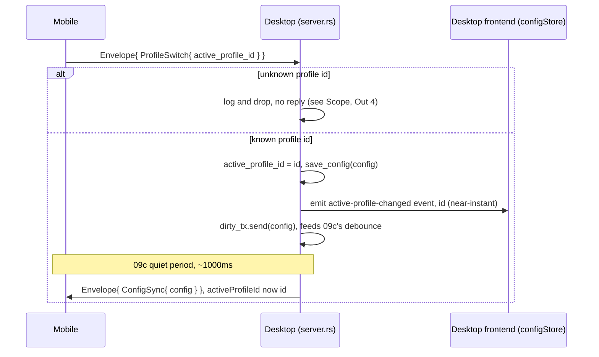

# Slice Spec: Profile Switch

| | |
|---|---|
| **Doc Type** | Slice Spec |
| **Author** | Gregory |
| **Date** | 2026-09-16 |
| **Status** | Draft |
| **Reviewers** | — |

**Implements:** `01. Architecture Overview.edd.md`, Testing & Rollout Plan
step 10, manual half only ("manual switch from mobile … then the OS-focus
watcher for auto-switching" — the OS-focus half is 10a, its own native
platform work, matching the 09/09a and 07/07a-d split).
**TL;DR:** Mobile can request a Profile switch; desktop applies it, persists,
and both devices end up showing the new Profile. One new `ProfileSwitch`
message, M→D only this slice — the D→M announce half of EDD §5.2's table
entry is deliberately deferred (see Scope → Out #1), not dropped.

> **Style:** terse over complete — cut words that don't carry a decision,
> fact, or constraint. Write for a human skimming and an agent executing:
> concrete nouns, exact names, exact commands, not vague gestures at intent.
> Use a Mermaid diagram instead of prose for any multi-step exchange.
> Use numbered lists (`1.`, `2.`, ...), not `-` bullets — see CONTRIBUTING.md
> § Documentation style.

---

## Scope

**In:**

1. `wire.proto`: `ProfileSwitch { string active_profile_id = 1; }` added to
   `Envelope`'s oneof, tag 8. Shape is usable in either direction — EDD Open
   Question 3, note 2 already tolerates this for `profile_switch` ("the
   cursor fires far more often, so don't inherit [the two-message split]
   there") — but only the M→D direction is wired this slice.
2. Desktop: `server.rs`'s client-message dispatch (currently
   `handle_button_press`, parsing the frame and matching only `ButtonPress`)
   becomes a `handle_client_message` that parses once and routes by oneof
   case — `ButtonPress` unchanged, plus a new `ProfileSwitch` arm.
3. Desktop: a `handle_profile_switch` function — validates the requested id
   against the loaded `Config.profiles`, drops unknown ids (Scope → Out
   doesn't cover this; it's the one new correctness case, see Implementation
   Notes #1), else sets `active_profile_id`, saves via the existing
   `config::save_config`, and sends on the existing `ConfigDirtyTx` — the
   exact channel `lib.rs`'s `save_config` Tauri command already feeds, so
   this rides slice 09c's debounce → `config_sync` path to mobile with no
   new wire-broadcast code.
4. Desktop: a new Tauri event, `active-profile-changed`, emitted after a
   successful switch — the desktop **frontend's** notification, since
   `ConfigDirtyTx`/`ConfigChangedTx` (09c) only reach WebSocket-connected
   mobile clients, never the Tauri UI. Every write before this slice was
   authored by the frontend itself (09c Out #1: "nothing needs to be told
   about its own write"); a mobile-requested switch is the first write the
   frontend didn't author, so it's the first one that needs telling.
5. Desktop: `configStore` (`config.svelte.ts`) listens for
   `active-profile-changed` — same `listen()` shape `switchStatesStore`
   already uses for `switch-states-changed` — and applies the new id plus
   `switchProfile`'s own reset-to-first-page/clear-folder-stack logic,
   **without** re-invoking `save_config` (Rust already persisted it).
   Factor that reset logic out of `switchProfile()` into a small shared
   private method both call, rather than duplicating it.
6. Mobile: `Connection.swift` gets `requestProfileSwitch(to id: String)` —
   builds a `Buttons_ProfileSwitch`, wraps it in an `Envelope`, sends
   fire-and-forget, same shape as the existing `ButtonPress` send.
7. Mobile: a Profile switcher, shown only when `configSync.profiles.count >
   1` — a `Menu` listing Profile names, current one marked, tapping any
   other calls `requestProfileSwitch(to:)`. Exact placement (an overlay on
   `RootView`'s `Group`, the simplest option with no `DeckView`/
   `NavigationStack` changes) is an implementation-time call, not pinned
   here.

**Out:**

1. **The D→M `ProfileSwitch` announce.** EDD §5.2's original reason for a
   lightweight announce was cost, not correctness — "a free
   `activeProfileId` update," explicitly contrasted with a full
   `config_sync`. Routing every switch through 09c's path (Scope → In #3)
   means a desktop-initiated switch still pays a full-`Config` serialize +
   push + full mobile re-render, plus the debounce quiet period — exactly
   what the EDD wanted to avoid, and that cost is currently accepted only
   because switches are rare (manual, occasional). It stops being
   acceptable at 10a: the OS-focus watcher makes switches alt-tab-frequent,
   which is the case the announce message exists for. 10a should add the
   D→M send (no schema change — same message, `.proto` already supports
   it) rather than this slice building it against a caller that doesn't
   exist yet.
2. **The OS-focus watcher** and any auto-switch behavior — 10a, separate
   native platform work per roadmap step 10's own phrasing.
3. **Instant/optimistic mobile UI on tap.** Mobile learns the switch
   succeeded only via the next `config_sync`, one 09c debounce quiet period
   (1000ms) after the request lands — same round trip any other
   mobile-authored write outside `button_press`/`state_push` would see
   today. Accepted here rather than adding a new local-override field to
   `RootView.activeProfile` (currently a pure computed property with no
   mutable state) for a switch that's expected to be occasional, not
   per-frame. Revisit only if the round trip proves to feel laggy in
   practice.
4. **A reply/result message for `ProfileSwitch`.** EDD's message table has
   no result type for it, unlike `ButtonPress`/`ActionResult`. An unknown
   id is logged and dropped server-side (Implementation Notes #1); the
   requesting device's optimistic UI, if it had any, would self-correct on
   the next `config_sync` — moot this slice per Out #3.
5. Multi-device semantics — v1 is one paired device (PRD/EDD Non-Goals);
   this slice's `active_profile_id` is global `Config` state, same as
   every other Profile field.

> **Rule for agent:** stay inside this scope. If something out of scope
> blocks you, stop and flag it — don't silently expand scope to route around
> it.

## Files to Touch

1. `protocol/wire.proto` — modify — add `ProfileSwitch` message, extend
   `Envelope`'s oneof (tag 8); drop `profile_switch` from the header
   comment's "not here yet" note.
2. `protocol/README.md` — modify — drop `profile_switch` from the same
   "not designed" list (line 20), mirrored from the header comment above.
3. `desktop/src-tauri/src/server.rs` — modify — `handle_button_press` →
   `handle_client_message` (parses once, routes by oneof case); new
   `handle_profile_switch` fn; drop the stale "profile_switch isn't
   designed yet" comment at `handle_connection`'s loop (line 240); add
   `ACTIVE_PROFILE_CHANGED_EVENT` constant next to
   `SWITCH_STATES_CHANGED_EVENT`.
4. `desktop/src-tauri/src/lib.rs` — modify — thread `ConfigDirtyTx` into
   `server::run` (created here already, just not passed that far yet — see
   Interface).
5. `desktop/src/lib/stores/config.svelte.ts` — modify — extract
   `switchProfile`'s reset logic into a shared private method; `load()`
   registers a `listen("active-profile-changed", …)` handler calling it.
6. `ios/Buttons/Networking/Connection.swift` — modify — add
   `requestProfileSwitch(to:)`.
7. `ios/Buttons/ButtonsApp.swift` — modify — Profile switcher UI on
   `RootView`, wired to `connection.requestProfileSwitch(to:)`.
8. `ios/Buttons/Generated/wire.pb.swift` — regenerate (command below).
   `buttons.pb.swift` untouched — no data-model change.

> **Rule for agent:** don't touch files outside this list without flagging
> it first.

## Interface / Data Contract

The two notification paths this slice creates run at different speeds and
never touch each other — desktop's own frontend hears about the switch
almost immediately (a direct Tauri event), mobile hears about it only once
09c's debounce quiet period elapses (a full `config_sync`, same as any
other desktop edit):



**Reading this against 10a (not built here):** once the OS-focus watcher
lands, `D->>D` starts firing on its own (no `M->>D` request first) — the
`F` and `M` arms below the `alt` are unchanged either way, since desktop
already treats "my own edit" and "a request I just applied" as the same
"active_profile_id changed" event (Implementation Notes #2). What 10a adds
is the direct `D->>M` announce Scope → Out #1 defers — skipping the
`Note over D,M` wait for the frequent auto-switch case.

`protocol/wire.proto` — new message, next free `Envelope` tag:

```protobuf
message Envelope {
  string protocol_version = 1;
  oneof message {
    PairRequest pair_request = 2;
    PairResponse pair_response = 3;
    ConfigSync config_sync = 4;
    ButtonPress button_press = 5;
    ActionResult action_result = 6;
    StatePush state_push = 7;
    // 1. new — M→D only this slice; D→M deferred to 10a, see Scope → Out #1
    ProfileSwitch profile_switch = 8;
  }
}

message ProfileSwitch {
  string active_profile_id = 1;
}
```

1. No `repeated`/batch shape needed — unlike `StatePush` (09a), a Profile
   switch is one id, one event, never a batch of them arriving together.

**Desktop dispatch (`server.rs`):**

```rust
async fn handle_client_message(
    text: &str,
    config_path: &Path,
    switch_state_path: &Path,
    switch_states: &SwitchStates,
    state_push_tx: &StatePushTx,
    // 1. new — reuses 09c's channel
    dirty_tx: &crate::ConfigDirtyTx,
    app: &tauri::AppHandle,
) -> Option<buttons::Envelope> {
    let envelope: buttons::Envelope = match serde_json::from_str(text) {
        Ok(envelope) => envelope,
        Err(parse_error) => {
            eprintln!("[{}] server: malformed Envelope: {parse_error}", log_time());
            return None;
        }
    };
    match envelope.message {
        Some(buttons::envelope::Message::ButtonPress(press)) => {
            let result = execute_press(
                &press.button_id, config_path, switch_state_path,
                switch_states, state_push_tx, app,
            ).await;
            Some(action_result(&press.button_id, result))
        }
        // 2. new
        Some(buttons::envelope::Message::ProfileSwitch(switch)) => {
            handle_profile_switch(switch, config_path, dirty_tx, app).await;
            // no reply envelope — see Scope → Out #4
            None
        }
        // no other client-initiated message this slice
        _ => None,
    }
}

// 3. new
async fn handle_profile_switch(
    switch: buttons::ProfileSwitch,
    config_path: &Path,
    dirty_tx: &crate::ConfigDirtyTx,
    app: &tauri::AppHandle,
) {
    let Ok(mut config) = config::load_config(config_path) else {
        eprintln!("[{}] server: profile_switch: failed to load config", log_time());
        return;
    };
    if !config.profiles.iter().any(|p| p.id == switch.active_profile_id) {
        // unknown id — drop, no reply (Scope → Out #4)
        eprintln!(
            "[{}] server: profile_switch to unknown id {}, dropped",
            log_time(), switch.active_profile_id
        );
        return;
    }
    config.active_profile_id = switch.active_profile_id.clone();
    if config::save_config(config_path, &config).is_err() {
        eprintln!("[{}] server: profile_switch: failed to save config", log_time());
        return;
    }
    // feeds 09c's debounce → config_sync to mobile
    let _ = dirty_tx.send(config);
    let _ = app.emit("active-profile-changed", switch.active_profile_id);
}
```

1. `dirty_tx` threaded as an explicit param, same as `state_push_tx` and
   `switch_states` already are — this file's established idiom for shared
   channels, not a reach into `app.state::<ConfigDirtyTx>()` at point of
   use.
2. Routes to the existing 09c debounce path rather than building a second
   broadcast — `ProfileSwitch` becomes exactly "another kind of edit" from
   that path's point of view, same as any `save_config` call.
3. No reply envelope on any branch (success or unknown id) — matches Scope
   → Out #4.

**Desktop frontend (`config.svelte.ts`):**

```typescript
// 1. new — mirrors switchStatesStore's listen() shape
if (!this.unlisten) {
  this.unlisten = await listen<string>("active-profile-changed", (event) => {
    // 2. new — shared with switchProfile()
    this.applyActiveProfile(event.payload);
  });
}
```

1. Registered once, from `load()` — same "first load only" guard
   `switchStatesStore` already uses.
2. `applyActiveProfile(id)` is `switchProfile`'s existing body
   (`config.activeProfileId = id`; reset `currentPageId`/`folderStack`)
   minus the `persist()` call at the end — Rust already wrote and broadcast
   this change, so the frontend only mirrors local view state.

**Mobile (`Connection.swift`):**

```swift
// 1. new — fire-and-forget, same shape as the existing ButtonPress send
func requestProfileSwitch(to id: String) {
    var switchMsg = Buttons_ProfileSwitch()
    switchMsg.activeProfileID = id
    var envelope = Buttons_Envelope()
    envelope.protocolVersion = "1"
    envelope.profileSwitch = switchMsg
    send(envelope)
}
```

> **Note:** this matches `sendPairRequest()`/`pressButton()`'s existing
> var-then-assign shape — no `.with(_:)` builder or envelope-factory
> extensions anywhere in `Connection.swift` yet (checked 2026-09-16). If
> the boilerplate sweep discussed alongside this slice lands first, this
> snippet updates to match whatever shape it picks rather than staying
> the odd one out.

## Implementation Notes

1. **Unknown `active_profile_id` is a real case, not a hypothetical one** —
   mobile's `configSync` can be briefly stale (e.g. a Profile just deleted
   on desktop, per slice 4's delete-reassigns-active-Profile logic) between
   a resync and the next one. Dropping silently server-side, logged, is
   consistent with `handle_button_press`'s own "malformed/unexpected input
   this slice: log and drop, no reply" precedent (slice 08 Implementation
   Notes) — not a new failure mode invented for this slice.
2. **Why `dirty_tx` and not a new dedicated broadcast**, unlike `state_push`
   (09a) getting its own channel: `state_push` needed a new broadcast
   because nothing existing carried "a batch of button states changed."
   `active_profile_id` is just one more field inside `Config`, and 09c
   already built "an edit changed `Config`, tell connected mobile" as a
   generic path fed by `ConfigDirtyTx` — reusing it is the same "one path,
   no branch on origin" reasoning 09a's own flip-and-broadcast function
   used (09a Scope → In #3).
3. **The desktop frontend and mobile do not learn of a mobile-initiated
   switch at the same time or by the same path** — the frontend gets it
   almost immediately via the new direct `active-profile-changed` event;
   mobile gets it up to ~1s later via 09c's debounced `config_sync`. Both
   are correct, neither is a regression of the other; don't try to unify
   them onto one signal this slice.

## Definition of Done

1. [ ] With mobile and desktop both showing Profile A, tapping Profile B in
   mobile's switcher updates desktop's active Profile (editor grid, and
   `ProfileSwitcher.svelte`'s own dropdown) with no manual reload.
2. [ ] The same tap updates mobile's own `DeckView` to Profile B's pages,
   within roughly one debounce period — no manual refresh, no reconnect.
3. [ ] Switching to a Profile whose current mobile page id doesn't exist in
   the new Profile falls back to that Profile's first page (regression
   check against slice 09c's existing fallback, Implementation Notes #6 —
   confirms this slice didn't need to touch it).
4. [ ] A `profile_switch` naming a Profile id that doesn't exist in
   `Config` is dropped server-side (log line), doesn't crash the
   connection, and doesn't change `active_profile_id`.
5. [ ] `wire.proto` changes compile in all three generated languages
   (schema-lock check, same as slice 08/09a): `android/gradlew
   --project-dir protocol/verify-kotlin test`. Blocked by the pre-existing
   JDK 19/Kotlin-daemon toolchain break (09/09a's own DoD 1 carried the
   same note) — deferred to roadmap step 12, not fixed here.
6. [ ] `protoc --swift_out=…` regen produces the expected `wire.pb.swift`
   diff; `buttons.pb.swift` has **no** diff.

**Verification:**
```
cd desktop/src-tauri && cargo build
cd ios && xcodegen generate && xcodebuild build -scheme Buttons -destination 'platform=iOS Simulator,name=iPhone 15'
cd android && ./gradlew --project-dir ../protocol/verify-kotlin test
cd protocol && protoc --swift_out=../ios/Buttons/Generated --proto_path=. buttons.proto wire.proto && git diff --stat ../ios/Buttons/Generated
```

> **Rule for agent:** run the verification command(s) above before declaring
> this slice done. Report the actual output, not an assumption that it
> passed.

## Rollback

Additive (new oneof tag, new Tauri event, no changed message shapes) — safe
to `git revert` this slice's commits cleanly. If a regenerated
`wire.pb.swift` diverges further than expected, re-run the exact `protoc`
command above rather than hand-editing the committed file, same as slice
08/09a.
