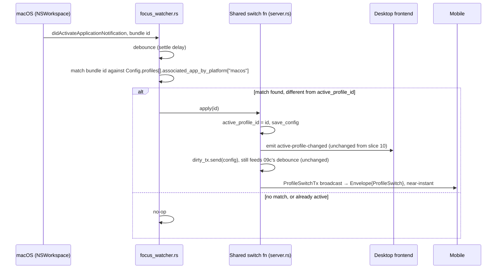

# Slice Spec: Auto Profile Switch

| | |
|---|---|
| **Doc Type** | Slice Spec |
| **Author** | Gregory |
| **Date** | 2026-09-17 |
| **Status** | Draft |
| **Reviewers** | — |

**Implements:** `01. Architecture Overview.edd.md`, Testing & Rollout Plan
step 10, OS-focus half ("then the OS-focus watcher for auto-switching" —
deferred here explicitly by slice 10 Scope → Out #2, matching the 09/09a
and 07/07a-d split); PRD "Smart Profiles" (auto-switch the active Profile
based on which application has OS focus).
**TL;DR:** Desktop watches OS focus and auto-switches the active Profile
per a user-set app↔Profile association, announcing the switch to mobile
immediately rather than waiting on 09c's debounce — the two pieces slice 10
deliberately deferred (Scope → Out #1 the D→M announce, #2 the watcher
itself). **macOS only this slice** — Windows is its own follow-up once the
mac end-to-end MVP and the iOS App Store track (steps 11/11a) are further
along; Linux has no standard focus API under Wayland and isn't scheduled.
Release/bundling/distribution CI is unrelated scope, out entirely — that's
step 15's job.

> **Style:** terse over complete — cut words that don't carry a decision,
> fact, or constraint. Write for a human skimming and an agent executing:
> concrete nouns, exact names, exact commands, not vague gestures at intent.
> Use a Mermaid diagram instead of prose for any multi-step exchange.
> Use numbered lists (`1.`, `2.`, ...), not `-` bullets — see CONTRIBUTING.md
> § Documentation style.

---

## Scope

**In:**

1. `buttons.proto`: `Profile` gets
   `map<string, string> associated_app_by_platform = 4;` — one
   platform-native app identifier per platform (macOS: `NSRunningApplication`
   bundle id, e.g. `com.google.Chrome`; Windows, later: executable name,
   e.g. `chrome.exe`), keyed by a lowercase platform string (`"macos"`,
   `"windows"`). A map, not a bare list, because two different operations
   need platform tagging and neither can safely recover it after the fact:
   replacing only the current platform's entry when the user re-picks, and
   showing which entry belongs to which platform when editing a Profile
   set up on a different machine. Regex-classifying an opaque id after
   storage doesn't work — Windows binaries don't reliably contain `.exe`
   (Mono apps on Linux do too) and Linux has no canonical id shape at all
   (`.desktop` file id, `WM_CLASS`, process basename all coexist) — so the
   platform tag has to be captured at write time, when the native API that
   produced the id already knows it. `map`, not `repeated {platform, id}`,
   because key uniqueness gets "one association per platform, last write
   wins" for free instead of needing application-level dedup. Verified
   2026-09-18: proto3 map keys must be a scalar type — an enum key
   (`map<Platform, string>`) fails Wire codegen outright ("map key must be
   non-byte, non-floating point scalar"), tested directly against
   `verify-kotlin`, so the key is a plain string, not the closed-set
   `Platform` enum Implementation Notes #1 adds in application code only.
   `repeated`/`map` either way, not a scalar, from the start: EDD § 5.5
   Desktop component #5 ("Profile export/import to a plain JSON file")
   makes this field's shape part of a user-facing, shareable export format
   the day this slice ships, and reshaping a scalar into a structure later
   would break that format and every generated-language binding reading
   it — the same non-additive-change problem 09a's `repeated StateChange`
   was decided against up front for.
2. Desktop Rust: a new Tauri command listing currently-running apps
   (bundle id + display name) — the picker's data source (Scope → Out #4:
   no free-text entry).
3. Desktop Rust: `focus_watcher.rs`, `#[cfg(target_os = "macos")]` —
   subscribes to `NSWorkspace`'s app-activation notification, debounces
   (EDD § 5.5.3's documented requirement — undebounced alt-tabbing would
   fire a switch, and 09c's `config_sync` fallback per switch, per raw
   focus event), then looks up a `Profile` whose `associated_app_by_platform["macos"]`
   equals the newly-focused app's bundle id.
4. Desktop Rust: extract slice 10's `handle_profile_switch` body (validate
   id, set `active_profile_id`, `save_config`, feed `ConfigDirtyTx`, emit
   `active-profile-changed`) into a shared function both the client-message
   path (existing) and the watcher path (new) call — "an edit to
   `active_profile_id`," same reasoning slice 10 Implementation Notes #2
   already used to justify one path with no branch on origin.
5. Desktop Rust: the shared switch function also sends on a new
   `ProfileSwitchTx` broadcast — same shape as `StatePushTx` (09a): each
   connection subscribes, gains a `tokio::select!` arm, forwards as a
   direct `Envelope{ ProfileSwitch }` to mobile. This is the D→M announce
   slice 10 Scope → Out #1 named and deferred specifically to this slice,
   now that a caller (the watcher) exists to make its cost worth paying.
6. Desktop Svelte: `ProfileSwitcher.svelte` gets an app-association picker
   per Profile — a dropdown sourced from Scope → In #2's command, current
   macOS association shown, "None" clears it. Writes (sets or clears) only
   the `"macos"` key of `associated_app_by_platform` — the map's other
   possible keys (Windows, later) are left untouched by this slice's UI,
   same "additive, not a reinterpretation" reasoning as Scope → Out #1.
   Exact placement (inline per-row vs. a small edit affordance) is an
   implementation-time call.
7. Mobile Swift: `Connection.swift`'s `case .profileSwitch` — currently a
   no-op at `handle(envelope:)`'s catch-all (line 345, grouped with
   `.pairRequest`/`.buttonPress` as "client-only-sent, never received") —
   gets its own arm applying the announced id to local state directly,
   mirroring desktop's `applyActiveProfile` (slice 10 Interface, `config
   .svelte.ts` note 2): same reset-to-first-page/clear-folder-stack logic,
   no `config_sync` wait.

**Out:**

1. **Windows watcher.** Same feature, different native API (no bundle-id
   concept — `GetForegroundWindow` → `GetWindowThreadProcessId` →
   `QueryFullProcessImageName` to resolve an executable name). Its own
   follow-up slice; the schema field (Scope → In #1) is already shaped to
   receive it as a new `"windows"` map key, not a reinterpretation of the
   existing `"macos"` one — no migration of existing exported configs.
   Sequencing reason, not a technical one: iOS App Store readiness (step
   11a) is the current priority — see roadmap Testing & Rollout Plan step
   11a's own "gates step 12" framing, same logic applied one level earlier
   here.
2. **Linux watcher.** No standard cross-compositor Wayland API exists (a
   deliberate sandboxing choice, not a library gap) — X11 alone is doable
   (`_NET_ACTIVE_WINDOW` + `WM_CLASS`/PID, the same approach
   `wmctrl`/`xdotool`/ActivityWatch's `aw-watcher-window` use) but would
   ship a watcher that silently does nothing under the increasingly-common
   Wayland default. Elgato itself never supported Linux for this feature.
   Not scheduled; revisit if a Linux desktop build becomes real deliverable
   for something else first. **Naming note for whenever this is picked
   up:** unlike `"macos"`/`"windows"`, where platform and id-namespace are
   the same thing (one OS, one API, one id shape), Linux isn't
   automatically one namespace — X11's `WM_CLASS`/process-name and any
   future Wayland integration (compositor-specific: wlroots'
   foreign-toplevel protocol, a GNOME Shell extension, a KWin script) are
   different, unrelated APIs. Whether they deserve separate map keys
   (`"x11"` vs. a Wayland-specific one) or can safely collapse into one
   `"linux"` key comes down to one empirical question that slice has to
   actually test, not assume: **do the id strings match** for the apps
   that matter — X11 `WM_CLASS` vs. a compositor's `app_id` — or do they
   diverge (plausible for Electron/Flatpak apps, where freedesktop's
   push toward `app_id == .desktop`-id and XWayland's compatibility
   shims don't always agree)? Default to separate keys until that's
   verified: unifying now on an untested assumption risks a silent,
   undiagnosable failure (auto-switch just doesn't fire, no error, no way
   to tell which backend wrote the stored id) if the ids turn out to
   differ; splitting keys now and collapsing them later once verified
   costs nothing (or the picker can write both once proven safe) — the
   reverse correction, discovering the unification was wrong after data's
   already stored under an ambiguous key, is the expensive direction.
3. **Release/bundling/distribution CI** (GitHub Actions release publishing,
   code signing, notarization, auto-update). Unrelated to this slice's
   scope — belongs entirely to step 15, "Bundling & Distribution."
4. **Free-text app-id entry.** The picker (Scope → In #2/#6) is
   list-and-select only — no path for a user to hand-type a bundle id for
   an app that isn't currently running. Revisit only if that proves a real
   need (e.g. associating an app the user doesn't have open yet).
5. **Two Profiles claiming the same app id.** Not detected or prevented;
   whichever the watcher's lookup finds first wins, undefined-but-harmless.
   No UI validation against it this slice.
6. **One Profile associated with multiple different apps on the same
   platform** (e.g. an "Art" Profile for both Aseprite and Photoshop) —
   `map<string, string>` holds one id per platform key, so this isn't
   schema-permitted the way an early `repeated string` draft of this field
   would have allowed. Not a requirement anyone's stated; if it becomes
   one, the value type can grow into a message (still additive) rather
   than reshaping the map itself.
7. **Any change to slice 10's manual M→D switch path.** Unaffected — still
   works exactly as shipped; this slice only adds a second *trigger* for
   the same underlying switch-and-persist logic (Scope → In #4).

> **Rule for agent:** stay inside this scope. If something out of scope
> blocks you, stop and flag it — don't silently expand scope to route around
> it.

## Files to Touch

1. `protocol/buttons.proto` — modify — add `associated_app_by_platform`
   (`map<string, string>`) to `Profile`, tag 4.
2. `desktop/src-tauri/Cargo.toml` — modify — macOS-only target dependency
   block: `objc2`, `objc2-app-kit`, `objc2-foundation` (NSWorkspace
   notification bindings). Pin to whatever version Tauri's own resolved
   `objc2` already uses (check `Cargo.lock`) to avoid two versions of the
   crate in the dependency tree.
3. `desktop/src-tauri/src/config.rs` — modify — new `Platform` enum
   (`MacOs`, `Windows`; closed set, application-side only — Interface
   Note 1); `Profile` struct gets
   `associated_app_by_platform: BTreeMap<Platform, String>`. `BTreeMap`,
   not `HashMap`: deterministic key order keeps an exported `buttons.json`
   diffable (EDD § 5.3), matching why `Config`/`Profile` are hand-written
   serde structs, independent of the generated wire types, in the first
   place.
4. `desktop/src-tauri/src/proto.rs` — modify — `Platform`'s wire-key
   conversion (`"macos"`/`"windows"` strings, the wire map's actual keys)
   feeding `ConfigSync` construction — same file already holds
   `config::MediaKeyKind` → `buttons::MediaKeyKind`'s conversion
   (`impl From<&config::MediaKeyKind> for buttons::MediaKeyKind`, line
   130), though this one has no generated-enum counterpart to convert
   *to* — only a string key — since the wire schema has no `Platform`
   enum, by design (Scope → In #1).
5. `desktop/src-tauri/src/focus_watcher.rs` — create — macOS
   `NSWorkspace` watcher, debounced, `cfg(target_os = "macos")`-gated;
   no-op stub (or absent module) on other targets.
6. `desktop/src-tauri/src/server.rs` — modify — extract shared
   switch-and-persist function out of `handle_profile_switch`; add
   `ProfileSwitchTx` broadcast alias and `handle_connection`'s new
   `tokio::select!` arm (mirrors `StatePushTx`, 09a).
7. `desktop/src-tauri/src/lib.rs` — modify — create `ProfileSwitchTx` at
   startup, thread into `server::run`; start `focus_watcher` (macOS only)
   at app setup, wired to the shared switch function; new Tauri command
   listing running apps (Scope → In #2).
8. `desktop/src/lib/stores/config.svelte.ts` — modify — `Profile` type
   gains `associatedAppByPlatform: Partial<Record<"macos" | "windows", string>>`;
   store exposes a setter that writes only the `"macos"` key (Scope → In
   #6).
9. `desktop/src/lib/components/ProfileSwitcher.svelte` — modify —
   app-association picker per Profile.
10. `ios/Buttons/Networking/Connection.swift` — modify — `.profileSwitch`
    case in `handle(envelope:)` applies the id (replacing the current
    no-op arm at line 345).
11. `ios/Buttons/Generated/buttons.pb.swift` — regenerate (schema change,
    unlike slice 10 which only touched `wire.pb.swift`).
12. `protocol/wire.proto` — modify — comment only: drop the "M→D only this
    slice" caveat on the `profile_switch` oneof entry (no new tag; same
    message now used both directions).

> **Rule for agent:** don't touch files outside this list without flagging
> it first.

## Interface / Data Contract



`protocol/buttons.proto` — `Profile`, next free tag:

```protobuf
message Profile {
  string id = 1;
  string name = 2;
  repeated Page pages = 3;
  // 1. new — platform-native app identifier per platform this Profile
  // auto-switches for, keyed by lowercase platform name ("macos",
  // "windows" later). Absent key = no association for that platform.
  map<string, string> associated_app_by_platform = 4;
}
```

1. `map`, not `optional string`/`repeated string` — decided for the same
   reason 09a's `StatePush.changes` was `repeated` from day one (Scope →
   In #1): `Profile` export/import (EDD § 5.5 Desktop component #5) makes
   this a shareable file format immediately, and reshaping a scalar into
   a structure later is a non-additive change once that format is in use.
   String-keyed, not an enum key — proto3 map keys must be a scalar type;
   an enum key fails Wire codegen (verified 2026-09-18, Implementation
   Notes #1).

`protocol/wire.proto` — no new tag, comment update only:

```protobuf
oneof message {
  PairRequest pair_request = 2;
  PairResponse pair_response = 3;
  ConfigSync config_sync = 4;
  ButtonPress button_press = 5;
  ActionResult action_result = 6;
  StatePush state_push = 7;
  // 1. changed — M→D (manual, slice 10) and D→M (auto-switch announce,
  // this slice) both use this message now; no schema change either
  // direction.
  ProfileSwitch profile_switch = 8;
}
```

1. Same message shape carries both directions, as EDD Open Question 3
   already anticipated for `profile_switch` — only the *sender* changes.

**Desktop (`server.rs`):**

```rust
// 1. new — mirrors StatePushTx (09a) exactly; one connection today,
// correct unmodified past N=1
pub type ProfileSwitchTx = tokio::sync::broadcast::Sender<String>;

// 2. changed — extracted out of handle_profile_switch so both the
// client-message path and focus_watcher can call it
async fn apply_profile_switch(
    id: String,
    config_path: &Path,
    dirty_tx: &crate::ConfigDirtyTx,
    profile_switch_tx: &ProfileSwitchTx,
    app: &tauri::AppHandle,
) -> Result<(), ()> {
    let Ok(mut config) = config::load_config(config_path) else {
        eprintln!("[{}] server: profile_switch: failed to load config", log_time());
        return Err(());
    };
    if !config.profiles.iter().any(|p| p.id == id) {
        eprintln!("[{}] server: profile_switch to unknown id {}, dropped", log_time(), id);
        return Err(());
    }
    config.active_profile_id = id.clone();
    if config::save_config(config_path, &config).is_err() {
        eprintln!("[{}] server: profile_switch: failed to save config", log_time());
        return Err(());
    }
    let _ = dirty_tx.send(config);
    let _ = app.emit(ACTIVE_PROFILE_CHANGED_EVENT, id.clone());
    // 3. new — direct announce, doesn't wait on 09c's debounce
    let _ = profile_switch_tx.send(id);
    Ok(())
}
```

1. `ProfileSwitchTx` broadcasts a bare `String` (the new
   `active_profile_id`), not a full `Envelope` — same "internal channel
   carries the value, the per-connection loop wraps it for the wire"
   split `StatePushTx` already uses.
2. `handle_profile_switch` (slice 10) becomes a thin wrapper: parse the
   incoming `ProfileSwitch`, call `apply_profile_switch`. `focus_watcher`
   calls the same function directly with a `Profile.id` it looked up
   locally — no wire round-trip through itself.
3. The new send is unconditional on success — same "one path, no branch
   on origin" reasoning already governing this function (slice 10
   Implementation Notes #2); a manual mobile-initiated switch now also
   gets the instant announce, which is harmless (mobile already knows —
   it just requested it) and keeps the function single-branch.

**Desktop (`config.rs`, `focus_watcher.rs`):**

```rust
// 1. new — config.rs. Closed set, application-side only: the wire schema
// (Interface, buttons.proto fragment above) has no matching enum, by
// design — see Implementation Notes #1. Only `MacOs` this slice — no
// Rust code constructs a `Windows`/`Linux` variant yet (no watcher, no
// picker UI for either), so neither belongs here until its own slice
// adds the code that uses it (Implementation Notes #5).
#[derive(Serialize, Deserialize, Clone, Copy, PartialEq, Eq, PartialOrd, Ord)]
#[serde(rename_all = "lowercase")]
pub enum Platform {
    MacOs,
}

// 2. changed — Profile struct
pub struct Profile {
    pub id: String,
    pub name: String,
    pub pages: Vec<Page>,
    // 3. new
    pub associated_app_by_platform: std::collections::BTreeMap<Platform, String>,
}
```

```rust
// focus_watcher.rs
// 4. new — the watcher's whole job: turn a bundle id into a Profile.id,
// or nothing
fn matching_profile_id(config: &Config, focused_bundle_id: &str) -> Option<String> {
    config.profiles.iter()
        .find(|p| p.associated_app_by_platform.get(&Platform::MacOs)
            .is_some_and(|id| id == focused_bundle_id))
        .map(|p| p.id.clone())
}
```

1. `#[serde(rename_all = "lowercase")]` makes `Platform::MacOs` serialize
   as `"macos"` — the same string the wire map (Interface, buttons.proto
   fragment) uses as its key, kept in sync by convention rather than a
   shared constant (no existing precedent in this codebase for sharing a
   literal between a Rust enum's serde attribute and a `.proto` map key
   convention; `MediaKeyKind`'s wire/app split has the same informal
   coupling).
2. `BTreeMap<Platform, String>`, not `HashMap` — deterministic iteration
   order for `serde_json` export (Files to Touch #3).
3. `matching_profile_id` never touches the wire-generated `buttons::Profile`
   type — it reads `config::Profile` (the hand-written struct actually
   loaded from `buttons.json`), same file `handle_profile_switch`/
   `apply_profile_switch` already load from (`config::load_config`).

**Mobile (`Connection.swift`, `handle(envelope:)`):**

```swift
// 1. changed — was grouped into the no-op catch-all with .pairRequest/
// .buttonPress; now handled
case .profileSwitch(let switchMsg):
    applyActiveProfile(switchMsg.activeProfileID)
```

1. `applyActiveProfile` is new shared logic mirroring desktop's
   `configStore.applyActiveProfile` (slice 10) — set the active Profile
   id locally, reset to first page / clear folder stack, no wait on the
   next `config_sync`.

## Implementation Notes

1. **`Platform` is a `config.rs`-only enum, never a wire-schema type** —
   proto3 map keys must be a scalar type; an enum key
   (`map<Platform, string>`) fails Wire codegen outright ("map key must be
   non-byte, non-floating point scalar: Platform" — verified 2026-09-18
   against `verify-kotlin`, then reverted). This is the same wire/app
   split `config::MediaKeyKind` already has from `buttons::MediaKeyKind`
   (bridged by `impl From<&config::MediaKeyKind> for buttons::MediaKeyKind`,
   `proto.rs:130`), just one-directional here — the wire side is a plain
   string key with no generated enum counterpart to convert to. Regex-
   guessing a platform from an already-stored id string was considered and
   rejected: Windows executables don't reliably end in `.exe` (Mono apps
   on Linux do too) and Linux has no single canonical id shape at all, so
   the tag has to be captured at write time, not reconstructed later.
2. **Why `objc2`/`objc2-app-kit` and not the older `cocoa`/`objc` crates**
   — Tauri 2's own macOS backend already depends on `objc2` internally;
   matching it avoids two independent Objective-C runtime bridge versions
   linked into the same binary, a real source of subtle crashes if their
   assumptions about the runtime ever diverge.
3. **Debounce lives in `focus_watcher.rs`, not in the shared switch
   function** — the settle delay is specifically about not reacting to
   every raw OS notification (EDD § 5.5.3); the manual mobile-initiated
   path (slice 10) has no analogous "rapid-fire" case and shouldn't pay
   for a debounce it doesn't need.
4. **The watcher never touches the wire or `ConfigDirtyTx` directly** —
   it only ever calls `apply_profile_switch`, same as `handle_client_message`
   does for a manual request. This keeps "how a switch happens" in exactly
   one place, consistent with slice 10 Implementation Notes #2's reasoning
   and easy to re-verify: nothing new to check if a future auto-switch
   trigger (e.g. a scheduled Profile) shows up later.
5. **Windows deferral is a sequencing call, not a technical blocker** — the
   schema (Scope → In #1) and the shared switch function (Scope → In #4)
   are already Windows-ready; only `focus_watcher.rs`'s watcher half and
   the running-apps picker's Windows equivalent are missing. Adding it
   later means a new `Platform::Windows` variant and a new `"windows"` map
   key — additive, not a rework.

## Definition of Done

1. [ ] With mobile and desktop paired, setting Profile B's app association
   to a running app, then focusing that app, switches desktop's active
   Profile to B within the debounce settle delay — no manual action.
2. [ ] The same auto-switch updates mobile's `DeckView` to Profile B's
   pages near-instantly (via the new `ProfileSwitchTx` announce), not
   after a ~1s `config_sync` wait — verified by comparing timing against
   slice 10 DoD 2's manual-switch round trip.
3. [ ] Rapid alt-tabbing between two associated apps' windows results in
   exactly one switch per settled focus, not one per raw OS event —
   confirm via desktop console log line count against manual alt-tab
   count.
4. [ ] Slice 10's manual mobile-initiated switch (DoD 1/2/3/4) still passes
   unchanged — regression check that the `apply_profile_switch` extraction
   (Scope → In #4) didn't alter that path's behavior.
5. [ ] `buttons.proto` changes compile in all three generated languages:
   `android/gradlew --project-dir protocol/verify-kotlin test`. Pre-checked
   2026-09-18 with a throwaway `map<string, string>` field on `Profile`
   (reverted, not committed) — Wire generates a real `Map<String, String>`
   and `RoundTripTest` passes; re-run for real once the field lands for
   real, don't rely on the throwaway check alone.
6. [ ] `protoc --swift_out=…` regen produces the expected `buttons.pb.swift`
   diff (new field only); `wire.pb.swift` has **no** diff (comment-only
   change, not schema).

**Verification:**
```
cd desktop/src-tauri && cargo build
cd ios && xcodegen generate && xcodebuild build -scheme Buttons -destination 'platform=iOS Simulator,name=iPhone 15'
cd android && ./gradlew --project-dir ../protocol/verify-kotlin test
cd protocol && protoc --swift_out=../ios/Buttons/Generated --proto_path=. buttons.proto wire.proto && git diff --stat ../ios/Buttons/Generated
```

> **Rule for agent:** run the verification command(s) above before declaring
> this slice done. Report the actual output, not an assumption that it
> passed.

## Rollback

Additive (new `Profile` map field, new broadcast channel, new macOS-only
module, comment-only `wire.proto` change) — safe to `git revert`
this slice's commits cleanly. If a regenerated `buttons.pb.swift` diverges
further than expected, re-run the exact `protoc` command above rather than
hand-editing the committed file, same as slice 08/09a/10.
