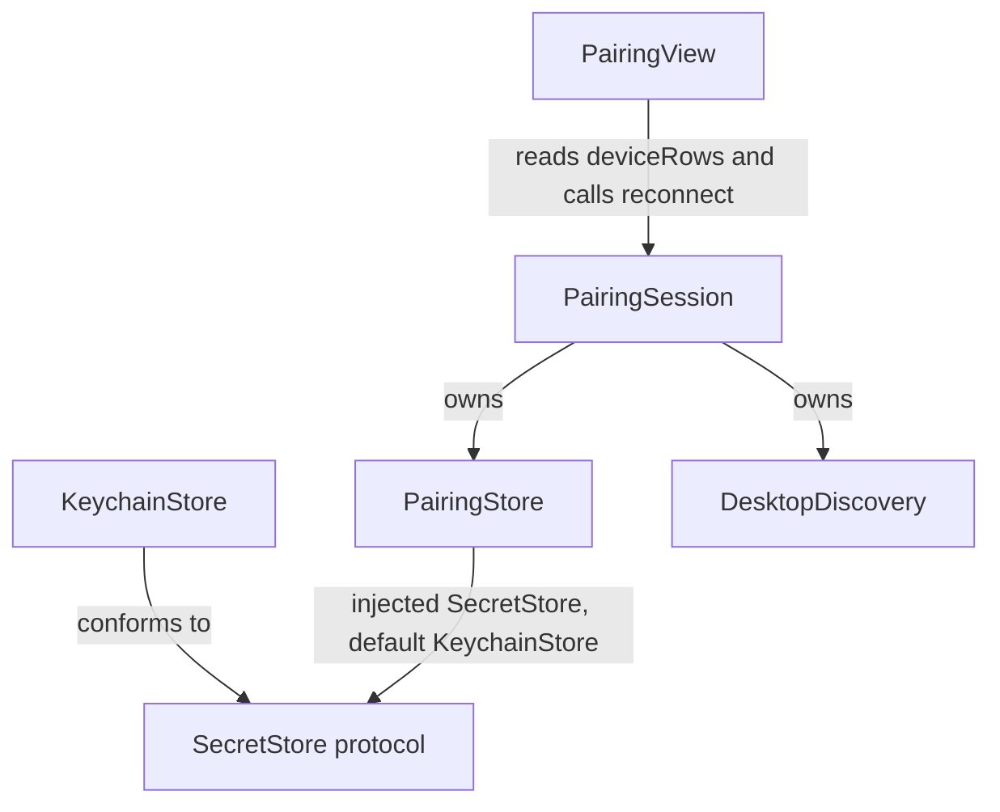

<!-- docs/slices/11a. Pairing Flow Robustness.spec.md -->

# Slice Spec: Pairing Flow Robustness

| | |
|---|---|
| **Doc Type** | Slice Spec |
| **Author** | Gregory McQuillan |
| **Date** | 2026-09-20 |
| **Status** | Draft |
| **Reviewers** | — (solo project) |

**Implements:** roadmap step 11a (EDD § Testing & Rollout Plan) —
repurposed from the closed manual-entry work in
`docs/slices/11. QR Reconnect Fallback.spec.md`. Realizes PRD Decision 1's
2026-09-20 update: multi-desktop enters v1.
**TL;DR:** today's pairing flow silently reconnects to whichever single
desktop was last paired, with no way to disambiguate multiple known
desktops and no way to unit-test `PairingStore` at all (it's Keychain
calls baked directly into pairing logic). This slice splits Keychain
access into its own protocol-backed layer, extends storage from one
credential to a known-devices history, and adds a picker to `PairingView`
so reconnect isn't blind to which desktop is actually live. Driver:
connection-flow robustness before launch, and it directly fixes real
dev-workflow friction disambiguating a live desktop app from a `websocat`
test harness on the same LAN. **Also absorbs the iOS-side half of
`07c. Desktop Device Name.spec.md`** (split 2026-09-20) — a picker
showing raw `deviceId` UUIDs defeats its own purpose, so `StoredPairing`
gains `deviceName` here rather than in a separate pass.

> **Style:** terse over complete — cut words that don't carry a decision,
> fact, or constraint. Use numbered lists (`1.`, `2.`, ...), not `-`
> bullets — see CONTRIBUTING.md § Documentation style.

---

## Design decisions

Settled 2026-09-20, after discussion (including an advisor consult):

1. **Only the storage layer gets a protocol, not `PairingStore`.**
   `PairingStore` stays a concrete class — its job is pairing-specific
   logic (which device is active, credential shape), not something a
   caller needs to swap out. The protocol boundary sits one layer down,
   named **`SecretStore`, not `KeychainStore`** — "Keychain" names one
   possible backend, not the capability itself, and a name that bakes in
   the backend reads as if nothing else could ever implement it. The
   concrete Keychain-backed implementation is named `KeychainStore`
   instead — that name was freed up by moving it off the protocol.
   Vocabulary is generic throughout, not Keychain-specific jargon: a
   `(namespace, key)` pair, not `(service, account)` — reusable if a
   future feature (a Tier 2 integration's API token, say) ever needs to
   persist a secret outside pairing entirely. Protocol stays minimal and
   stateless — `read`/`write`/`delete`/`keys` over explicit
   `(namespace, key)` string pairs, not generic over `Codable`, not
   async. No new `@Observable` layer: `PairingSession` (already
   `@MainActor @Observable`) is still the only observable object in this
   stack; `PairingStore` is a plain injected service.
2. **Two namespaces, not one, to avoid enumeration collision.**
   Per-device credentials live under namespace
   `"gg.pekk.buttons.pairing.devices"`, one entry per device (`key =
   deviceId`, value = `authToken`). The "which device is active" pointer
   lives under a *separate* namespace,
   `"gg.pekk.buttons.pairing.active"` (`key = "active"`, value = the
   active `deviceId`). Keeping them in different namespaces means
   listing known devices (`keys(namespace: .devices)`) never has to
   filter out a sentinel key by name — the pointer physically can't show
   up in that enumeration.
3. **No Keychain migration — this app hasn't shipped, so there's nothing
   to migrate.** Corrected 2026-09-20: earlier drafts of this decision
   hedged about "existing installs" and "orphaned data" as if real users
   held the old single-credential shape. They don't — the only install
   holding today's fixed `"device_id"`/`"auth_token"` accounts is the
   author's own dev phone, pre-release. The new shape can be picked
   freely with zero back-compat constraint; the old data just becomes
   invisible to the new code (different namespaces), and re-pairing a
   dev phone once is a non-event, not a documented user-facing
   guarantee.
4. **Silent auto-reconnect at launch still targets only the *active*
   device — never auto-switches.** `attemptAutoReconnect` keeps today's
   ~5s/250ms mDNS poll, unchanged, but now polls specifically for the
   active `deviceId`. If a *different* known device is discovered during
   that window, it becomes selectable in the picker — it is never
   auto-connected to instead of the active one. No silent
   device-switching, ever; a human always taps to change which desktop
   is live.
5. **Picker is a three-state merged list**, keyed by `deviceId`, built
   from `PairingStore.knownDevices()` + `DesktopDiscovery.discovered`:
   - known + currently discovered → "Connect" (uses stored `authToken`
     via the existing `session.reconnect(stored:endpoint:)`, unchanged).
   - known + not discovered → shown offline/greyed. This is what
     replaces today's silent `.notFound` dead end.
   - discovered + unknown (no stored credential) → "Pair new…", routes
     to the existing QR scan flow unchanged; a successful pair calls
     `PairingStore.save(_:makeActive:true)`.
6. **This is not PRD Open Question 2.** That question is about an
   *unpaired* desktop selected off a bare mDNS list completing a first
   pairing with no proof of possession — still open, untouched by this
   slice. Every entry this picker ever shows as "Connect" already has a
   persisted `authToken` from a real prior QR pairing; list-selection
   never substitutes for proof of possession here.
7. **`PairingSession` owns `DesktopDiscovery` outright; `PairingView`
   stops touching it directly.** Today `DesktopDiscovery` is constructed
   in `ButtonsApp.swift` and threaded as a *sibling* parameter alongside
   `session` into both `PairingView` and every
   `attemptAutoReconnect(discovery:)` call site — `PairingSession` never
   actually owned it despite being the only thing that uses it. Moving
   it into `PairingSession`'s initializer (stored, not per-call) removes
   that redundant threading: `attemptAutoReconnect()` drops its
   parameter, `PairingView` drops its separate `discovery` property, and
   the merge (item 5) becomes a `PairingSession.deviceRows` computed
   property `PairingView` reads directly, instead of the view importing
   both `PairingStore` and `DesktopDiscovery` data itself and merging
   them on its own. `ButtonsApp.swift`'s three `attemptAutoReconnect`
   call sites (`onAppear`, `onChange(of: connection.isConnected)`,
   `onChange(of: scenePhase)`) and its `PairingView(session:discovery:)`
   construction all simplify accordingly.
8. **`StoredPairing` gains `deviceName: String` (non-optional) from its
   first new-shape draft — absorbing `07c`'s iOS-side scope, not layering
   it on later.** `07c. Desktop Device Name.spec.md` split 2026-09-20:
   its wire + desktop half (`PairResponse.device_name`, `device.json`
   persistence, settings-UI rename field) ships standalone, independent
   of this slice. Its iOS half doesn't get built against the *current*
   single-fixed-account `PairingStore` (this slice deletes that shape
   almost immediately) — instead `StoredPairing` is 3 fields
   (`deviceId`, `authToken`, `deviceName`) from the start here, sourced
   from `PairResponse.device_name` once the wire/desktop half has
   shipped. `deviceName` is non-optional, not `String?` — revised
   2026-09-20: the `websocat` test fixture (`PAIRING.md`) now sends
   `deviceName` too, so a missing field is a genuine anomaly, not a
   routine case worth threading `Optional` through every consumer for.
   `Connection.swift` absorbs that anomaly into a fallback string at the
   wire boundary; `StoredCredential` (the Keychain-packed value) stays
   `String?` for decode-tolerance, with `PairingStore.knownDevices()` as
   the boundary that resolves it. A raw `deviceId` UUID in the picker
   would defeat this slice's own dev-workflow motivation (telling a real
   desktop apart
   from a `websocat` fixture), so this isn't optional polish — the
   picker needs it to be useful at all.
9. **Picker list is uniform at any known-device count, including one.**
   No special-casing "exactly one known device → skip the list, show
   old-style status text." `PairingView` only ever renders while
   disconnected in the first place (`RootView`'s `body` gates it on
   `!connection.isConnected`), so the list is "here's what you can do
   while not connected," not narrowly "disambiguate among many" — useful
   at N=1 too (retry, or connect to a since-reappeared offline device).
   Simpler code, one path, not two.
10. **`PairingSession.deviceRows` is a stored, explicitly-refreshed
    property, not a naive computed one.** A computed property reading
    `discovery.discovered` would correctly participate in `@Observable`
    tracking (`DesktopDiscovery` is itself `@Observable`) — that half
    isn't the problem. The Keychain half is: nothing marks a Keychain
    write as "changed," so a computed property re-reading
    `pairingStore.knownDevices()` would silently go stale right after a
    successful pair, with no signal telling SwiftUI to re-render.
    Fix: `PairingView` never calls `PairingStore` directly — every
    mutation routes through a `PairingSession` method, which refreshes
    the stored `deviceRows` immediately after. Live mDNS changes (a
    device appearing/disappearing with no user action) are caught by a
    lightweight periodic refresh while `PairingView` is on screen, same
    polling idiom `attemptAutoReconnect`'s existing 250ms loop already
    uses — not a bespoke observer bridge between `DesktopDiscovery`'s
    callback and `PairingSession`.
11. **Exactly one default constructor argument in the whole chain,
    at the real leaf.** `PairingStore.init(secrets: SecretStore =
    KeychainStore())` keeps its default — it's the one place swapping
    in a fake is the entire point. `PairingSession.init(pairingStore:
    PairingStore)` does **not** get a default: there is exactly one
    composition root (`ButtonsApp.swift`), so a default there hides
    where wiring happens for no benefit — a test constructing
    `PairingSession` passes an explicit `PairingStore(secrets: fake)`
    regardless, never leaning on `PairingSession`'s own default.
12. **Open, not yet resolved: what "Connect" does to an already-live
    connection.** Tapping a non-active known device while a *different*
    one is currently connected is now a routine, reachable user action
    this slice enables — not the rare two-desktops-on-a-LAN accident
    `07d` deferred (its Out item 5). `DesktopConnection` has a single
    `webSocketTask`/`pairCompletion` slot; whether "Connect" needs to
    disconnect the current device first, or the single-slot behavior
    already handles it cleanly, isn't decided. A related, explicitly
    **separate** future scope item surfaced alongside this: an
    auto-reconnect-on/off preference ("remember me"-style), independent
    of this decision either way. Must be resolved before Scope In item 5
    (the picker UI) is built — doesn't block the storage-foundation work
    that comes first.

## Shape sketches

Illustrative, not final implementation — exact method bodies may shift
once this is actually built, but the shapes (protocol surface, injection
point, merge keying) shouldn't.

### Keychain layout — two namespaces, not one

| Namespace | Key(s) | Value | Purpose |
|---|---|---|---|
| `gg.pekk.buttons.pairing.devices` | one per paired desktop, `key = deviceId` | `authToken` | every known desktop's credential |
| `gg.pekk.buttons.pairing.active` | single fixed key, `"active"` | a `deviceId` | which known device silent reconnect targets |

### Dependency shape

`PairingSession` now owns both `PairingStore` and `DesktopDiscovery`
outright (Design decision 7) — `PairingView` depends on `PairingSession`
alone, nothing else:



### `SecretStore` — full protocol

```swift
/// A namespaced key-value store for secrets — Keychain-backed in
/// production, fakeable in tests. Reusable beyond pairing: any future
/// feature needing to persist a secret (a Tier 2 integration's API
/// token, say) is a new namespace, not a new protocol.
protocol SecretStore {
    /// The stored value for `key` under `namespace`, or nil if nothing's
    /// stored (or the read fails).
    func read(namespace: String, key: String) -> String?

    /// Stores `value` for `key` under `namespace` — an upsert,
    /// overwriting any existing value rather than failing on conflict.
    func write(_ value: String, namespace: String, key: String)

    /// Removes any stored value for `key` under `namespace`.
    /// A no-op if nothing's stored.
    func delete(namespace: String, key: String)

    /// Every key currently stored under `namespace` — the enumeration
    /// primitive today's single-fixed-account code has no analogue for.
    func keys(namespace: String) -> [String]
}
```

### `KeychainStore` — representative methods

The concrete, Keychain-backed `SecretStore`. `write` (the upsert pattern
today's code already has, now parameterized by `namespace`/`key`) and
`keys` (genuinely new — `kSecMatchLimitAll` + `kSecReturnAttributes`
instead of today's single-item `kSecMatchLimitOne`):

```swift
final class KeychainStore: SecretStore {
    private func query(namespace: String, key: String) -> [String: Any] {
        [
            kSecClass as String: kSecClassGenericPassword,
            kSecAttrService as String: namespace,
            kSecAttrAccount as String: key,
        ]
    }

    func write(_ value: String, namespace: String, key: String) {
        let base = query(namespace: namespace, key: key)
        let data = Data(value.utf8)
        let status = SecItemCopyMatching(base as CFDictionary, nil)
        if status == errSecSuccess {
            SecItemUpdate(base as CFDictionary, [kSecValueData as String: data] as CFDictionary)
        } else {
            var newItem = base
            newItem[kSecValueData as String] = data
            SecItemAdd(newItem as CFDictionary, nil)
        }
    }

    func keys(namespace: String) -> [String] {
        let query: [String: Any] = [
            kSecClass as String: kSecClassGenericPassword,
            kSecAttrService as String: namespace,
            kSecReturnAttributes as String: true,
            kSecMatchLimit as String: kSecMatchLimitAll,
        ]
        var result: AnyObject?
        let status = SecItemCopyMatching(query as CFDictionary, &result)
        guard status == errSecSuccess, let items = result as? [[String: Any]] else { return [] }
        return items.compactMap { $0[kSecAttrAccount as String] as? String }
    }

    // read/delete: same shape as today's PairingStore.readString/delete
    // in Pairing.swift, just parameterized by namespace/key instead of a
    // fixed constant. kSecAttrService holds `namespace`, kSecAttrAccount
    // holds `key` — Keychain's own vocabulary stays internal to this
    // class, never leaks into the protocol.
}
```

### `PairingStore` — injection point + sample calls

`StoredPairing` is 3 fields now (Design decision 8) — `authToken` and
`deviceName` are packed into one JSON string per device key, since
`SecretStore` stores a bare string value (Design decision 1: no
`Codable` in the protocol itself). The encode/decode lives here, one
layer above the protocol boundary, not in it. `StoredPairing.deviceName`
is non-optional; `StoredCredential.deviceName` stays `String?` for
decode-tolerance of an entry written before this field existed —
`knownDevices()` is the one place that resolves the fallback. Shows the
constructor injection (`SecretStore` defaults to the real
`KeychainStore`, a fake goes in for tests — Design decision 11), and a
"getting/setting auth" round trip (`save`/`activeDeviceId`) built
entirely from the protocol's four methods:

```swift
struct StoredPairing: Equatable {
    let deviceId: String
    let authToken: String
    let deviceName: String
}

/// The `authToken`/`deviceName` pair packed into one Keychain value —
/// `deviceId` is the key, not repeated in the value.
private struct StoredCredential: Codable {
    let authToken: String
    let deviceName: String?
}

final class PairingStore {
    private static let devicesNamespace = "gg.pekk.buttons.pairing.devices"
    private static let activeNamespace = "gg.pekk.buttons.pairing.active"
    private static let activeKey = "active"

    private let secrets: SecretStore

    /// Defaults to the real Keychain; tests inject a fake `SecretStore`.
    init(secrets: SecretStore = KeychainStore()) {
        self.secrets = secrets
    }

    func knownDevices() -> [StoredPairing] {
        secrets.keys(namespace: Self.devicesNamespace).compactMap { deviceId in
            guard let raw = secrets.read(namespace: Self.devicesNamespace, key: deviceId),
                let credential = try? JSONDecoder().decode(StoredCredential.self, from: Data(raw.utf8))
            else { return nil }
            return StoredPairing(
                deviceId: deviceId, authToken: credential.authToken,
                deviceName: credential.deviceName ?? "Unnamed Device"
            )
        }
    }

    func activeDeviceId() -> String? {
        secrets.read(namespace: Self.activeNamespace, key: Self.activeKey)
    }

    func save(_ pairing: StoredPairing, makeActive: Bool = true) {
        let credential = StoredCredential(authToken: pairing.authToken, deviceName: pairing.deviceName)
        guard let data = try? JSONEncoder().encode(credential), let json = String(data: data, encoding: .utf8) else { return }
        secrets.write(json, namespace: Self.devicesNamespace, key: pairing.deviceId)
        if makeActive { setActive(deviceId: pairing.deviceId) }
    }

    func setActive(deviceId: String) {
        secrets.write(deviceId, namespace: Self.activeNamespace, key: Self.activeKey)
    }

    func remove(deviceId: String) {
        secrets.delete(namespace: Self.devicesNamespace, key: deviceId)
    }
}
```

### `PairingSession` — owns discovery, exposes the merged list

`deviceRows` is stored and explicitly refreshed (Design decision 10),
not computed — a Keychain write has no signal SwiftUI can observe on
its own. `pairingStore` has no default (Design decision 11): `PairingSession`
is only ever constructed once, at the composition root
(`ButtonsApp.swift`).

```swift
@MainActor
@Observable
final class PairingSession {
    private(set) var lastError: String?
    private(set) var autoReconnectState: AutoReconnectState = .idle

    /// What `PairingView` renders — it never touches `DesktopDiscovery`
    /// or `PairingStore` directly. Refreshed explicitly, not computed
    /// (Design decision 10).
    private(set) var deviceRows: [PairedDeviceRow] = []

    private let connection: DesktopConnection
    private let discovery: DesktopDiscovery
    private let pairingStore: PairingStore

    init(connection: DesktopConnection, discovery: DesktopDiscovery, pairingStore: PairingStore) {
        self.connection = connection
        self.discovery = discovery
        self.pairingStore = pairingStore
        refreshDeviceRows()
    }

    private func refreshDeviceRows() {
        deviceRows = mergedDeviceRows(known: pairingStore.knownDevices(), discovered: discovery.discovered)
    }

    /// Called after any mutation `PairingView` triggers (a fresh pair, a
    /// tap on "Connect") — `PairingView` never calls `PairingStore`
    /// directly, so this is the only place a write and a refresh can
    /// drift apart.
    func connect(to row: PairedDeviceRow) {
        // … looks up the matching StoredPairing, calls reconnect(stored:endpoint:),
        // then pairingStore.setActive(deviceId:) + refreshDeviceRows() on success
        // (Design decision 12 still open: what happens to an already-live connection)
    }

    func attemptAutoReconnect() async {
        discovery.start()
        // … polls for pairingStore.activeDeviceId() specifically (Design decision 4),
        // refreshDeviceRows() on completion either way
    }
}
```

### Merge logic — the three-state list

Keyed by `deviceId`. A `Dictionary`/`Set` precompute keeps this
`O(known + discovered)` instead of a nested-loop `O(known × discovered)`
— the transformation itself is two `map`/`filter` chains, concatenated,
no mutable accumulator. `discovered.map { ($0.deviceId, $0) }` is built
with `uniquingKeysWith:`, not `uniqueKeysWithValues:` — the latter traps
on a duplicate `deviceId` (a desktop restarting mid-browse, or
advertising on two interfaces, both real mDNS occurrences, not just
theoretical). `name` always comes from the *stored* `deviceName`
(captured at the last successful pair/reconnect), never a live mDNS
value — `07c`'s Out item 1 deliberately keeps the device name off the
Bonjour TXT record (unauthenticated, spoofable by anything on the LAN)
in favor of the wire field, delivered only over the already-authenticated
`PairResponse`. `DiscoveredDesktop` stays `deviceId`/`endpoint` only, no
`name` field. `PairedDeviceRow.name` is non-optional — revised
2026-09-20, same reasoning as `StoredPairing`: users should never see a
raw UUID, and a generic placeholder would defeat the picker's own job of
telling devices apart (the `websocat` fixture sends a real,
distinguishing name now, per `PAIRING.md`). Two distinct literal
fallbacks carry the distinction `Optional` used to: a known device with
no name received ("Unnamed Device") and a "Pair new…" row, where nothing
paired yet even *has* a name to source ("New Device") — different facts,
not the same nil:

```swift
enum PairedDeviceStatus {
    case connectable(endpoint: NWEndpoint)  // known + discovered
    case offline                            // known + not discovered
    case pairable(endpoint: NWEndpoint)     // discovered + unknown
}

struct PairedDeviceRow: Identifiable {
    var id: String { deviceId }
    let deviceId: String
    let name: String
    let status: PairedDeviceStatus
}

func mergedDeviceRows(
    known: [StoredPairing], discovered: [DiscoveredDesktop]
) -> [PairedDeviceRow] {
    let discoveredById = Dictionary(discovered.map { ($0.deviceId, $0) }, uniquingKeysWith: { first, _ in first })
    let knownIds = Set(known.map(\.deviceId))

    let knownRows = known.map { pairing in
        PairedDeviceRow(
            deviceId: pairing.deviceId,
            name: pairing.deviceName,
            status: discoveredById[pairing.deviceId].map { .connectable(endpoint: $0.endpoint) } ?? .offline
        )
    }
    let newRows = discovered
        .filter { !knownIds.contains($0.deviceId) }
        .map { PairedDeviceRow(deviceId: $0.deviceId, name: "New Device", status: .pairable(endpoint: $0.endpoint)) }

    return numberingDuplicateNames(knownRows + newRows)
}

private func numberingDuplicateNames(_ rows: [PairedDeviceRow]) -> [PairedDeviceRow] {
    var seenCounts: [String: Int] = [:]
    return rows.map { row in
        seenCounts[row.name, default: 0] += 1
        let count = seenCounts[row.name]!
        guard count > 1 else { return row }
        return PairedDeviceRow(deviceId: row.deviceId, name: "\(row.name) (\(count))", status: row.status)
    }
}
```

**Duplicate names get an AirPlay/AppleTV-style " (2)", " (3)" suffix** —
revised 2026-09-20, general motto: UX above all else. A picker exists to
tell devices apart; a name collision (two desktops both defaulting to
the same hostname, two never-paired rows both reading "New Device")
should look like Apple's own solution to the identical problem, not
leak a raw identifier. First occurrence stays plain, only the second and
later get numbered — matches "Office," "Office (2)."

`PairingView` reads `session.deviceRows` directly; "Connect" rows call
`session.connect(to:)`, "Pair new…" rows route to the existing QR scan
flow.

## Scope

**In:**
1. `ios/Buttons/Networking/SecretStore.swift` (new): `protocol
   SecretStore { func read(namespace:key:) -> String?; func
   write(_:namespace:key:); func delete(namespace:key:); func
   keys(namespace:) -> [String] }`, plus `final class KeychainStore:
   SecretStore` wrapping `SecItemCopyMatching`/`SecItemAdd`/
   `SecItemUpdate`/`SecItemDelete` — `keys(namespace:)` is new, using
   `kSecMatchLimitAll` + `kSecReturnAttributes` to list every stored key
   under a namespace (today's code only ever looks up one known account
   at a time).
2. `PairingStore` (`Pairing.swift`) refactored onto `SecretStore`: drops
   the old fixed-account `load()`/`save()`/`clear()` API, adds
   `knownDevices() -> [StoredPairing]`, `activeDeviceId() -> String?`,
   `save(_ pairing: StoredPairing, makeActive: Bool)`, `setActive(deviceId:
   String)`, `remove(deviceId: String)`. `StoredPairing` gains
   `deviceName: String` (non-optional) from its first draft (Design
   decision 8, absorbing `07c`'s iOS half) — packed with `authToken`
   into one JSON value per device key. No default in `PairingSession`'s
   initializer
   (Design decision 11) — constructed explicitly at the one composition
   root, `ButtonsApp.swift`.
3. `PairingSession` takes ownership of `DesktopDiscovery` (Design
   decision 7): stored in its initializer instead of passed per-call.
   `attemptAutoReconnect()` drops its `discovery:` parameter and polls
   for `pairingStore.activeDeviceId()` specifically (Design decision 4)
   — same timing, narrower target than today's single-stored-credential
   lookup. New stored, explicitly-refreshed `deviceRows: [PairedDeviceRow]`
   (Design decision 10, not a naive computed property) exposes the merge
   (Design decision 5) to `PairingView`. New `connect(to row:
   PairedDeviceRow)` looks up the matching `StoredPairing` and delegates
   to `reconnect(stored:endpoint:)` — every successful pair/reconnect
   always calls `save(_:makeActive: true)`, so a separate explicit
   `setActive` call isn't needed. `PairingView` never calls
   `PairingStore` directly.
4. `ios/Buttons/Networking/Connection.swift`: `PairResult.success` gains
   `deviceName: String` (non-optional — revised 2026-09-20, see Design
   decision 8) alongside `authToken` (07c's Files to Touch #8, read from
   `PairResponse.device_name` once the wire/desktop half has shipped —
   depends on that, doesn't rebuild it). Absent-field fallback lives
   here, at the wire boundary.
5. `ButtonsApp.swift`: construct `PairingSession(connection:discovery:
   pairingStore:)` explicitly (no default, Design decision 11); simplify
   all three `attemptAutoReconnect` call sites (`onAppear`,
   `onChange(of: connection.isConnected)`, `onChange(of: scenePhase)`) to
   drop the now-removed `discovery:` argument; `PairingView(session:)`
   drops its separate `discovery:` argument.
6. `PairingView`: a device list view (three states, Design decision 5;
   uniform at any count including one, Design decision 9) reading
   `session.deviceRows` directly, showing `row.name ?? row.deviceId`
   (truncated) — never a raw UUID as the primary label — replacing the
   current binary "landing (with silent-reconnect status text) vs.
   failed" framing. Existing
   `.scanning`/`.cameraPreAsk`/`.cameraDenied`/`.connecting`/`.failed`
   phases and their transitions are otherwise unchanged. Its preview
   provider's `PairingSession` construction updates to match.
7. `remove(deviceId:)` at the `PairingStore` layer, for hygiene and
   future use — no UI affordance to call it this slice (Out item 4).

**Out:**
1. Keychain migration — Design decision 3 (moot; nothing's shipped).
2. Hub-and-spoke (multiple phones paired to one desktop) — separate
   axis, still deferred per PRD Decision 1.
3. Any desktop-side change **beyond `07c`'s already-independent wire/
   desktop half**, which ships on its own regardless of this slice.
   `device.json`'s single `PairedSlot` per desktop instance is
   unaffected by the *multi-device* part of this work — the N-ness this
   slice adds lives entirely on the phone, each desktop still only ever
   tracks its own one paired phone. Verified, not assumed — DoD item 7.
4. A "forget device" UI affordance in the picker. `PairingStore.remove`
   exists at the store layer; nothing calls it yet.
5. Bootstrapping an iOS unit-test target. None exists today
   (`find ios -iname "*Tests*"` — nothing). The `SecretStore` protocol
   makes `PairingStore` testable *whenever* that infra exists; standing
   one up is a separate, cross-cutting concern, not bundled into a
   pairing-flow slice.
6. Any change to `PairRequest`/`PairResponse`/the wire protocol *from
   this slice*. `PairResponse.device_name` is `07c`'s addition, built and
   shipped independently before this slice's storage work needs it —
   this slice only ever reads it via `Connection.swift`.
7. The PIN/manual-entry design from the closed slice 11 — unrelated,
   still not being built.
8. Auto-switching to a different desktop without an explicit tap —
   Design decision 4.
9. Resolving what happens to an already-live connection when "Connect"
   targets a different device — Design decision 12, open, must be
   resolved before Scope In item 6 (the picker UI) is built.
10. A user-facing auto-reconnect on/off preference ("remember me"-style)
    — a separate future scope item, floated during Design decision 12's
    discussion, not this slice's problem.

> **Rule for agent:** stay inside this scope. If something out of scope
> blocks you, stop and flag it — don't silently expand scope to route
> around it.

## Files to Touch

1. `ios/Buttons/Networking/SecretStore.swift` — new — protocol +
   `KeychainStore`.
2. `ios/Buttons/Networking/Pairing.swift` — modify — `PairingStore`
   refactor (including `deviceName`/JSON packing), `PairingSession`
   gains `discovery`/`pairingStore` properties, stored `deviceRows`,
   `connect(to:)`, `attemptAutoReconnect()` signature change.
3. `ios/Buttons/Networking/Connection.swift` — modify — `PairResult`
   carries `deviceName` alongside `authToken`.
4. `ios/Buttons/Networking/Discovery.swift` — check only; `discovered:
   [DiscoveredDesktop]` already exposes what the picker needs (no `name`
   field added — Design decision 8's reasoning), expect no change.
5. `ios/Buttons/ButtonsApp.swift` — modify — `PairingSession`
   construction (no default, explicit `pairingStore:`), three
   `attemptAutoReconnect` call sites, `PairingView(session:)`
   construction.
6. `ios/Buttons/Views/PairingView.swift` — modify — device list UI reading
   `session.deviceRows`, showing `row.name` (always a real string, never
   `nil`/a raw UUID), "Connect"/"Pair new…" actions, drop the
   `discovery:` property; preview provider updated to match.
7. `protocol/PAIRING.md` — modify — the `websocat` fake-desktop fixture's
   `PairResponse` JSON now includes `deviceName` (a distinguishing value,
   e.g. `"websocat fixture"`) so the picker can tell it apart from a real
   desktop — revised 2026-09-20, Design decision 8.
7. `docs/slices/07c. Desktop Device Name.spec.md` — reference only,
   already amended separately — this slice implements its iOS-side half.
8. `docs/slices/11a. Pairing Flow Robustness.spec.md` — this file.

## Definition of Done

1. [ ] `KeychainStore` passes read/write/delete/`keys` against the real
       Keychain (manual check — no test target yet, Out item 5).
2. [ ] Pairing to two different desktops persists both as separate known
       devices; pairing to the second doesn't overwrite or clear the
       first.
3. [ ] Force-quit/relaunch silently reconnects to whichever device is
       active — unchanged UX from today for the common single-desktop
       case.
4. [ ] With two desktops live on the LAN (real app + real app, or real
       app + a `websocat` fixture per `PAIRING.md`), `PairingView`'s list
       shows both as "Connect" if both are known, or one as "Pair new…"
       if only one was ever paired.
5. [ ] A known-but-not-discovered device shows offline/greyed, not
       silence.
6. [ ] Tapping "Connect" on a non-active known device connects to it and
       makes it active — next relaunch's silent reconnect targets that
       one, not whichever was active before.
7. [ ] An old-shape (pre-refactor) Keychain entry doesn't crash on
       launch — resolves to zero known devices, QR pairing still works
       from there.
8. [ ] Confirmed (not assumed): pairing the same phone to two separate
       desktop instances leaves each desktop's own `device.json` holding
       only its own single `PairedSlot`, unaffected by the other.
9. [ ] `PairingView`'s list shows each known desktop's real `deviceName`
       (once `07c`'s wire/desktop half has shipped and a fresh pair has
       run against it) — never a raw `deviceId` UUID as the primary
       label.
10. [ ] Fresh install, zero known devices: `PairingView` still shows
        today's plain "Scan QR Code" landing, not an empty list widget —
        the uniform-list decision (9) applies once at least one device is
        known or discovered, not to the true first-run empty case.

**Verification:**
```
cd ios && xcodegen generate && xcodebuild build -scheme Buttons -destination 'platform=iOS Simulator,name=iPhone 15'
# manual, two desktop endpoints needed (matches DoD 1-10 above); assumes 07c's
# wire/desktop half is already built and running on both endpoints:
# 1. pair phone to desktop A, then desktop B (or a websocat fixture standing in for B,
#    per PAIRING.md's "Faking the desktop side with websocat") — confirm both persist,
#    with real names
# 2. force-quit, relaunch — confirm silent reconnect to whichever was paired/selected last
# 3. with both live, open PairingView — confirm both show "Connect" with real names
# 4. tap the non-active one, confirm it connects and becomes active; relaunch, confirm
#    the newly-active one is now the silent-reconnect target
# 5. quit one endpoint, relaunch app — confirm it shows offline/greyed, the other still connects
# 6. on the dev phone's existing old-shape Keychain data (from before this slice), confirm
#    no crash on launch — resolves to zero known devices, fresh QR pair still works
# 7. fresh install (no Keychain data at all), confirm plain QR-scan landing, no list shown
# 8. inspect device.json on both desktop instances — confirm neither references the other
```
