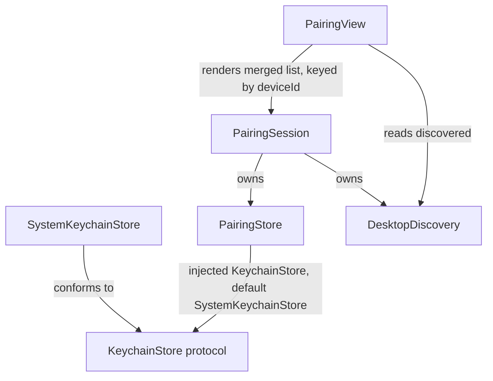

<!-- docs/slices/11a. Pairing Flow Robustness.spec.md -->

# Slice Spec: Pairing Flow Robustness

| | |
|---|---|
| **Doc Type** | Slice Spec |
| **Author** | Gregory McQuillan |
| **Date** | 2026-09-20 |
| **Status** | Draft |
| **Reviewers** | — (solo project) |

**Implements:** roadmap step 11a (EDD § Testing & Rollout Plan) —
repurposed from the closed manual-entry work in
`docs/slices/11. QR Reconnect Fallback.spec.md`. Realizes PRD Decision 1's
2026-09-20 update: multi-desktop enters v1.
**TL;DR:** today's pairing flow silently reconnects to whichever single
desktop was last paired, with no way to disambiguate multiple known
desktops and no way to unit-test `PairingStore` at all (it's Keychain
calls baked directly into pairing logic). This slice splits Keychain
access into its own protocol-backed layer, extends storage from one
credential to a known-devices history, and adds a picker to `PairingView`
so reconnect isn't blind to which desktop is actually live. Driver:
connection-flow robustness before launch, and it directly fixes real
dev-workflow friction disambiguating a live desktop app from a `websocat`
test harness on the same LAN.

> **Style:** terse over complete — cut words that don't carry a decision,
> fact, or constraint. Use numbered lists (`1.`, `2.`, ...), not `-`
> bullets — see CONTRIBUTING.md § Documentation style.

---

## Design decisions

Settled 2026-09-20, after discussion (including an advisor consult):

1. **Only `KeychainStore` gets a protocol, not `PairingStore`.**
   `PairingStore` stays a concrete class — its job is pairing-specific
   logic (which device is active, credential shape), not something a
   caller needs to swap out. The protocol boundary sits one layer down:
   a `KeychainStore` implementation is what's swappable, which is what
   makes `PairingStore` unit-testable against a fake later. Protocol
   stays minimal and stateless — `read`/`write`/`delete`/`accounts` over
   explicit `(service, account)` string pairs, not generic over
   `Codable`, not async. No new `@Observable` layer: `PairingSession`
   (already `@MainActor @Observable`) is still the only observable
   object in this stack; `PairingStore` is a plain injected service.
2. **Two Keychain services, not one, to avoid enumeration collision.**
   Per-device credentials live under service
   `"gg.pekk.buttons.pairing.devices"`, one Keychain item per device
   (`account = deviceId`, value = `authToken`). The "which device is
   active" pointer lives under a *separate* service,
   `"gg.pekk.buttons.pairing.active"` (`account = "active"`, value =
   the active `deviceId`). Keeping them in different services means
   listing known devices (`accounts(service: .devices)`) never has to
   filter out a sentinel account by name — the pointer physically can't
   show up in that enumeration.
3. **No Keychain migration from the old shape.** Existing installs hold
   fixed accounts `"device_id"`/`"auth_token"` under the pre-refactor
   single service — a completely different shape (one credential, not
   one-per-device). Pre-release solo project: don't migrate, document
   it, the one existing install re-pairs once. Old-shape data must not
   crash anything; it's just invisible to the new code (zero known
   devices until a fresh pair).
4. **Silent auto-reconnect at launch still targets only the *active*
   device — never auto-switches.** `attemptAutoReconnect` keeps today's
   ~5s/250ms mDNS poll, unchanged, but now polls specifically for the
   active `deviceId`. If a *different* known device is discovered during
   that window, it becomes selectable in the picker — it is never
   auto-connected to instead of the active one. No silent
   device-switching, ever; a human always taps to change which desktop
   is live.
5. **Picker is a three-state merged list**, keyed by `deviceId`, built
   from `PairingStore.knownDevices()` + `DesktopDiscovery.discovered`:
   - known + currently discovered → "Connect" (uses stored `authToken`
     via the existing `session.reconnect(stored:endpoint:)`, unchanged).
   - known + not discovered → shown offline/greyed. This is what
     replaces today's silent `.notFound` dead end.
   - discovered + unknown (no stored credential) → "Pair new…", routes
     to the existing QR scan flow unchanged; a successful pair calls
     `PairingStore.save(_:makeActive:true)`.
6. **This is not PRD Open Question 2.** That question is about an
   *unpaired* desktop selected off a bare mDNS list completing a first
   pairing with no proof of possession — still open, untouched by this
   slice. Every entry this picker ever shows as "Connect" already has a
   persisted `authToken` from a real prior QR pairing; list-selection
   never substitutes for proof of possession here.

## Shape sketches

Illustrative, not final implementation — exact method bodies may shift
once this is actually built, but the shapes (protocol surface, injection
point, merge keying) shouldn't.

### Keychain layout — two services, not one

| Service | Account(s) | Value | Purpose |
|---|---|---|---|
| `gg.pekk.buttons.pairing.devices` | one per paired desktop, `account = deviceId` | `authToken` | every known desktop's credential |
| `gg.pekk.buttons.pairing.active` | single fixed account, `"active"` | a `deviceId` | which known device silent reconnect targets |

### Dependency shape



### `KeychainStore` — full protocol

```swift
/// Abstracts Keychain access so `PairingStore` can be tested against a
/// fake instead of the real Keychain. Stateless: every call takes the
/// service/account pair explicit, nothing baked into the instance.
protocol KeychainStore {
    /// The stored string for `account` under `service`, or nil if
    /// nothing's stored (or the read fails).
    func read(service: String, account: String) -> String?

    /// Stores `value` for `account` under `service` — an upsert,
    /// overwriting any existing value rather than failing on conflict.
    func write(_ value: String, service: String, account: String)

    /// Removes any stored value for `account` under `service`.
    /// A no-op if nothing's stored.
    func delete(service: String, account: String)

    /// Every account currently stored under `service` — the enumeration
    /// primitive today's single-fixed-account code has no analogue for.
    func accounts(service: String) -> [String]
}
```

### `SystemKeychainStore` — representative methods

`write` (the upsert pattern today's code already has, now parameterized
by `service`) and `accounts` (genuinely new — `kSecMatchLimitAll` +
`kSecReturnAttributes` instead of today's single-item
`kSecMatchLimitOne`):

```swift
final class SystemKeychainStore: KeychainStore {
    private func query(service: String, account: String) -> [String: Any] {
        [
            kSecClass as String: kSecClassGenericPassword,
            kSecAttrService as String: service,
            kSecAttrAccount as String: account,
        ]
    }

    func write(_ value: String, service: String, account: String) {
        let base = query(service: service, account: account)
        let data = Data(value.utf8)
        let status = SecItemCopyMatching(base as CFDictionary, nil)
        if status == errSecSuccess {
            SecItemUpdate(base as CFDictionary, [kSecValueData as String: data] as CFDictionary)
        } else {
            var newItem = base
            newItem[kSecValueData as String] = data
            SecItemAdd(newItem as CFDictionary, nil)
        }
    }

    func accounts(service: String) -> [String] {
        let query: [String: Any] = [
            kSecClass as String: kSecClassGenericPassword,
            kSecAttrService as String: service,
            kSecReturnAttributes as String: true,
            kSecMatchLimit as String: kSecMatchLimitAll,
        ]
        var result: AnyObject?
        let status = SecItemCopyMatching(query as CFDictionary, &result)
        guard status == errSecSuccess, let items = result as? [[String: Any]] else { return [] }
        return items.compactMap { $0[kSecAttrAccount as String] as? String }
    }

    // read/delete: same shape as today's PairingStore.readString/delete
    // in Pairing.swift, just parameterized by `service` instead of a
    // fixed constant.
}
```

### `PairingStore` — injection point + sample calls

Shows the constructor injection (`KeychainStore` defaults to the real
`SystemKeychainStore`, a fake goes in for tests), and a "getting/setting
auth" round trip (`save`/`activeDeviceId`) built entirely from the
protocol's four methods:

```swift
struct StoredPairing: Equatable {
    let deviceId: String
    let authToken: String
}

final class PairingStore {
    private static let devicesService = "gg.pekk.buttons.pairing.devices"
    private static let activeService = "gg.pekk.buttons.pairing.active"
    private static let activeAccount = "active"

    private let keychain: KeychainStore

    /// Defaults to the real Keychain; tests inject a fake `KeychainStore`.
    init(keychain: KeychainStore = SystemKeychainStore()) {
        self.keychain = keychain
    }

    func knownDevices() -> [StoredPairing] {
        keychain.accounts(service: Self.devicesService).compactMap { deviceId in
            keychain.read(service: Self.devicesService, account: deviceId)
                .map { StoredPairing(deviceId: deviceId, authToken: $0) }
        }
    }

    func activeDeviceId() -> String? {
        keychain.read(service: Self.activeService, account: Self.activeAccount)
    }

    func save(_ pairing: StoredPairing, makeActive: Bool = true) {
        keychain.write(pairing.authToken, service: Self.devicesService, account: pairing.deviceId)
        if makeActive { setActive(deviceId: pairing.deviceId) }
    }

    func setActive(deviceId: String) {
        keychain.write(deviceId, service: Self.activeService, account: Self.activeAccount)
    }

    func remove(deviceId: String) {
        keychain.delete(service: Self.devicesService, account: deviceId)
    }
}
```

### Merge logic — the three-state list

Keyed by `deviceId` — a known device present in `DesktopDiscovery`'s
live results is connectable; absent, it's offline; a discovered device
with no matching known credential is pairable:

```swift
enum PairedDeviceStatus {
    case connectable(endpoint: NWEndpoint)  // known + discovered
    case offline                            // known + not discovered
    case pairable(endpoint: NWEndpoint)     // discovered + unknown
}

struct PairedDeviceRow: Identifiable {
    var id: String { deviceId }
    let deviceId: String
    let status: PairedDeviceStatus
}

func mergedDeviceRows(
    known: [StoredPairing], discovered: [DiscoveredDesktop]
) -> [PairedDeviceRow] {
    let discoveredById = Dictionary(uniqueKeysWithValues: discovered.map { ($0.deviceId, $0) })

    var rows = known.map { pairing in
        if let found = discoveredById[pairing.deviceId] {
            return PairedDeviceRow(deviceId: pairing.deviceId, status: .connectable(endpoint: found.endpoint))
        }
        return PairedDeviceRow(deviceId: pairing.deviceId, status: .offline)
    }

    let knownIds = Set(known.map(\.deviceId))
    rows += discovered
        .filter { !knownIds.contains($0.deviceId) }
        .map { PairedDeviceRow(deviceId: $0.deviceId, status: .pairable(endpoint: $0.endpoint)) }

    return rows
}
```

`PairingView` calls this with `pairingStore.knownDevices()` and
`discovery.discovered` to render the list; "Connect" rows call
`session.reconnect(stored:endpoint:)` (unchanged), "Pair new…" rows route
to the existing QR scan flow.

## Scope

**In:**
1. `ios/Buttons/Networking/KeychainStore.swift` (new): `protocol
   KeychainStore { func read(service:account:) -> String?; func
   write(_:service:account:); func delete(service:account:); func
   accounts(service:) -> [String] }`, plus `final class
   SystemKeychainStore: KeychainStore` wrapping `SecItemCopyMatching`/
   `SecItemAdd`/`SecItemUpdate`/`SecItemDelete` — `accounts(service:)` is
   new, using `kSecMatchLimitAll` + `kSecReturnAttributes` to list every
   `kSecAttrAccount` under a service (today's code only ever looks up one
   known account at a time).
2. `PairingStore` (`Pairing.swift`) refactored onto `KeychainStore`:
   drops the old fixed-account `load()`/`save()`/`clear()` API, adds
   `knownDevices() -> [StoredPairing]`, `activeDeviceId() -> String?`,
   `save(_ pairing: StoredPairing, makeActive: Bool)`, `setActive(deviceId:
   String)`, `remove(deviceId: String)`. Injected into `PairingSession`'s
   initializer (constructor default: real `SystemKeychainStore`-backed
   instance), mirroring how `connection: DesktopConnection` is already
   injected.
3. `PairingSession.attemptAutoReconnect`: polls for the active
   `deviceId` specifically (Design decision 4) — same timing, narrower
   target than today's single-stored-credential lookup.
4. `PairingView`: a device list view (three states, Design decision 5)
   replacing the current binary "landing (with silent-reconnect status
   text) vs. failed" framing for the *multi-known-device* case. Existing
   `.scanning`/`.cameraPreAsk`/`.cameraDenied`/`.connecting`/`.failed`
   phases and their transitions are otherwise unchanged.
5. `remove(deviceId:)` at the `PairingStore` layer, for hygiene and
   future use — no UI affordance to call it this slice (Out item 4).

**Out:**
1. Keychain migration from the old single-credential shape — Design
   decision 3.
2. Hub-and-spoke (multiple phones paired to one desktop) — separate
   axis, still deferred per PRD Decision 1.
3. Any desktop-side change. `device.json`'s single `PairedSlot` per
   desktop instance is unaffected — the N-ness this slice adds lives
   entirely on the phone, each desktop still only ever tracks its own
   one paired phone. Verified, not assumed — DoD item 7.
4. A "forget device" UI affordance in the picker. `PairingStore.remove`
   exists at the store layer; nothing calls it yet.
5. Bootstrapping an iOS unit-test target. None exists today
   (`find ios -iname "*Tests*"` — nothing). The `KeychainStore` protocol
   makes `PairingStore` testable *whenever* that infra exists; standing
   one up is a separate, cross-cutting concern, not bundled into a
   pairing-flow slice.
6. Any change to `PairRequest`/`PairResponse`/the wire protocol. This is
   entirely local storage + UI — the number of known devices never
   crosses the wire.
7. The PIN/manual-entry design from the closed slice 11 — unrelated,
   still not being built.
8. Auto-switching to a different desktop without an explicit tap —
   Design decision 4.

> **Rule for agent:** stay inside this scope. If something out of scope
> blocks you, stop and flag it — don't silently expand scope to route
> around it.

## Files to Touch

1. `ios/Buttons/Networking/KeychainStore.swift` — new — protocol +
   `SystemKeychainStore`.
2. `ios/Buttons/Networking/Pairing.swift` — modify — `PairingStore`
   refactor, `PairingSession` init/`attemptAutoReconnect` changes.
3. `ios/Buttons/Networking/Discovery.swift` — check only; `discovered:
   [DiscoveredDesktop]` already exposes what the picker needs, expect no
   change.
4. `ios/Buttons/Views/PairingView.swift` — modify — device list UI,
   "Connect"/"Pair new…" actions.
5. `docs/slices/11a. Pairing Flow Robustness.spec.md` — this file, new.

## Definition of Done

1. [ ] `SystemKeychainStore` passes read/write/delete/`accounts` against
       the real Keychain (manual check — no test target yet, Out item 5).
2. [ ] Pairing to two different desktops persists both as separate known
       devices; pairing to the second doesn't overwrite or clear the
       first.
3. [ ] Force-quit/relaunch silently reconnects to whichever device is
       active — unchanged UX from today for the common single-desktop
       case.
4. [ ] With two desktops live on the LAN (real app + real app, or real
       app + a `websocat` fixture per `PAIRING.md`), `PairingView`'s list
       shows both as "Connect" if both are known, or one as "Pair new…"
       if only one was ever paired.
5. [ ] A known-but-not-discovered device shows offline/greyed, not
       silence.
6. [ ] Tapping "Connect" on a non-active known device connects to it and
       makes it active — next relaunch's silent reconnect targets that
       one, not whichever was active before.
7. [ ] An old-shape (pre-refactor) Keychain entry doesn't crash on
       launch — resolves to zero known devices, QR pairing still works
       from there.
8. [ ] Confirmed (not assumed): pairing the same phone to two separate
       desktop instances leaves each desktop's own `device.json` holding
       only its own single `PairedSlot`, unaffected by the other.

**Verification:**
```
cd ios && xcodegen generate && xcodebuild build -scheme Buttons -destination 'platform=iOS Simulator,name=iPhone 15'
# manual, two desktop endpoints needed (matches DoD 1-8 above):
# 1. pair phone to desktop A, then desktop B (or a websocat fixture standing in for B,
#    per PAIRING.md's "Faking the desktop side with websocat") — confirm both persist
# 2. force-quit, relaunch — confirm silent reconnect to whichever was paired/selected last
# 3. with both live, open PairingView — confirm both show "Connect"
# 4. tap the non-active one, confirm it connects and becomes active; relaunch, confirm
#    the newly-active one is now the silent-reconnect target
# 5. quit one endpoint, relaunch app — confirm it shows offline/greyed, the other still connects
# 6. manually seed an old-shape Keychain entry (or use a pre-refactor build's install),
#    confirm no crash, zero known devices, fresh QR pair still works
# 7. inspect device.json on both desktop instances — confirm neither references the other
```
