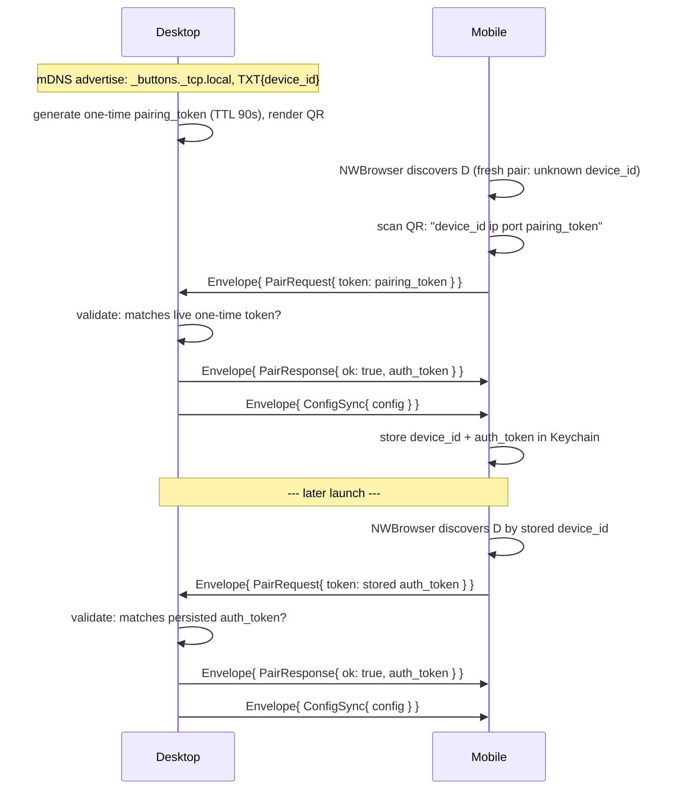

# protocol/PAIRING.md

Canonical pairing sequence for the desktop↔mobile WebSocket connection —
concrete version of `docs/01. Architecture Overview.edd.md` §5.1, with real
message/field names from `wire.proto`. This file is the normative copy;
the EDD keeps the rationale and links here.



1. **QR payload** — not protobuf, a bootstrap string parsed before any
   connection exists: `"<device_id> <lan_ip> <port> <pairing_token>"`,
   space-delimited, four fields.
2. **One validator, two acceptable tokens** — the server checks a
   `PairRequest.token` against either the live one-time token (fresh pair)
   or the persisted `auth_token` (reconnect), same code path either way.
3. **`auth_token` doesn't rotate** in v1 — issued once on first successful
   pair, reused indefinitely on every reconnect.
4. **Rejection** — bad/expired token, or a `protocol_version` mismatch,
   both produce `Envelope{ PairResponse{ ok: false, error } }`, then close.

Message shapes: see `wire.proto` directly (`Envelope`, `PairRequest`,
`PairResponse`, `ConfigSync`) — this file doesn't restate field-by-field
docs already on the messages themselves.

Full design rationale, TTL/eviction reasoning, and threat-model notes:
`docs/slices/07. Discovery, Pairing & Config Sync.spec.md`.

## Manually testing the handshake with `websocat`

`websocat` (`brew install websocat`) is a generic WebSocket CLI client —
useful for poking at the real desktop server without a mobile client, and
for the specific case a mobile client can't easily produce on demand: a
malformed or unauthenticated connection attempt. From the same machine as
the desktop, connect to loopback (the server binds `0.0.0.0`, so it
answers on `127.0.0.1` too, no LAN IP needed):

```
websocat ws://127.0.0.1:47821
```

Envelopes on the wire are canonical proto3 JSON (EDD §5.2) — the `oneof`
case name is a top-level key, **not** nested under a `message` wrapper:

```
{"protocolVersion":"1","pairRequest":{"token":"<value>"}}
```

The server closes the connection after one rejected attempt — it's a
single-shot handshake, not a retry loop (`authenticate()` runs once per
connection). **Run a fresh `websocat` invocation for each payload below**,
not multiple lines in one session; a second line into an already-rejected
connection just gets `websocat`'s own I/O-failure error, not a second
server response.

1. **Garbage token** — `{"protocolVersion":"1","pairRequest":{"token":"nonsense"}}`
   — passes shape/version checks, fails `Pairing::validate`.
2. **Malformed JSON** — `garbage` — fails to parse as an `Envelope` at all.
3. **Wrong shape** — `{"protocolVersion":"1"}` (no `pairRequest`/etc.) — parses,
   but has no recognized oneof case.
4. **Nothing at all** — open the connection and leave it idle. `authenticate()`
   blocks on the first frame; closing `websocat` (Ctrl-C) delivers a reset,
   not a `PairRequest`.

All four fail inside `authenticate()`, which runs before a connection ever
touches the single-connection slot — none of them should evict or disrupt
an already-paired session running elsewhere. Confirm by pairing a real
client first, then running one of the above and checking both of these
hold:

1. **Desktop console never prints `server: evicting previous connection
   to authenticate …`.** That line only appears at the one point in
   `server.rs` where the slot is actually replaced — its absence, not any
   positive signal, is the proof nothing was disrupted.
2. **The paired client stays on its normal screen** (iOS: `DeckView`
   doesn't drop back to `PairingView` — that only happens once
   `DesktopConnection.isConnected` flips false, which a real eviction or
   dropped connection would trigger).

None of the four attempts above should produce `server: WebSocket error
from …` either — that line comes only from the post-authentication loop,
so seeing it during one of these attempts would mean the payload
authenticated when it shouldn't have.

## Faking mobile with a persisted `auth_token`

The section above uses a single-shot `websocat` invocation to test
*rejected* handshakes — one frame, then the connection closes. This is
for the opposite case: a real, authenticated session against the real
desktop, to send an M→D message no real UI can produce on demand (e.g.
slice 10 DoD 4's `profile_switch` naming a Profile id that doesn't
exist). No QR, no camera, no fresh one-time token — reuse the desktop's
own persisted `auth_token`, which `Pairing::validate`'s reconnect path
already accepts:

```
cat "$HOME/Library/Application Support/gg.pekk.buttons/device.json"
```

**Caveat — this evicts whatever device currently holds the connection
slot** (§ Implementation Notes, "Single-connection slot"). Reconnect your
real phone/simulator afterward if you want it live again.

1. **Open a FIFO-backed connection** — same shape as "Faking the desktop
   side" below, needed because a plain `websocat` invocation only pipes
   stdin once and this test sends more than one message:
   ```
   mkfifo ws_in
   exec 3<> ws_in
   websocat ws://127.0.0.1:47821 <&3 > ws_out.log 2>&1 &
   ```
2. **Authenticate with the persisted token** (`device.json`'s
   `paired.auth_token`, not a QR's one-time token):
   ```
   echo '{"protocolVersion":"1","pairRequest":{"token":"<paired.auth_token>"}}' > ws_in
   ```
   `ws_out.log` should show `pairResponse{ok:true}` followed by a full
   `configSync` — real Profile/Page/Button ids to build the next message
   from.
3. **Send whatever M→D message is under test**, e.g. a `profile_switch`
   naming an id that doesn't exist in any synced Profile:
   ```
   echo '{"protocolVersion":"1","profileSwitch":{"activeProfileId":"does-not-exist-1234"}}' > ws_in
   ```
   Check the result against `buttons.json` on disk (`activeProfileId`
   unchanged for a bogus id) rather than only the desktop console — file
   state doesn't depend on scrolling back through a running `tauri dev`
   terminal.
4. **Prove the connection survived** by sending a real id right after, on
   the same connection, and confirming `buttons.json` changed to it —
   this is what actually shows a bad message didn't kill the handler,
   not just that no error printed.
5. **Clean up**: kill the `websocat` process, and if the message you sent
   changed real state (like the `profileSwitch` above), switch back
   manually before reconnecting your real device.

Used to verify slice 10 DoD 4 (`does-not-exist-1234` dropped, real id
right after still worked) — see `docs/slices/10. Profile Switch.spec.md`.

## Faking the desktop side with `websocat`

The section above uses `websocat` as a stand-in *mobile* client against a
real desktop. This is the reverse: `websocat` stands in for **desktop**,
against a real mobile app — for testing a D→M message no real trigger
produces yet (e.g. a `state_push` with more than one `StateChange`, used
to verify slice 09a DoD 3). Same tool, opposite direction; don't confuse
the two.

**Caveat — this overwrites mobile's real pairing.** A fresh QR pair
replaces whatever `device_id`/`auth_token` mobile's Keychain currently
holds. After this test, restart the real desktop app and re-scan its
real QR to restore normal pairing — don't skip this.

1. **Find your Mac's LAN IP** (must be reachable from the phone's WiFi;
   `127.0.0.1` won't work here since the phone is a separate device):
   ```
   ipconfig getifaddr en0   # or en1/en2 — whichever interface has your LAN IP
   ```
2. **Build a fresh-pair QR** pointing at a `websocat` server instead of
   the real desktop. `device_id`/token can be any string — this bypasses
   `Pairing::validate` entirely, since `websocat` isn't running desktop's
   real validation code:
   ```
   qrencode -o fake-desktop.png -s 10 "fake-device 10.10.10.152 47822 fake-token"
   ```
   Display `fake-desktop.png` somewhere the phone's camera can scan it
   (a second screen, not the phone itself).
3. **Start `websocat` in server mode**, piped through a FIFO so more than
   one message can be sent over the same connection (plain
   `websocat -s <addr>` alone only pipes stdin once — a FIFO kept open on
   a spare file descriptor lets separate shell commands append to it
   without closing the pipe):
   ```
   mkfifo ws_in
   exec 3<> ws_in                         # open read-write so it doesn't block
   websocat -s 10.10.10.152:47822 <&3 > ws_out.log 2>&1 &
   ```
4. **On the phone**: get to `PairingView` (stop the real desktop app so
   the existing connection drops), tap "Scan QR Code," scan
   `fake-desktop.png`.
5. **Watch `ws_out.log` for the incoming `PairRequest`**, then write
   responses into the FIFO, one JSON line each (canonical proto3 JSON,
   same shape as the client-side section above — oneof case as a
   top-level key):
   ```
   echo '{"protocolVersion":"1","pairResponse":{"ok":true,"authToken":"fake-token"}}' > ws_in
   echo '{"protocolVersion":"1","configSync":{"config":{"profiles":[{"id":"p1","name":"Test","pages":[{"id":"pg1","buttons":[{"id":"btnA","label":"A","switchContent":{"off":{"label":"Off A"},"on":{"label":"On A"}}},{"id":"btnB","label":"B","switchContent":{"off":{"label":"Off B"},"on":{"label":"On B"}}}]}]}],"activeProfileId":"p1"}}}' > ws_in
   ```
   Mobile shows the two Switch buttons once `ConfigSync` lands. Now send
   whatever D→M message is actually under test, e.g. a 2-entry
   `state_push`:
   ```
   echo '{"protocolVersion":"1","statePush":{"changes":[{"buttonId":"btnA","isActive":true},{"buttonId":"btnB","isActive":true}]}}' > ws_in
   ```
6. **Beat the 10s `pairTimeout`** — `DesktopConnection.connect(...)`
   cancels the whole attempt 10s after `PairRequest` is sent if no
   `PairResponse` arrives (`Connection.swift`'s `scheduleTimeout`). Typing
   the response by hand while also relaying between two people/screens
   easily blows through that window. If timing by hand is too slow, poll
   for the request and react in one script instead of a manual
   back-and-forth:
   ```bash
   for i in $(seq 1 40); do
     grep -q pairRequest ws_out.log && { echo '{"protocolVersion":"1","pairResponse":{"ok":true,"authToken":"fake-token"}}' > ws_in; break; }
     sleep 0.25
   done
   ```
7. **Clean up**: kill the `websocat` process, restart the real desktop
   app, re-scan its real QR on the phone.
