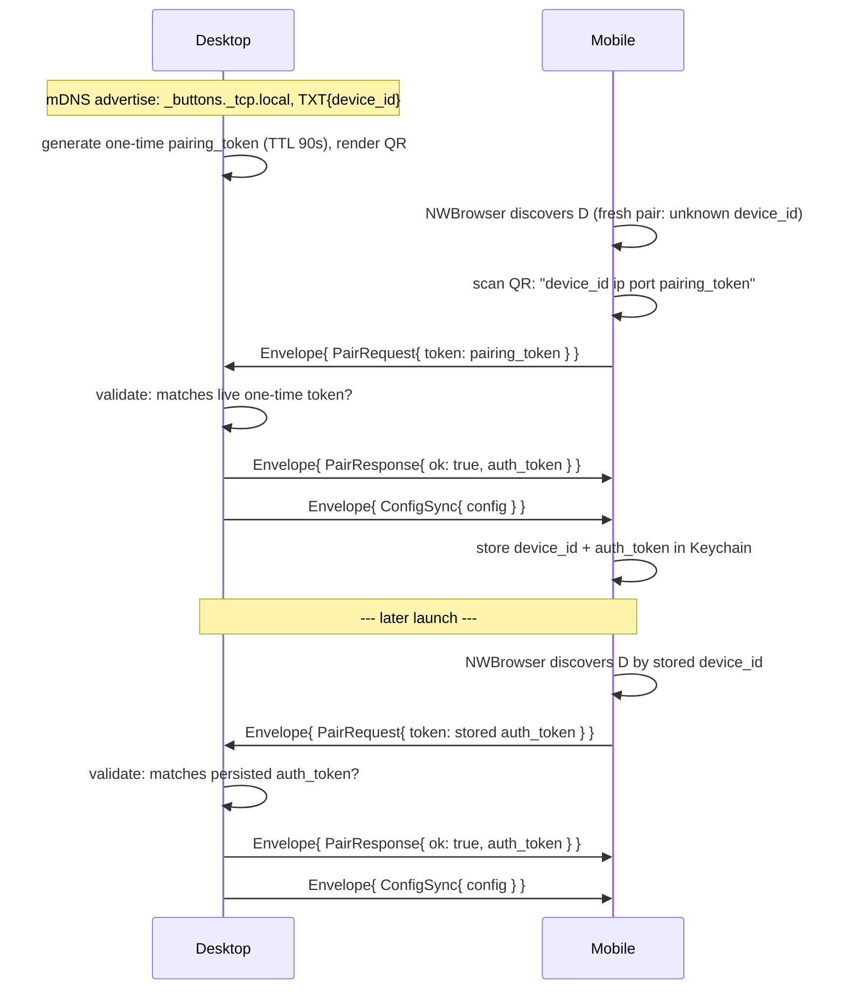

# protocol/PAIRING.md

Canonical pairing sequence for the desktop↔mobile WebSocket connection —
concrete version of `docs/01. Architecture Overview.edd.md` §5.1, with real
message/field names from `wire.proto`. This file is the normative copy;
the EDD keeps the rationale and links here.



1. **QR payload** — not protobuf, a bootstrap string parsed before any
   connection exists: `"<device_id> <lan_ip> <port> <pairing_token>"`,
   space-delimited, four fields.
2. **One validator, two acceptable tokens** — the server checks a
   `PairRequest.token` against either the live one-time token (fresh pair)
   or the persisted `auth_token` (reconnect), same code path either way.
3. **`auth_token` doesn't rotate** in v1 — issued once on first successful
   pair, reused indefinitely on every reconnect.
4. **Rejection** — bad/expired token, or a `protocol_version` mismatch,
   both produce `Envelope{ PairResponse{ ok: false, error } }`, then close.

Message shapes: see `wire.proto` directly (`Envelope`, `PairRequest`,
`PairResponse`, `ConfigSync`) — this file doesn't restate field-by-field
docs already on the messages themselves.

Full design rationale, TTL/eviction reasoning, and threat-model notes:
`docs/slices/07. Discovery, Pairing & Config Sync.spec.md`.

## Manually testing the handshake with `websocat`

`websocat` (`brew install websocat`) is a generic WebSocket CLI client —
useful for poking at the real desktop server without a mobile client, and
for the specific case a mobile client can't easily produce on demand: a
malformed or unauthenticated connection attempt. From the same machine as
the desktop, connect to loopback (the server binds `0.0.0.0`, so it
answers on `127.0.0.1` too, no LAN IP needed):

```
websocat ws://127.0.0.1:47821
```

Envelopes on the wire are canonical proto3 JSON (EDD §5.2) — the `oneof`
case name is a top-level key, **not** nested under a `message` wrapper:

```
{"protocolVersion":"1","pairRequest":{"token":"<value>"}}
```

The server closes the connection after one rejected attempt — it's a
single-shot handshake, not a retry loop (`authenticate()` runs once per
connection). **Run a fresh `websocat` invocation for each payload below**,
not multiple lines in one session; a second line into an already-rejected
connection just gets `websocat`'s own I/O-failure error, not a second
server response.

1. **Garbage token** — `{"protocolVersion":"1","pairRequest":{"token":"nonsense"}}`
   — passes shape/version checks, fails `Pairing::validate`.
2. **Malformed JSON** — `garbage` — fails to parse as an `Envelope` at all.
3. **Wrong shape** — `{"protocolVersion":"1"}` (no `pairRequest`/etc.) — parses,
   but has no recognized oneof case.
4. **Nothing at all** — open the connection and leave it idle. `authenticate()`
   blocks on the first frame; closing `websocat` (Ctrl-C) delivers a reset,
   not a `PairRequest`.

All four fail inside `authenticate()`, which runs before a connection ever
touches the single-connection slot — none of them should evict or disrupt
an already-paired session running elsewhere. Confirm by pairing a real
client first, running one of the above, and checking the paired client
stays live throughout (Definition of Done #11, slice 07). None of these
produce a `server: WebSocket error from …` log line either — that message
comes only from the post-authentication loop, so seeing it during one of
these attempts would mean the payload authenticated when it shouldn't
have.
