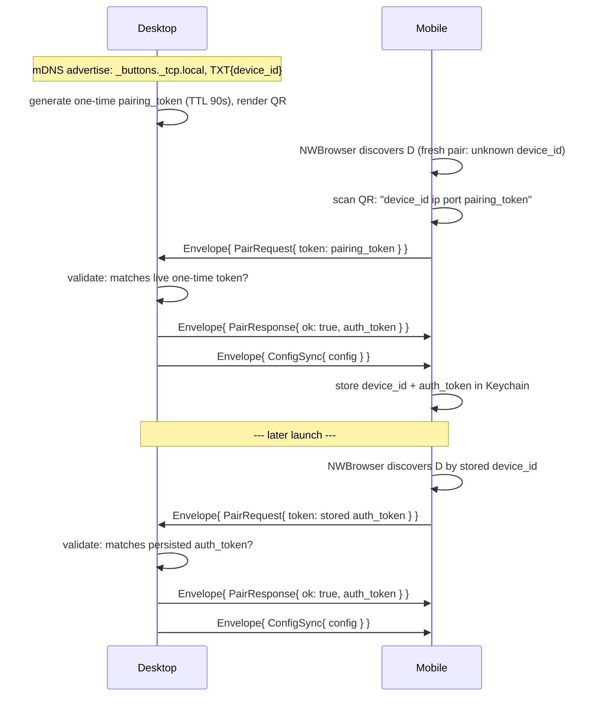

# protocol/PAIRING.md

Canonical pairing sequence for the desktop↔mobile WebSocket connection —
concrete version of `docs/01. Architecture Overview.edd.md` §5.1, with real
message/field names from `wire.proto`. This file is the normative copy;
the EDD keeps the rationale and links here.

1. **QR payload** — not protobuf, a bootstrap string parsed before any
   connection exists: `"<device_id> <lan_ip> <port> <pairing_token>"`,
   space-delimited, four fields.
2. **One validator, two acceptable tokens** — the server checks a
   `PairRequest.token` against either the live one-time token (fresh pair)
   or the persisted `auth_token` (reconnect), same code path either way.
3. **`auth_token` doesn't rotate** in v1 — issued once on first successful
   pair, reused indefinitely on every reconnect.
4. **Rejection** — bad/expired token, or a `protocol_version` mismatch,
   both produce `Envelope{ PairResponse{ ok: false, error } }`, then close.

Message shapes: see `wire.proto` directly (`Envelope`, `PairRequest`,
`PairResponse`, `ConfigSync`) — this file doesn't restate field-by-field
docs already on the messages themselves.

Full design rationale, TTL/eviction reasoning, and threat-model notes:
`docs/slices/07. Discovery, Pairing & Config Sync.spec.md`.
